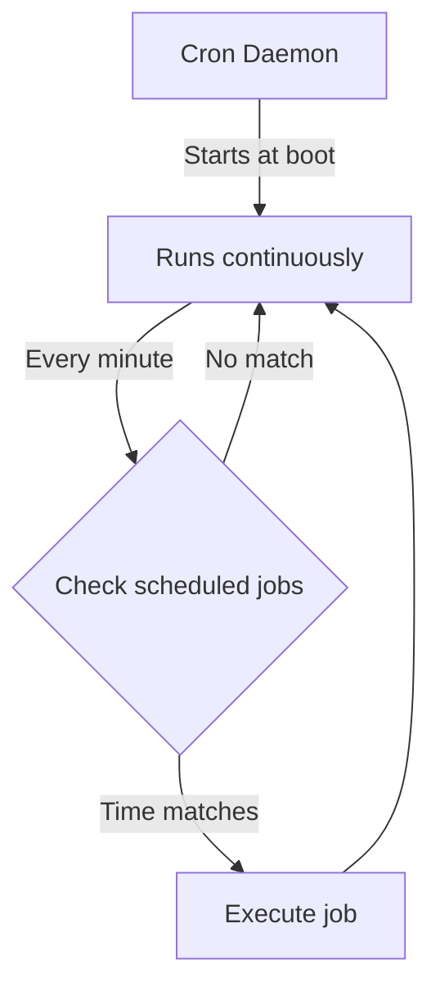

# Ubuntu Cron Jobs

## Introduction

Cron is a powerful job scheduling utility in Unix-like operating systems, including Ubuntu. It allows you to schedule commands or scripts to run automatically at specified intervals, from minutes to months. Cron jobs are particularly useful for:

- System maintenance tasks
- Backing up data
- Running periodic reports
- Automating repetitive tasks
- Monitoring system resources

In this tutorial, you'll learn how to create, manage, and troubleshoot cron jobs in Ubuntu. By the end, you'll be able to automate tasks effectively, saving time and ensuring critical operations run consistently.

## Understanding the Cron System

### How Cron Works

Cron runs as a daemon (background service) that wakes up every minute to check if there are any scheduled jobs to execute. If it finds a job that matches the current time, it executes that command or script.



### Cron Files and Directories

Ubuntu's cron system uses several configuration files and directories:

- `/etc/crontab` - System-wide crontab file
- `/etc/cron.d/` - Directory for system crontab files
- `/etc/cron.hourly/`, `/etc/cron.daily/`, `/etc/cron.weekly/`, `/etc/cron.monthly/` - Directories for scripts to run at those intervals
- `/var/spool/cron/crontabs/` - Directory containing user crontab files

## Basic Crontab Usage

### Viewing Your Crontab

To view your current crontab:

```bash
crontab -l
```

If you've never created a crontab before, you'll see a message like:

```
no crontab for username
```

### Editing Your Crontab

To edit your crontab:

```bash
crontab -e
```

The first time you run this command, you'll be asked to choose an editor:

```
Select an editor. To change later, run 'select-editor'.
  1. /bin/nano        <---- easiest
  2. /usr/bin/vim.basic
  3. /usr/bin/vim.tiny
  4. /bin/ed

Choose 1-4 [1]:
```

After selecting an editor, you'll see an empty file (or your existing crontab if you have one) with comments explaining the syntax.

### Crontab Syntax

Each line in a crontab file represents a single job and follows this format:

```
minute hour day-of-month month day-of-week command
```

Field explanation:

| Field | Values | Description |
|-------|--------|-------------|
| minute | 0-59 | Minute of the hour |
| hour | 0-23 | Hour of the day (24-hour format) |
| day-of-month | 1-31 | Day of the month |
| month | 1-12 or JAN-DEC | Month of the year |
| day-of-week | 0-7 or SUN-SAT | Day of the week (0 or 7 is Sunday) |
| command | any valid command | Command or script to execute |

Special characters for time fields:

- `*` - Any value (wildcard)
- `,` - Value list separator (e.g., `1,3,5`)
- `-` - Range of values (e.g., `1-5`)
- `/` - Step values (e.g., `*/5` means every 5 units)

## Creating Cron Jobs: Examples

### Running a Job Every Minute

To run a command every minute:

```
* * * * * echo "Hello, every minute" >> ~/cron-log.txt
```

### Running a Job Every Hour

To run a script at the beginning of every hour:

```
0 * * * * /path/to/your/script.sh
```

### Running a Job Every Day at Specific Time

To run a backup script every day at 2:30 AM:

```
30 2 * * * /home/username/scripts/backup.sh
```

### Weekly Jobs

To run a job every Sunday at midnight:

```
0 0 * * 0 /path/to/weekly-maintenance.sh
```

### Monthly Jobs

To run a job on the first day of every month at 4:45 AM:

```
45 4 1 * * /path/to/monthly-report.sh
```

### Multiple Times Per Day

To run a job every 6 hours:

```
0 */6 * * * /path/to/check-service.sh
```

### Using Date Ranges

To run a job Monday through Friday at 8 AM:

```
0 8 * * 1-5 /path/to/workday-script.sh
```

## Practical Real-World Examples

### Example 1: System Update Automation

Automatically update your Ubuntu system every Sunday at 1 AM:

```bash
# First create a script for updating
echo '#!/bin/bash
apt-get update
apt-get -y upgrade
apt-get -y autoremove' > ~/scripts/system-update.sh

# Make it executable
chmod +x ~/scripts/system-update.sh

# Add to crontab (run as root with sudo)
sudo crontab -e
```

Then add this line:

```
0 1 * * 0 /home/username/scripts/system-update.sh > /home/username/logs/update.log 2>&1
```

### Example 2: Database Backup

Create a daily MySQL database backup at 3 AM:

```bash
# Create a backup script
cat > ~/scripts/db-backup.sh << 'EOF'
#!/bin/bash
TIMESTAMP=$(date +"%Y%m%d_%H%M%S")
BACKUP_DIR="/home/username/backups"
mkdir -p $BACKUP_DIR
mysqldump -u username -p'password' database_name > "$BACKUP_DIR/database_$TIMESTAMP.sql"
# Keep only the last 7 backups
ls -tp $BACKUP_DIR/database_*.sql | tail -n +8 | xargs -I {} rm -- {}
EOF

# Make it executable
chmod +x ~/scripts/db-backup.sh

# Add to crontab
crontab -e
```

Then add this line:

```
0 3 * * * /home/username/scripts/db-backup.sh > /home/username/logs/db-backup.log 2>&1
```

### Example 3: Website Monitoring

Check if a website is running properly every 15 minutes:

```bash
# Create monitoring script
cat > ~/scripts/check-website.sh << 'EOF'
#!/bin/bash
SITE="https://example.com"
LOG_FILE="/home/username/logs/website-status.log"
HTTP_CODE=$(curl -s -o /dev/null -w "%{http_code}" $SITE)

if [ $HTTP_CODE -ne 200 ]; then
  echo "$(date): Website returned HTTP code $HTTP_CODE" >> $LOG_FILE
  # Send email notification
  echo "Website down with HTTP code $HTTP_CODE" | mail -s "Website Alert" your@email.com
fi
EOF

# Make it executable
chmod +x ~/scripts/check-website.sh

# Add to crontab
crontab -e
```

Then add this line:

```
*/15 * * * * /home/username/scripts/check-website.sh
```

## Advanced Cron Techniques

### Environment Variables in Crontab

Cron jobs run with a minimal set of environment variables. To set environment variables for your cron jobs, add them at the top of your crontab:

```
PATH=/usr/local/sbin:/usr/local/bin:/usr/sbin:/usr/bin:/sbin:/bin
SHELL=/bin/bash
MAILTO=your@email.com

# Your jobs below
30 * * * * /path/to/script.sh
```

The `MAILTO` variable will send any output from your cron jobs to the specified email address.

### Redirecting Output

To capture the output of your cron jobs, redirect both standard output and standard error:

```
30 5 * * * /path/to/script.sh > /path/to/logfile.log 2>&1
```

- `>` redirects standard output
- `2>&1` redirects standard error to the same place as standard output

To discard all output:

```
30 5 * * * /path/to/script.sh > /dev/null 2>&1
```

### Special Cron Strings

Cron offers some special string replacements for common schedules:

```
@reboot     # Run once at startup
@yearly     # Run once a year (0 0 1 1 *)
@annually   # Same as @yearly
@monthly    # Run once a month (0 0 1 * *)
@weekly     # Run once a week (0 0 * * 0)
@daily      # Run once a day (0 0 * * *)
@midnight   # Same as @daily
@hourly     # Run once an hour (0 * * * *)
```

Example:

```
@daily /path/to/daily-script.sh
```

## Troubleshooting Cron Jobs

### Checking Cron Logs

If your cron jobs aren't running as expected, check the system logs:

```bash
grep CRON /var/log/syslog
```

### Common Problems and Solutions

1. **Job not running**: Ensure the script is executable:

```bash
chmod +x /path/to/your/script.sh
```

2. **Path issues**: Use absolute paths in your cron jobs:

```
30 5 * * * /full/path/to/command /full/path/to/file
```

3. **Permission problems**: Ensure the user has appropriate permissions for the commands and files being accessed.

4. **Syntax errors**: Validate your crontab syntax with online tools or by checking logs.

5. **Conflicting environment**: Test your script independently to ensure it works outside of cron.

### Debugging Tips

1. Add debugging information to your scripts:

```bash
echo "Script started at $(date)" >> /tmp/script-debug.log
# Your commands here
echo "Script completed at $(date)" >> /tmp/script-debug.log
```

2. Run a test job that executes in the next minute:

```
# Add this to crontab (assuming current time is 10:30)
31 10 * * * /path/to/script.sh > /tmp/cron-test.log 2>&1
```

## Security Considerations

1. **Restrict access to crontab files**: Only allow authorized users to modify cron jobs.

2. **Review system-wide cron jobs**: Regularly check `/etc/crontab` and `/etc/cron.d/` for suspicious entries.

3. **Use specific user accounts**: Run critical cron jobs with the minimum necessary privileges.

4. **Monitor cron job execution**: Log and review the execution of important cron jobs.

5. **Sanitize inputs**: If your cron jobs process external data, ensure proper validation.

## Summary

Cron jobs provide a powerful way to automate tasks in Ubuntu systems. In this tutorial, you've learned:

- The basic syntax and structure of crontab entries
- How to create, edit, and manage cron jobs
- Practical examples for common automation scenarios
- Advanced techniques for environment control and output management
- Troubleshooting methods for when things go wrong
- Security best practices for cron job implementation

With these skills, you can effectively automate routine tasks, ensuring they run consistently and reliably without manual intervention.

## Additional Resources and Exercises

### Resources

- `man crontab` - The crontab manual page for more details
- `man 5 crontab` - Documentation for the crontab file format

### Exercises

1. **Basic Scheduling**: Create a cron job that outputs the current date and time to a file every 5 minutes.

2. **Log Rotation**: Write a cron job that compresses and archives log files older than 7 days.

3. **Resource Monitoring**: Create a cron job that checks system resources (CPU, memory, disk space) and sends an alert if usage exceeds thresholds.

4. **Multi-step Process**: Develop a cron job that performs a sequence of related tasks, such as backing up data, compressing it, and then uploading it to a remote server.

5. **Conditional Execution**: Write a cron job that only performs its task if certain conditions are met (e.g., only backup if the system is idle).