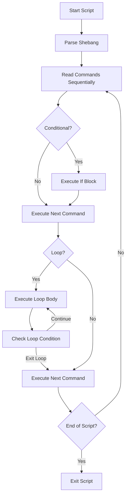

# Ubuntu Script Creation

## Introduction

Shell scripting is one of the most powerful skills you can develop as an Ubuntu user. Scripts allow you to automate repetitive tasks, combine multiple commands into a single executable file, and create custom solutions for your specific needs. In this tutorial, we'll explore how to create, execute, and manage shell scripts in Ubuntu.

Shell scripts in Ubuntu are essentially text files containing a sequence of commands that the shell can execute. These scripts can range from simple one-liners to complex programs with conditionals, loops, and functions.

## Setting Up Your First Script

### Basic Structure

Let's start by creating a simple "Hello World" script:

1. Open a terminal (Ctrl+Alt+T)
2. Create a new file using a text editor like nano:

```bash
nano hello.sh
```

3. Enter the following code:

```bash
#!/bin/bash

# This is a comment
echo "Hello, World!"
```

4. Save the file (in nano: Ctrl+O, then Enter, then Ctrl+X)

The first line `#!/bin/bash` is called a "shebang" line. It tells the system which interpreter should be used to execute the script. In this case, we're using the Bash shell.

### Making Your Script Executable

Before running your script, you need to make it executable:

```bash
chmod +x hello.sh
```

This command changes the file permissions to allow execution. Now you can run your script:

```bash
./hello.sh
```

Output:
```
Hello, World!
```

The `./` prefix indicates that the script is located in the current directory.

## Variables and User Input

### Working with Variables

Variables allow you to store and reuse data in your scripts:

```bash
#!/bin/bash

# Define variables
name="Ubuntu User"
current_date=$(date)

echo "Hello, $name!"
echo "Today is: $current_date"
```

Save this as `variables.sh`, make it executable with `chmod +x variables.sh`, and run it:

```bash
./variables.sh
```

Output:
```
Hello, Ubuntu User!
Today is: Sun Mar 10 15:30:45 UTC 2024
```

### Accepting User Input

Let's modify our script to accept user input:

```bash
#!/bin/bash

echo "What is your name?"
read user_name

echo "Hello, $user_name! Welcome to shell scripting."
```

Save as `input.sh`, make it executable, and run:

```bash
./input.sh
```

Interactive session:
```
What is your name?
Sarah
Hello, Sarah! Welcome to shell scripting.
```

## Control Structures

### Conditional Statements

Conditional statements allow your script to make decisions:

```bash
#!/bin/bash

echo "Please enter your age:"
read age

if [ "$age" -lt 18 ]; then
    echo "You are under 18 years old."
elif [ "$age" -eq 18 ]; then
    echo "You are exactly 18 years old."
else
    echo "You are over 18 years old."
fi
```

Save as `age_check.sh`, make it executable, and run:

```bash
./age_check.sh
```

### Loops

Loops help you perform repetitive tasks:

```bash
#!/bin/bash

# For loop example
echo "Counting from 1 to 5:"
for i in {1..5}
do
    echo "Number: $i"
done

# While loop example
echo -e "
Counting down from 3:"
count=3
while [ $count -gt 0 ]
do
    echo "Count: $count"
    count=$((count-1))
    sleep 1
done
echo "Blast off!"
```

Save as `loops.sh`, make it executable, and run.

## Functions

Functions allow you to organize and reuse code:

```bash
#!/bin/bash

# Define a function
greet() {
    echo "Hello, $1!"
    echo "Today is $(date +%A)."
}

# Call the function with an argument
greet "Friend"

# Another example function
calculate_sum() {
    local num1=$1
    local num2=$2
    local sum=$((num1 + num2))
    echo "Sum of $num1 and $num2 is: $sum"
}

# Call the second function
calculate_sum 5 7
```

Save as `functions.sh`, make it executable, and run:

```bash
./functions.sh
```

Output:
```
Hello, Friend!
Today is Sunday.
Sum of 5 and 7 is: 12
```

## Practical Examples

### System Information Script

Let's create a useful script that displays system information:

```bash
#!/bin/bash

echo "====== System Information ======"
echo "Hostname: $(hostname)"
echo "Operating System: $(lsb_release -d | cut -f2)"
echo "Kernel Version: $(uname -r)"
echo "CPU: $(grep 'model name' /proc/cpuinfo | head -1 | cut -d':' -f2 | sed 's/^[ \t]*//')"
echo "Memory: $(free -h | grep 'Mem' | awk '{print $2}')"
echo "Disk Usage: $(df -h --output=pcent / | tail -1)"
echo "Uptime: $(uptime -p)"
echo "==============================="
```

Save as `sysinfo.sh`, make it executable, and run.

### Backup Script

Here's a simple backup script to archive important files:

```bash
#!/bin/bash

# Configuration
source_dir="$HOME/Documents"
backup_dir="$HOME/Backups"
date_format=$(date +%Y-%m-%d_%H-%M-%S)
archive_name="backup_$date_format.tar.gz"

# Create backup directory if it doesn't exist
mkdir -p "$backup_dir"

# Create the backup
echo "Creating backup of $source_dir..."
tar -czf "$backup_dir/$archive_name" "$source_dir"

# Check if backup was successful
if [ $? -eq 0 ]; then
    echo "Backup created successfully: $backup_dir/$archive_name"
    echo "Backup size: $(du -h "$backup_dir/$archive_name" | cut -f1)"
else
    echo "Backup failed!"
fi
```

Save as `backup.sh`, make it executable, and run.

## Script Execution Flow

Here's a diagram illustrating the typical execution flow of a shell script:



## Best Practices

1. **Always include the shebang line** (`#!/bin/bash`) at the beginning of your scripts.
2. **Make your scripts executable** using `chmod +x script.sh`.
3. **Comment your code** to explain what it does and why.
4. **Use descriptive variable names** to make your code more readable.
5. **Handle errors** by checking return codes and providing meaningful error messages.
6. **Use functions** to organize and reuse code.
7. **Validate user input** to prevent unexpected behavior.
8. **Test your scripts** thoroughly before using them in production.
9. **Use version control** like Git to track changes to your scripts.
10. **Consider security implications**, especially when running scripts with elevated privileges.

## Advanced Topics

As you become more comfortable with basic scripting, you might want to explore:

- **Command-line arguments**: Accept parameters when running your script
- **Error handling**: Catch and manage errors using `trap`
- **Regular expressions**: Pattern matching for text processing
- **Signal handling**: Respond to system signals
- **Process management**: Work with background processes
- **Debugging techniques**: Tools and methods to find and fix bugs

## Summary

Shell scripting in Ubuntu is a powerful skill that allows you to automate tasks, combine commands, and create custom solutions. In this tutorial, we covered:

- Creating and executing basic scripts
- Working with variables and user input
- Implementing control structures like conditionals and loops
- Organizing code with functions
- Building practical scripts for real-world use cases

With these fundamentals, you're well on your way to becoming proficient in Ubuntu shell scripting!

## Exercises

1. Create a script that asks for a directory path and lists all files in that directory, sorted by size.
2. Write a script that checks if a specific service is running and starts it if it's not.
3. Create a script that takes a filename as an argument and creates a backup of that file with the current date appended to the filename.
4. Write a script that monitors system resource usage and sends an alert if CPU or memory usage exceeds a threshold.
5. Create a script that automates the installation of your favorite applications on a fresh Ubuntu system.

## Additional Resources

- [Bash Guide for Beginners](https://tldp.org/LDP/Bash-Beginners-Guide/html/index.html)
- [Advanced Bash-Scripting Guide](https://tldp.org/LDP/abs/html/)
- [ShellCheck](https://www.shellcheck.net/) - A tool to find bugs in your shell scripts
- [Explainshell](https://explainshell.com/) - Explains shell commands
- `man bash` - The official Bash manual on your system