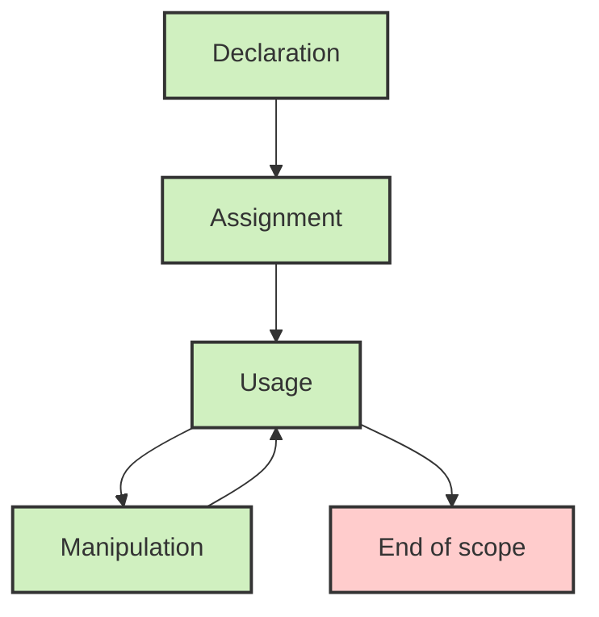

# Ubuntu Variables

Variables are fundamental building blocks in shell scripting that allow you to store, access, and manipulate data within your scripts. Understanding how variables work in Ubuntu shell scripts will help you create more dynamic and flexible scripts.

## Introduction to Variables

In Ubuntu shell scripting (which uses Bash by default), variables act as containers that hold information which can be referenced and manipulated throughout your script. Unlike some programming languages, Bash doesn't require you to declare variable types - all variables are essentially treated as strings, though they can be used in arithmetic operations when they contain numeric values.

## Variable Declaration and Assignment

Declaring a variable in Bash is straightforward:

```bash
name="John"
age=25
```

Important rules to remember:
- No spaces around the equals sign (`=`)
- Variable names can contain letters, numbers, and underscores
- Variable names cannot start with a number
- Variable names are case-sensitive

## Accessing Variable Values

To access a variable's value, prefix the variable name with a `$` symbol:

```bash
#!/bin/bash

# Declaring variables
name="Alice"
age=30

# Accessing variables
echo "Name: $name"
echo "Age: $age"
```

Output:
```
Name: Alice
Age: 30
```

You can also use curly braces `{}` to clearly define the variable name boundary:

```bash
greeting="Hello"
echo "${greeting}, world!"
```

Output:
```
Hello, world!
```

This is particularly useful when you need to append text directly to a variable:

```bash
animal="cat"
echo "I have a $animal"      # Works fine
echo "I have a ${animal}s"   # Uses braces to clarify we want "cats"
```

Output:
```
I have a cat
I have a cats
```

## Variable Types

### 1. User-Defined Variables

These are variables you create and assign values to:

```bash
filename="data.txt"
max_attempts=5
```

### 2. Environment Variables

These are variables set by the system that provide information about the environment:

```bash
echo "Home directory: $HOME"
echo "Current user: $USER"
echo "Shell path: $SHELL"
```

### 3. Special Variables

Bash provides special variables that have predefined meanings:

```bash
#!/bin/bash

echo "Script name: $0"
echo "First argument: $1"
echo "Second argument: $2"
echo "All arguments: $@"
echo "Number of arguments: $#"
echo "Process ID: $$"
echo "Exit status of last command: $?"
```

If you save this as `special_vars.sh` and run `./special_vars.sh hello world`:

Output:
```
Script name: ./special_vars.sh
First argument: hello
Second argument: world
All arguments: hello world
Number of arguments: 2
Process ID: 3542
Exit status of last command: 0
```

## Read-Only Variables

You can make variables read-only using the `readonly` command:

```bash
#!/bin/bash

readonly MAX_USERS=100
echo "Maximum users: $MAX_USERS"

# This will cause an error
MAX_USERS=200
```

Output:
```
Maximum users: 100
./readonly_demo.sh: line 6: MAX_USERS: readonly variable
```

## Command Substitution

You can assign the output of a command to a variable using command substitution:

```bash
current_date=$(date)
echo "Current date is: $current_date"

file_count=$(ls | wc -l)
echo "Number of files in current directory: $file_count"
```

Output:
```
Current date is: Thu Mar 13 10:15:23 EDT 2025
Number of files in current directory: 14
```

## Variable Scope

By default, variables in Bash scripts have global scope. To create a local variable, use the `local` keyword within a function:

```bash
#!/bin/bash

# Global variable
name="Global"

function demo_scope() {
    # Local variable
    local name="Local"
    echo "Inside function: $name"
}

echo "Before function call: $name"
demo_scope
echo "After function call: $name"
```

Output:
```
Before function call: Global
Inside function: Local
After function call: Global
```

## Array Variables

Bash supports array variables, which can hold multiple values:

```bash
#!/bin/bash

# Declare an array
fruits=("Apple" "Banana" "Cherry" "Date")

# Access specific element
echo "First fruit: ${fruits[0]}"

# Access all elements
echo "All fruits: ${fruits[@]}"

# Get array length
echo "Number of fruits: ${#fruits[@]}"

# Add element to array
fruits+=("Elderberry")
echo "Updated fruits: ${fruits[@]}"

# Remove element (this removes "Cherry" at index 2)
unset fruits[2]
echo "After removal: ${fruits[@]}"
```

Output:
```
First fruit: Apple
All fruits: Apple Banana Cherry Date
Number of fruits: 4
Updated fruits: Apple Banana Cherry Date Elderberry
After removal: Apple Banana Date Elderberry
```

## Practical Examples

### Example 1: Backup Script

```bash
#!/bin/bash

# Variables for backup configuration
source_dir="/home/user/documents"
backup_dir="/backup"
date_format=$(date +%Y-%m-%d)
backup_file="backup_${date_format}.tar.gz"

# Create backup
echo "Creating backup of $source_dir..."
tar -czf "${backup_dir}/${backup_file}" "$source_dir"

# Check if backup was successful
if [ $? -eq 0 ]; then
    echo "Backup created successfully: ${backup_dir}/${backup_file}"
    echo "Backup size: $(du -h ${backup_dir}/${backup_file} | cut -f1)"
else
    echo "Backup failed!"
fi
```

### Example 2: User Input and Processing

```bash
#!/bin/bash

# Prompt for user information
echo "Please enter your name:"
read name

echo "Please enter your age:"
read age

# Process information
current_year=$(date +%Y)
birth_year=$((current_year - age))

# Display results
echo "Hello, $name!"
echo "You were born around the year $birth_year."

if [ $age -lt 18 ]; then
    echo "You are a minor."
elif [ $age -ge 65 ]; then
    echo "You are eligible for senior benefits."
else
    echo "You are an adult."
fi
```

### Example 3: System Monitoring

```bash
#!/bin/bash

# Variables for thresholds
cpu_threshold=80
disk_threshold=90
mem_threshold=85

# Get system information
cpu_usage=$(top -bn1 | grep "Cpu(s)" | awk '{print $2 + $4}')
disk_usage=$(df -h / | awk 'NR==2 {print $5}' | tr -d '%')
mem_usage=$(free | grep Mem | awk '{print $3/$2 * 100}' | cut -d. -f1)

# Display information
echo "=== System Status ==="
echo "CPU Usage: ${cpu_usage}%"
echo "Disk Usage: ${disk_usage}%"
echo "Memory Usage: ${mem_usage}%"

# Check thresholds and alert if needed
alerts=0

if [ $cpu_usage -gt $cpu_threshold ]; then
    echo "WARNING: CPU usage is high!"
    alerts=$((alerts + 1))
fi

if [ $disk_usage -gt $disk_threshold ]; then
    echo "WARNING: Disk space is low!"
    alerts=$((alerts + 1))
fi

if [ $mem_usage -gt $mem_threshold ]; then
    echo "WARNING: Memory usage is high!"
    alerts=$((alerts + 1))
fi

if [ $alerts -eq 0 ]; then
    echo "All systems normal."
fi
```

## Variable Expansion and Manipulation

Bash provides powerful ways to manipulate variable values:

### Setting Default Values

```bash
#!/bin/bash

# Use a default value if variable is unset or empty
name=${1:-"Anonymous"}
echo "Hello, $name!"
```

If you run this script without arguments, it outputs:
```
Hello, Anonymous!
```

But if you provide an argument:
```
./script.sh John
```

Output:
```
Hello, John!
```

### String Length

```bash
text="Ubuntu Linux"
echo "Length of text: ${#text}"
```

Output:
```
Length of text: 12
```

### Substring Extraction

```bash
text="Ubuntu Linux"
echo "First 6 characters: ${text:0:6}"
echo "From position 7 onwards: ${text:7}"
```

Output:
```
First 6 characters: Ubuntu
From position 7 onwards: Linux
```

### String Replacement

```bash
sentence="The quick brown fox jumps over the lazy dog"
echo "${sentence/fox/cat}"  # Replace first occurrence
echo "${sentence//the/a}"   # Replace all occurrences (case-sensitive)
```

Output:
```
The quick brown cat jumps over the lazy dog
The quick brown fox jumps over a lazy dog
```

## Variable Best Practices

1. **Use meaningful names**: Choose descriptive variable names that indicate their purpose.

2. **Use uppercase for constants**: By convention, constants and environment variables are uppercase.
   ```bash
   MAX_ATTEMPTS=5
   ```

3. **Always quote variables** when using them to avoid issues with spaces and special characters:
   ```bash
   file_name="My Document.txt"
   # Good
   cat "$file_name"
   # Bad - will try to cat three different files: "My", "Document.txt"
   cat $file_name
   ```

4. **Validate input** before using it:
   ```bash
   if [[ -z "$input" ]]; then
       echo "Error: Input cannot be empty"
       exit 1
   fi
   ```

5. **Use local variables** within functions to avoid naming conflicts:
   ```bash
   function process_file() {
       local file_name="$1"
       # Function code here
   }
   ```

6. **Initialize variables** before using them to avoid unexpected behavior.

## Process Visualization

Let's visualize the variable lifecycle in a shell script:



## Summary

Variables in Ubuntu shell scripting provide a way to store and manipulate data within your scripts. Key points to remember:

- Variables don't require type declarations
- No spaces around the equals sign when assigning values
- Use `$` to access variable values, with optional curly braces `${}`
- Different types include user-defined, environment, and special variables
- Arrays can store multiple values
- Bash provides powerful variable expansion and manipulation features
- Following best practices helps write cleaner, more maintainable scripts

## Exercises

1. Create a script that takes a filename as input and displays information about the file (size, type, permissions).

2. Write a script that calculates the factorial of a number using variables.

3. Develop a menu-driven script that uses variables to keep track of user choices and perform different operations.

4. Create a script that finds all files larger than a specified size (provided as a variable) in a directory.

5. Write a script that uses environment variables to customize its behavior based on the user's environment.

## Additional Resources

- The Bash manual: Run `man bash` in your terminal
- [Bash Guide for Beginners](https://tldp.org/LDP/Bash-Beginners-Guide/html/index.html)
- [Advanced Bash-Scripting Guide](https://tldp.org/LDP/abs/html/index.html)
- `help` command in Bash: Try `help let` or `help set` for built-in commands