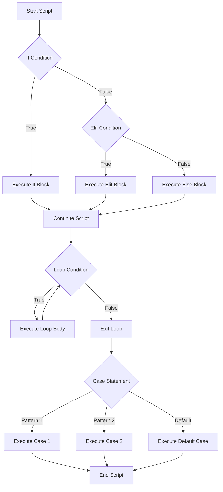

# Ubuntu Control Structures

## Introduction

Control structures are fundamental components of shell scripting that allow you to control the flow of execution in your scripts. In Ubuntu's bash shell, these structures enable you to make decisions, repeat actions, and select different paths based on conditions. Understanding control structures is essential for writing effective and dynamic shell scripts that can respond to different situations and inputs.

In this tutorial, we'll explore the main control structures available in Ubuntu shell scripting:

1. Conditional statements (if-else)
2. Loops (for, while, until)
3. Case statements
4. Logical operators

By the end of this tutorial, you'll be able to implement various control structures to create more powerful and flexible shell scripts.

## Conditional Statements

Conditional statements allow your script to make decisions based on whether certain conditions are true or false.

### If Statement

The basic syntax of an if statement is:

```bash
if [ condition ]
then
    # commands to execute if condition is true
fi
```

Let's create a simple example to check if a number is positive:

```bash
#!/bin/bash

echo "Enter a number:"
read number

if [ $number -gt 0 ]
then
    echo "$number is positive."
fi
```

Output (when entering 5):
```
Enter a number:
5
5 is positive.
```

### If-Else Statement

To execute commands when a condition is false, you can use an if-else statement:

```bash
if [ condition ]
then
    # commands to execute if condition is true
else
    # commands to execute if condition is false
fi
```

Let's expand our example:

```bash
#!/bin/bash

echo "Enter a number:"
read number

if [ $number -gt 0 ]
then
    echo "$number is positive."
else
    echo "$number is not positive."
fi
```

Output (when entering -3):
```
Enter a number:
-3
-3 is not positive.
```

### If-Elif-Else Statement

For multiple conditions, you can use elif (else if):

```bash
if [ condition1 ]
then
    # commands to execute if condition1 is true
elif [ condition2 ]
then
    # commands to execute if condition2 is true
else
    # commands to execute if all conditions are false
fi
```

Example to classify a number:

```bash
#!/bin/bash

echo "Enter a number:"
read number

if [ $number -gt 0 ]
then
    echo "$number is positive."
elif [ $number -lt 0 ]
then
    echo "$number is negative."
else
    echo "$number is zero."
fi
```

Output (when entering 0):
```
Enter a number:
0
0 is zero.
```

### Comparison Operators

Here are common comparison operators used in conditional expressions:

For numeric comparisons:
- `-eq`: Equal to
- `-ne`: Not equal to
- `-gt`: Greater than
- `-lt`: Less than
- `-ge`: Greater than or equal to
- `-le`: Less than or equal to

For string comparisons:
- `=`: Equal to
- `!=`: Not equal to
- `-z`: String is empty
- `-n`: String is not empty

For file tests:
- `-e`: File exists
- `-f`: Regular file exists
- `-d`: Directory exists
- `-r`: File is readable
- `-w`: File is writable
- `-x`: File is executable

Example of file test:

```bash
#!/bin/bash

echo "Enter a filename:"
read filename

if [ -f "$filename" ]
then
    echo "$filename exists and is a regular file."
elif [ -d "$filename" ]
then
    echo "$filename exists and is a directory."
else
    echo "$filename does not exist."
fi
```

Output (when entering an existing file):
```
Enter a filename:
test.txt
test.txt exists and is a regular file.
```

## Loops

Loops allow you to execute a block of code repeatedly. Ubuntu shell scripting provides three main types of loops.

### For Loop

The for loop iterates over a list of items:

```bash
for variable in list
do
    # commands to execute
done
```

Example to print numbers 1 to 5:

```bash
#!/bin/bash

for num in 1 2 3 4 5
do
    echo "Number: $num"
done
```

Output:
```
Number: 1
Number: 2
Number: 3
Number: 4
Number: 5
```

You can also use ranges with the seq command:

```bash
#!/bin/bash

for num in $(seq 1 5)
do
    echo "Number: $num"
done
```

For iterating over files, you can use wildcards:

```bash
#!/bin/bash

echo "Text files in current directory:"
for file in *.txt
do
    echo "- $file"
done
```

Output (with sample txt files):
```
Text files in current directory:
- document1.txt
- notes.txt
- readme.txt
```

### While Loop

The while loop executes as long as a condition is true:

```bash
while [ condition ]
do
    # commands to execute
done
```

Example of a countdown:

```bash
#!/bin/bash

counter=5

while [ $counter -gt 0 ]
do
    echo "Countdown: $counter"
    counter=$((counter - 1))
    sleep 1
done

echo "Blast off!"
```

Output:
```
Countdown: 5
Countdown: 4
Countdown: 3
Countdown: 2
Countdown: 1
Blast off!
```

### Until Loop

The until loop is the opposite of the while loop – it executes until a condition becomes true:

```bash
until [ condition ]
do
    # commands to execute
done
```

Example of the same countdown using until:

```bash
#!/bin/bash

counter=5

until [ $counter -eq 0 ]
do
    echo "Countdown: $counter"
    counter=$((counter - 1))
    sleep 1
done

echo "Blast off!"
```

Output:
```
Countdown: 5
Countdown: 4
Countdown: 3
Countdown: 2
Countdown: 1
Blast off!
```

### Loop Control Commands

You can use the following commands to control loops:

- `break`: Exit the loop immediately
- `continue`: Skip the rest of the current iteration and move to the next one

Example using break:

```bash
#!/bin/bash

for num in 1 2 3 4 5 6 7 8 9 10
do
    if [ $num -eq 6 ]
    then
        echo "Breaking at $num"
        break
    fi
    echo "Number: $num"
done
```

Output:
```
Number: 1
Number: 2
Number: 3
Number: 4
Number: 5
Breaking at 6
```

Example using continue:

```bash
#!/bin/bash

for num in 1 2 3 4 5
do
    if [ $num -eq 3 ]
    then
        echo "Skipping 3"
        continue
    fi
    echo "Number: $num"
done
```

Output:
```
Number: 1
Number: 2
Skipping 3
Number: 4
Number: 5
```

## Case Statements

The case statement is used when you want to match a variable against several values and execute different code based on which value it matches.

Basic syntax:

```bash
case variable in
    pattern1)
        # commands for pattern1
        ;;
    pattern2)
        # commands for pattern2
        ;;
    *)
        # default commands
        ;;
esac
```

Example of a simple menu system:

```bash
#!/bin/bash

echo "Choose an option:"
echo "1) View date"
echo "2) View current directory"
echo "3) View users logged in"
echo "q) Quit"

read choice

case $choice in
    1)
        date
        ;;
    2)
        pwd
        ;;
    3)
        who
        ;;
    q|Q)
        echo "Exiting..."
        ;;
    *)
        echo "Invalid option"
        ;;
esac
```

Output (when choosing option 1):
```
Choose an option:
1) View date
2) View current directory
3) View users logged in
q) Quit
1
Thu Mar 13 14:30:45 UTC 2025
```

Case statements are particularly useful for handling command-line arguments:

```bash
#!/bin/bash

# Script to manage a service

case $1 in
    start)
        echo "Starting service..."
        # Commands to start service
        ;;
    stop)
        echo "Stopping service..."
        # Commands to stop service
        ;;
    restart)
        echo "Restarting service..."
        # Commands to restart service
        ;;
    status)
        echo "Service status:"
        # Commands to check service status
        ;;
    *)
        echo "Usage: $0 {start|stop|restart|status}"
        ;;
esac
```

## Logical Operators

Logical operators allow you to combine multiple conditions:

- `&&`: AND operator (execute command if the previous command succeeds)
- `||`: OR operator (execute command if the previous command fails)
- `!`: NOT operator (negates a condition)

### AND Operator (&&)

```bash
#!/bin/bash

echo "Enter your age:"
read age

if [ $age -ge 18 ] && [ $age -le 65 ]
then
    echo "You are of working age."
fi
```

You can also write this as:

```bash
if [[ $age -ge 18 && $age -le 65 ]]
then
    echo "You are of working age."
fi
```

### OR Operator (||)

```bash
#!/bin/bash

echo "Enter the day (1-7, where 1 is Monday):"
read day

if [ $day -eq 6 ] || [ $day -eq 7 ]
then
    echo "It's the weekend!"
else
    echo "It's a weekday."
fi
```

### Combining Logical Operators

You can create complex conditions by combining operators:

```bash
#!/bin/bash

echo "Enter filename:"
read filename

if [ -f "$filename" ] && [ -r "$filename" ] && [ -w "$filename" ]
then
    echo "$filename exists, is readable, and is writable."
elif [ ! -e "$filename" ]
then
    echo "$filename does not exist."
else
    echo "$filename exists but doesn't have required permissions."
fi
```

## Practical Examples

### Example 1: System Backup Script

This script creates a backup of important directories and checks if the backup was successful.

```bash
#!/bin/bash

# Directories to backup
backup_dirs=("/home/user/documents" "/home/user/projects")
backup_dest="/backup"
timestamp=$(date +%Y%m%d_%H%M%S)
backup_file="backup_$timestamp.tar.gz"

# Check if backup destination exists
if [ ! -d "$backup_dest" ]
then
    echo "Creating backup directory $backup_dest..."
    mkdir -p "$backup_dest"
    
    if [ $? -ne 0 ]
    then
        echo "Error: Failed to create backup directory."
        exit 1
    fi
fi

# Create the backup
echo "Creating backup of ${backup_dirs[@]}..."
tar -czf "$backup_dest/$backup_file" "${backup_dirs[@]}" 2>/dev/null

# Check if backup was successful
if [ $? -eq 0 ] && [ -f "$backup_dest/$backup_file" ]
then
    echo "Backup successful: $backup_dest/$backup_file"
    echo "Backup size: $(du -h "$backup_dest/$backup_file" | cut -f1)"
else
    echo "Error: Backup failed."
    exit 1
fi
```

### Example 2: Monitoring Script

This script monitors CPU usage and sends alerts if it exceeds a threshold.

```bash
#!/bin/bash

threshold=80
check_interval=5
alert_count=0

while true
do
    cpu_usage=$(top -bn1 | grep "Cpu(s)" | awk '{print $2}' | cut -d. -f1)
    
    echo "Current CPU usage: $cpu_usage%"
    
    if [ $cpu_usage -gt $threshold ]
    then
        alert_count=$((alert_count + 1))
        echo "ALERT: High CPU usage detected: $cpu_usage%"
        
        # If high usage persists for 3 checks, take action
        if [ $alert_count -ge 3 ]
        then
            echo "Critical: CPU usage has been high for $((alert_count * check_interval)) seconds."
            # Here you could add code to send an email or perform other actions
            
            # Reset the counter after taking action
            alert_count=0
        fi
    else
        # Reset alert count if CPU usage goes back to normal
        if [ $alert_count -gt 0 ]
        then
            echo "CPU usage has returned to normal levels."
            alert_count=0
        fi
    fi
    
    sleep $check_interval
done
```

### Example 3: File Processing Script

This script processes all text files in a directory using case statement to handle different file types.

```bash
#!/bin/bash

process_dir="./documents"

# Check if directory exists
if [ ! -d "$process_dir" ]
then
    echo "Error: Directory $process_dir does not exist."
    exit 1
fi

# Process each file
for file in "$process_dir"/*
do
    # Skip if not a file
    if [ ! -f "$file" ]
    then
        continue
    fi
    
    # Get file extension
    filename=$(basename "$file")
    extension="${filename##*.}"
    
    case "$extension" in
        txt)
            echo "Processing text file: $filename"
            # Example: count words
            wc -w "$file"
            ;;
        csv)
            echo "Processing CSV file: $filename"
            # Example: count lines and show header
            lines=$(wc -l < "$file")
            echo "Total lines: $lines"
            head -n 1 "$file"
            ;;
        log)
            echo "Processing log file: $filename"
            # Example: show last 5 errors
            grep "ERROR" "$file" | tail -n 5
            ;;
        *)
            echo "Skipping unsupported file type: $filename"
            ;;
    esac
done
```

## Control Flow Visualization

Here's a visual representation of control structures in shell scripts:



## Summary

Control structures in Ubuntu shell scripting provide powerful tools to control program flow and make your scripts more dynamic:

- **Conditional statements** (if, elif, else) allow your script to make decisions based on conditions.
- **Loops** (for, while, until) let you repeat actions efficiently.
- **Case statements** provide a clean way to handle multiple possible values of a variable.
- **Logical operators** (&&, ||, !) allow you to create complex conditions.

By mastering these control structures, you can write shell scripts that can handle various situations, process data effectively, and automate complex tasks in Ubuntu.

## Exercises

To reinforce your learning, try these exercises:

1. Write a script that checks if a file exists, and if not, creates it.
2. Create a script that asks for a number and then prints that many lines from a log file.
3. Write a script that monitors disk space and alerts when usage exceeds 90%.
4. Create a menu-driven script that provides different system maintenance options.
5. Write a script that processes a list of servers, checking if each one is online and collecting basic system information.

## Additional Resources

- The GNU Bash Reference Manual: [https://www.gnu.org/software/bash/manual/bash.html](https://www.gnu.org/software/bash/manual/bash.html)
- Advanced Bash-Scripting Guide: [https://tldp.org/LDP/abs/html/](https://tldp.org/LDP/abs/html/)
- Linux Command Line Cheat Sheet: [https://cheatography.com/davechild/cheat-sheets/linux-command-line/](https://cheatography.com/davechild/cheat-sheets/linux-command-line/)