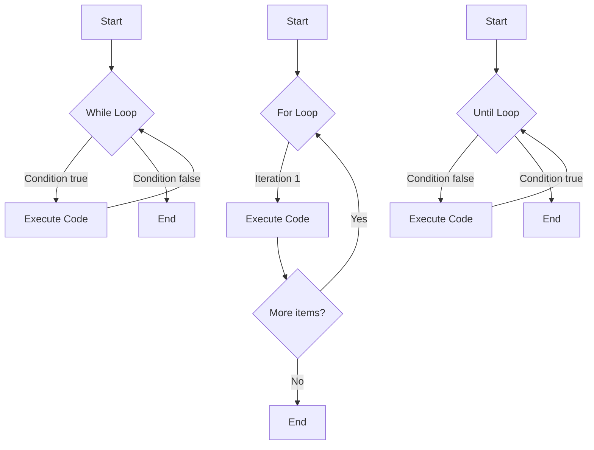

# Ubuntu Loops

## Introduction

Loops are fundamental programming constructs that allow you to execute a block of code repeatedly. In Ubuntu shell scripting, loops are powerful tools that help automate repetitive tasks, process multiple files, iterate through data sets, and create efficient scripts that save time and reduce errors.

This guide will explore the different types of loops available in Ubuntu shell scripting (which uses Bash as the default shell), explain their syntax, and demonstrate practical applications through examples. By the end, you'll be comfortable implementing loops in your own shell scripts.

## Types of Loops in Bash

Ubuntu shell scripting supports four main types of loops:

1. `for` loops
2. `while` loops
3. `until` loops
4. `select` loops

Let's explore each type in detail.

## For Loops

The `for` loop iterates through a list of values, executing commands once for each item in the list.

### Basic Syntax

```bash
for variable in list
do
    # commands to execute
done
```

### Example 1: Simple For Loop

```bash
#!/bin/bash
# A simple for loop that prints numbers from 1 to 5

for num in 1 2 3 4 5
do
    echo "Number: $num"
done
```

**Output:**
```
Number: 1
Number: 2
Number: 3
Number: 4
Number: 5
```

### Example 2: Using Range with For Loop

You can use brace expansion to create ranges:

```bash
#!/bin/bash
# Using range with for loop

echo "Counting from 1 to 5:"
for num in {1..5}
do
    echo "Number: $num"
done

echo "Counting from 10 to 50 by 10s:"
for num in {10..50..10}
do
    echo "Number: $num"
done
```

**Output:**
```
Counting from 1 to 5:
Number: 1
Number: 2
Number: 3
Number: 4
Number: 5
Counting from 10 to 50 by 10s:
Number: 10
Number: 20
Number: 30
Number: 40
Number: 50
```

### Example 3: Iterating Over Files

```bash
#!/bin/bash
# Iterating over files in current directory

echo "Text files in current directory:"
for file in *.txt
do
    echo "Found file: $file"
done
```

**Output (assuming there are text files in the directory):**
```
Text files in current directory:
Found file: document1.txt
Found file: notes.txt
Found file: report.txt
```

### C-style For Loop

Bash also supports C-style for loops:

```bash
#!/bin/bash
# C-style for loop

for ((i=1; i<=5; i++))
do
    echo "Iteration number $i"
done
```

**Output:**
```
Iteration number 1
Iteration number 2
Iteration number 3
Iteration number 4
Iteration number 5
```

## While Loops

The `while` loop executes a block of code as long as a specified condition is true.

### Basic Syntax

```bash
while [ condition ]
do
    # commands to execute
done
```

### Example 1: Basic While Loop

```bash
#!/bin/bash
# A simple while loop that counts from 1 to 5

count=1
while [ $count -le 5 ]
do
    echo "Count: $count"
    count=$((count + 1))
done
```

**Output:**
```
Count: 1
Count: 2
Count: 3
Count: 4
Count: 5
```

### Example 2: Reading File Line by Line

```bash
#!/bin/bash
# Reading a file line by line using while loop

# Create a sample file
echo "Line 1: Hello" > sample.txt
echo "Line 2: World" >> sample.txt
echo "Line 3: Ubuntu" >> sample.txt

echo "Contents of sample.txt:"
while read line
do
    echo "  $line"
done < sample.txt

# Clean up
rm sample.txt
```

**Output:**
```
Contents of sample.txt:
  Line 1: Hello
  Line 2: World
  Line 3: Ubuntu
```

### Example 3: Infinite Loop with Break

Sometimes you need an infinite loop that you can break out of conditionally:

```bash
#!/bin/bash
# Infinite loop with break condition

count=1
while true
do
    echo "Count: $count"
    if [ $count -eq 5 ]
    then
        echo "Breaking the loop!"
        break
    fi
    count=$((count + 1))
done
```

**Output:**
```
Count: 1
Count: 2
Count: 3
Count: 4
Count: 5
Breaking the loop!
```

## Until Loops

The `until` loop is similar to the `while` loop, but it executes a block of code as long as a condition is false. It stops when the condition becomes true.

### Basic Syntax

```bash
until [ condition ]
do
    # commands to execute
done
```

### Example: Basic Until Loop

```bash
#!/bin/bash
# A simple until loop that counts from 1 to 5

count=1
until [ $count -gt 5 ]
do
    echo "Count: $count"
    count=$((count + 1))
done
```

**Output:**
```
Count: 1
Count: 2
Count: 3
Count: 4
Count: 5
```

## Select Loops

The `select` loop is used to create simple menus, allowing users to make choices from a list of options.

### Basic Syntax

```bash
select variable in list
do
    # commands to execute
done
```

### Example: Creating a Simple Menu

```bash
#!/bin/bash
# Creating a simple menu with select loop

echo "Please select an option:"
select option in "List files" "Show date" "Check disk space" "Exit"
do
    case $option in
        "List files")
            echo "Files in current directory:"
            ls
            ;;
        "Show date")
            echo "Current date and time:"
            date
            ;;
        "Check disk space")
            echo "Disk space usage:"
            df -h
            ;;
        "Exit")
            echo "Goodbye!"
            break
            ;;
        *)
            echo "Invalid option"
            ;;
    esac
    echo
    echo "Please select an option:"
done
```

**Output (interactive, depends on user selection):**
```
Please select an option:
1) List files
2) Show date
3) Check disk space
4) Exit
#? 2
Current date and time:
Thu Mar 13 10:30:45 UTC 2025

Please select an option:
#? 4
Goodbye!
```

## Loop Control Statements

There are three loop control statements that can be used within loops:

1. `break` - Exits the loop immediately
2. `continue` - Skips the rest of the current iteration and moves to the next
3. `exit` - Terminates the entire script

### Example: Using Continue and Break

```bash
#!/bin/bash
# Demonstrating continue and break

for num in {1..10}
do
    # Skip even numbers
    if [ $((num % 2)) -eq 0 ]
    then
        echo "Skipping $num (continue)"
        continue
    fi
    
    echo "Processing number: $num"
    
    # Break when we reach 7
    if [ $num -eq 7 ]
    then
        echo "Reached 7, breaking out of loop"
        break
    fi
done
```

**Output:**
```
Processing number: 1
Skipping 2 (continue)
Processing number: 3
Skipping 4 (continue)
Processing number: 5
Skipping 6 (continue)
Processing number: 7
Reached 7, breaking out of loop
```

## Nested Loops

You can place one loop inside another to create nested loops. This is useful for working with multi-dimensional data or when you need to perform complex iterations.

### Example: Nested Loops

```bash
#!/bin/bash
# Demonstration of nested loops

echo "Multiplication table (1-3):"
for i in {1..3}
do
    for j in {1..3}
    do
        result=$((i * j))
        echo -n "$i × $j = $result   "
    done
    echo # New line after each row
done
```

**Output:**
```
Multiplication table (1-3):
1 × 1 = 1   1 × 2 = 2   1 × 3 = 3   
2 × 1 = 2   2 × 2 = 4   2 × 3 = 6   
3 × 1 = 3   3 × 2 = 6   3 × 3 = 9   
```

## Practical Examples

Let's look at some practical uses of loops in real-world Ubuntu shell scripting scenarios.

### Example 1: Batch File Processing

```bash
#!/bin/bash
# Batch process text files - convert to uppercase

# Create sample files
echo "hello world" > file1.txt
echo "ubuntu loops" > file2.txt
echo "shell scripting" > file3.txt

echo "Processing files..."

for file in file*.txt
do
    echo "Converting $file to uppercase"
    # Use tr command to convert content to uppercase
    tr '[:lower:]' '[:upper:]' < "$file" > "${file%.txt}_upper.txt"
done

echo "Original files:"
cat file*.txt

echo -e "
Converted files:"
cat *_upper.txt

# Clean up
rm file*.txt *_upper.txt
```

**Output:**
```
Processing files...
Converting file1.txt to uppercase
Converting file2.txt to uppercase
Converting file3.txt to uppercase
Original files:
hello world
ubuntu loops
shell scripting

Converted files:
HELLO WORLD
UBUNTU LOOPS
SHELL SCRIPTING
```

### Example 2: System Monitoring Script

```bash
#!/bin/bash
# Simple system monitoring script

echo "System Monitoring Starting..."
echo "Press Ctrl+C to stop"

count=1
while true
do
    echo -e "
Check #$count - $(date)"
    echo "----------------------------"
    
    echo "CPU Usage:"
    top -bn1 | head -3
    
    echo "Memory Usage:"
    free -m | head -2
    
    echo "Disk Usage:"
    df -h | head -1
    df -h | grep "/dev/sd"
    
    count=$((count + 1))
    sleep 5  # Wait for 5 seconds before next iteration
done
```

**Output (will vary based on your system):**
```
System Monitoring Starting...
Press Ctrl+C to stop

Check #1 - Thu Mar 13 10:35:22 UTC 2025
----------------------------
CPU Usage:
top - 10:35:22 up  3:45,  1 user,  load average: 0.15, 0.10, 0.09
Tasks: 123 total,   1 running, 122 sleeping,   0 stopped,   0 zombie
%Cpu(s):  2.3 us,  1.1 sy,  0.0 ni, 96.4 id,  0.2 wa,  0.0 hi,  0.0 si,  0.0 st
Memory Usage:
               total        used        free      shared  buff/cache   available
Mem:           7.7Gi       1.2Gi       5.1Gi        78Mi       1.4Gi       6.2Gi
Disk Usage:
Filesystem      Size  Used Avail Use% Mounted on
/dev/sda1        98G   28G   65G  30% /

Check #2 - Thu Mar 13 10:35:27 UTC 2025
...
```

### Example 3: User Account Automation

```bash
#!/bin/bash
# Create multiple user accounts from a list

# Create a sample user list file
cat > users.txt << EOL
john:John Smith:Accounting
jane:Jane Doe:HR
mike:Mike Johnson:IT
EOL

echo "Creating users from list..."

while IFS=: read -r username fullname department
do
    echo "Processing user: $username"
    echo "  Full Name: $fullname"
    echo "  Department: $department"
    
    # In a real system, you would use the following command to create users
    # Note: This requires root privileges
    # useradd -c "$fullname, $department" -m $username
    
    # Since we're just demonstrating, we'll simulate it
    echo "  Command that would run: useradd -c \"$fullname, $department\" -m $username"
    echo "  User would be created: /home/$username"
    echo "---"
done < users.txt

# Clean up
rm users.txt
```

**Output:**
```
Creating users from list...
Processing user: john
  Full Name: John Smith
  Department: Accounting
  Command that would run: useradd -c "John Smith, Accounting" -m john
  User would be created: /home/john
---
Processing user: jane
  Full Name: Jane Doe
  Department: HR
  Command that would run: useradd -c "Jane Doe, HR" -m jane
  User would be created: /home/jane
---
Processing user: mike
  Full Name: Mike Johnson
  Department: IT
  Command that would run: useradd -c "Mike Johnson, IT" -m mike
  User would be created: /home/mike
---
```

## Loop Visualization

Here's a visualization of how different loops work:



## Best Practices for Loops

1. **Always initialize variables** before using them in loops
2. **Use meaningful variable names** to make your scripts more readable
3. **Indent your code** consistently to improve readability
4. **Add comments** to explain complex loops
5. **Test loop conditions** carefully to avoid infinite loops
6. **Use the appropriate loop type** for your specific task:
   - Use `for` when you know exactly how many times to iterate
   - Use `while` when you need to loop until a condition changes
   - Use `until` when you need to loop until a goal is reached
   - Use `select` when you need user input from a menu
7. **Consider performance** for large datasets or long-running loops
8. **Use loop control statements** (`break` and `continue`) judiciously

## Summary

Loops are essential constructs in Ubuntu shell scripting that allow you to automate repetitive tasks efficiently. In this guide, we've covered:

- Four main types of loops: `for`, `while`, `until`, and `select`
- Loop control statements: `break`, `continue`, and `exit`
- Nested loops for complex iterations
- Practical examples demonstrating real-world applications

By mastering loops, you'll be able to write more efficient and powerful shell scripts to automate tasks on your Ubuntu system.

## Exercises

To reinforce your learning, try these exercises:

1. Write a script that counts the number of files in each subdirectory of the current directory using a loop.
2. Create a backup script that uses a loop to back up all `.txt` files in a directory by adding a timestamp to the filename.
3. Write a menu-driven script using `select` that offers options to check system information (CPU, memory, disk space, etc.).
4. Create a script that downloads files from a list of URLs using a loop.
5. Write a loop that finds and displays all files larger than a specified size.

## Additional Resources

To deepen your understanding of Ubuntu shell scripting loops, check out these resources:

- The Bash manual: `man bash`
- The Bash Guide: Run `info bash` in your terminal
- GNU Bash documentation online
- Advanced Bash-Scripting Guide
- Ubuntu community tutorials and forums

Remember, the best way to learn is by practicing. Start writing your own scripts using loops, and don't be afraid to experiment!