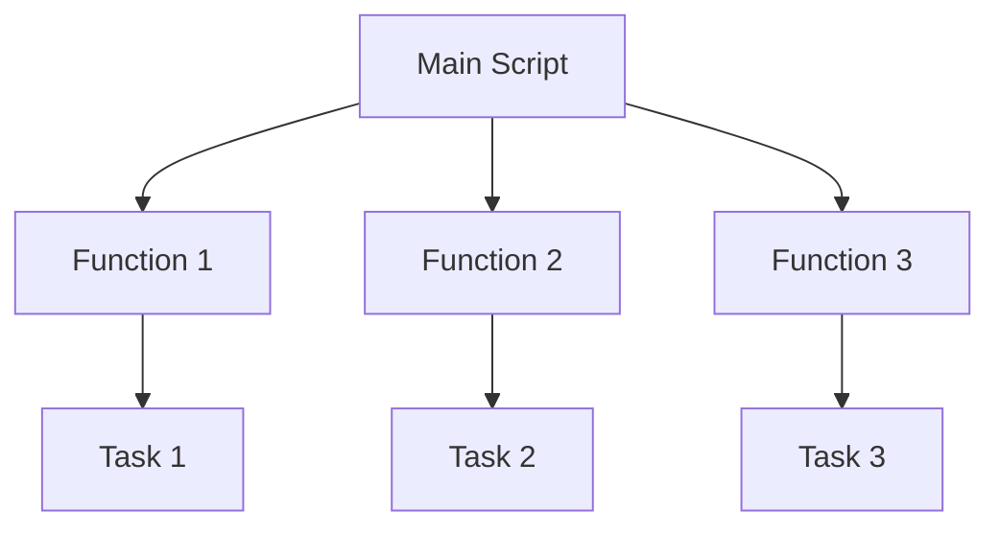

# Ubuntu Functions

Functions are one of the most powerful features in shell scripting. They allow you to organize your code into reusable blocks, making your scripts more modular, readable, and maintainable.

## What Are Shell Functions?

A function in shell scripting is a block of code that performs a specific task and can be reused throughout your script. Think of functions as mini-scripts within your main script.



## Defining Functions in Ubuntu Shell

There are two common ways to define functions in Ubuntu shell scripts:

### Method 1: Using the `function` keyword

```bash
function function_name {
    # Commands go here
    echo "Function executed!"
}
```

### Method 2: Using the standard POSIX syntax

```bash
function_name() {
    # Commands go here
    echo "Function executed!"
}
```

Both methods work in Ubuntu, but the second method (POSIX syntax) is more portable across different shells.

## Calling Functions

To call (execute) a function, simply use its name:

```bash
# Define the function
say_hello() {
    echo "Hello, world!"
}

# Call the function
say_hello
```

**Output:**
```
Hello, world!
```

## Function Parameters

You can pass arguments to functions just like you pass arguments to scripts:

```bash
greet() {
    echo "Hello, $1! Nice to meet you."
}

# Call with an argument
greet "John"
```

**Output:**
```
Hello, John! Nice to meet you.
```

Inside the function, parameters are accessed using positional parameters:
- `$1`, `$2`, `$3`, etc. for individual parameters
- `$@` for all parameters as separate strings
- `$*` for all parameters as a single string
- `$#` for the number of parameters

Here's a more complex example:

```bash
process_arguments() {
    echo "Total arguments: $#"
    echo "All arguments: $@"
    echo "First argument: $1"
    echo "Second argument: $2"
}

process_arguments apple banana orange
```

**Output:**
```
Total arguments: 3
All arguments: apple banana orange
First argument: apple
Second argument: banana
```

## Return Values

Unlike functions in many programming languages, shell functions don't return values directly. Instead, they:

1. Use the `return` command to return an exit status (a number from 0 to 255)
2. Output values using `echo` or `printf` which can be captured

### Example using return status:

```bash
is_even() {
    if [ $(($1 % 2)) -eq 0 ]; then
        return 0  # Success (true)
    else
        return 1  # Failure (false)
    fi
}

# Testing the function
number=42
if is_even $number; then
    echo "$number is even"
else
    echo "$number is odd"
fi
```

**Output:**
```
42 is even
```

### Example using echo to return a value:

```bash
get_square() {
    echo $(($1 * $1))
}

# Capture the output
result=$(get_square 5)
echo "The square of 5 is $result"
```

**Output:**
```
The square of 5 is 25
```

## Local Variables

By default, variables in shell scripts are global. However, you can create local variables within functions using the `local` keyword:

```bash
demonstrate_scope() {
    local local_var="I am local"
    global_var="I am global"
    echo "Inside function: local_var = $local_var"
    echo "Inside function: global_var = $global_var"
}

# Call the function
demonstrate_scope
echo "Outside function: global_var = $global_var"
echo "Outside function: local_var = $local_var"
```

**Output:**
```
Inside function: local_var = I am local
Inside function: global_var = I am global
Outside function: global_var = I am global
Outside function: local_var = 
```

Notice how `local_var` is not accessible outside the function.

## Practical Examples

### Example 1: Log Function

A reusable logging function for your scripts:

```bash
#!/bin/bash

log() {
    local timestamp=$(date +"%Y-%m-%d %H:%M:%S")
    local message="$1"
    local level="${2:-INFO}"
    
    echo "[$timestamp] [$level] $message"
}

# Usage examples
log "Script started"
log "Warning! Disk space is low" "WARNING"
log "Error occurred during processing" "ERROR"
```

**Output:**
```
[2023-09-14 15:23:45] [INFO] Script started
[2023-09-14 15:23:45] [WARNING] Warning! Disk space is low
[2023-09-14 15:23:45] [ERROR] Error occurred during processing
```

### Example 2: Backup Function

A function to backup files:

```bash
#!/bin/bash

backup_file() {
    local file="$1"
    local backup_dir="${2:-./backups}"
    
    # Create backup directory if it doesn't exist
    if [ ! -d "$backup_dir" ]; then
        mkdir -p "$backup_dir"
    fi
    
    # Generate a backup filename with timestamp
    local timestamp=$(date +"%Y%m%d-%H%M%S")
    local backup_file="$backup_dir/$(basename "$file").$timestamp.bak"
    
    # Copy the file
    cp "$file" "$backup_file"
    
    if [ $? -eq 0 ]; then
        echo "Backup created: $backup_file"
        return 0
    else
        echo "Failed to create backup of $file"
        return 1
    fi
}

# Usage
backup_file "/path/to/important.txt"
backup_file "/path/to/config.ini" "/var/backups"
```

### Example 3: System Information Function

A function to display system information:

```bash
#!/bin/bash

show_system_info() {
    echo "=== System Information ==="
    echo "Hostname: $(hostname)"
    echo "Kernel: $(uname -r)"
    echo "CPU: $(grep "model name" /proc/cpuinfo | head -n1 | cut -d ":" -f2 | sed 's/^[ \t]*//')"
    echo "Memory: $(free -h | grep Mem | awk '{print $2}')"
    echo "Disk Usage: $(df -h / | tail -n1 | awk '{print $5}')"
    echo "System Uptime: $(uptime -p)"
    echo "=========================="
}

# Usage
show_system_info
```

**Output:**
```
=== System Information ===
Hostname: ubuntu-server
Kernel: 5.15.0-52-generic
CPU: Intel(R) Core(TM) i7-9700K CPU @ 3.60GHz
Memory: 16Gi
Disk Usage: 45%
System Uptime: up 3 days, 7 hours, 15 minutes
==========================
```

## Advanced Function Techniques

### Recursive Functions

Functions can call themselves (recursion):

```bash
factorial() {
    if [ $1 -le 1 ]; then
        echo 1
    else
        local sub_factorial=$(factorial $(($1 - 1)))
        echo $(($1 * sub_factorial))
    fi
}

echo "Factorial of 5: $(factorial 5)"
```

**Output:**
```
Factorial of 5: 120
```

### Function Libraries

You can create a library of functions in a separate file and source it in your scripts:

**functions.sh:**
```bash
#!/bin/bash

# Function library

# Print text in color
print_color() {
    local color_code=""
    case "$1" in
        "red") color_code="31" ;;
        "green") color_code="32" ;;
        "yellow") color_code="33" ;;
        "blue") color_code="34" ;;
        *) color_code="0" ;;
    esac
    
    echo -e "\e[${color_code}m$2\e[0m"
}

# Check if a command exists
command_exists() {
    command -v "$1" >/dev/null 2>&1
}
```

**main_script.sh:**
```bash
#!/bin/bash

# Source the function library
source ./functions.sh

# Use the functions
print_color "green" "Success! Everything is working."

if command_exists "docker"; then
    print_color "blue" "Docker is installed!"
else
    print_color "red" "Docker is not installed!"
fi
```

## Best Practices for Shell Functions

1. **Use descriptive names**: Choose function names that clearly describe what the function does.

2. **Keep functions focused**: Each function should perform a single task.

3. **Document your functions**: Add comments explaining what each function does, what parameters it expects, and what it returns.

4. **Use local variables**: Use the `local` keyword for variables that should be confined to the function.

5. **Check for required parameters**: Validate that all required parameters are provided.

   ```bash
   process_file() {
       if [ -z "$1" ]; then
           echo "Error: Filename is required"
           return 1
       fi
       
       # Process the file...
   }
   ```

6. **Handle errors**: Return appropriate exit codes and provide error messages.

7. **Test your functions**: Write tests to ensure your functions work as expected.

## Summary

Functions are essential building blocks for writing maintainable shell scripts in Ubuntu. They allow you to:

- Organize your code into reusable blocks
- Reduce redundancy
- Improve readability
- Create modular scripts

By mastering functions, you'll be able to write more powerful, flexible, and maintainable shell scripts for your Ubuntu system.

## Exercises

1. Create a function that checks if a given number is prime.
2. Write a function that converts temperatures between Celsius and Fahrenheit.
3. Create a function library with utilities for file operations (copy, move, delete with logging).
4. Write a function that monitors system resources and sends alerts if usage exceeds thresholds.
5. Create a menu system using functions for a system administration script.

## Additional Resources

- The Bash man page (`man bash`) - See the "FUNCTIONS" section
- The [Advanced Bash-Scripting Guide](https://tldp.org/LDP/abs/html/functions.html)
- Ubuntu Community Help Wiki on Shell Scripting