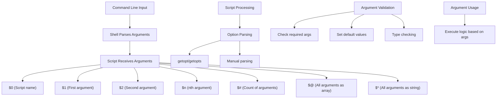

# Ubuntu Script Arguments

## Introduction

When writing shell scripts in Ubuntu, one of the most powerful features is the ability to accept and process command-line arguments. These arguments allow users to provide input to scripts, making them more flexible and reusable. Rather than hardcoding values into your scripts, arguments enable you to create general-purpose tools that can work with different inputs each time they're executed.

In this tutorial, we'll explore how to work with script arguments in Ubuntu shell scripting, from basic usage to more advanced techniques.

## Basic Script Arguments

In shell scripts, command-line arguments are accessible through special variables. The most common ones are:

- `$0` - The name of the script itself
- `$1`, `$2`, `$3`, etc. - The first, second, third, etc. arguments
- `$#` - The number of arguments passed to the script
- `$@` - All arguments passed to the script (as separate strings)
- `$*` - All arguments passed to the script (as a single string)

Let's create a simple example to demonstrate:

```bash
#!/bin/bash

echo "Script name: $0"
echo "First argument: $1"
echo "Second argument: $2"
echo "Number of arguments: $#"
echo "All arguments: $@"
```

Save this script as `args_demo.sh`, make it executable with `chmod +x args_demo.sh`, and run it with different arguments:

```bash
$ ./args_demo.sh hello world
Script name: ./args_demo.sh
First argument: hello
Second argument: world
Number of arguments: 2
All arguments: hello world
```

## Checking for Required Arguments

A common need is to verify that the user has provided the necessary arguments before proceeding with script execution:

```bash
#!/bin/bash

# Check if at least one argument is provided
if [ $# -eq 0 ]; then
    echo "Error: No arguments provided"
    echo "Usage: $0 <filename>"
    exit 1
fi

echo "You provided the filename: $1"
# Script continues here...
```

This script will exit with an error message if no arguments are provided:

```bash
$ ./check_args.sh
Error: No arguments provided
Usage: ./check_args.sh <filename>

$ ./check_args.sh data.txt
You provided the filename: data.txt
```

## Looping Through Arguments

You can process all arguments using a loop:

```bash
#!/bin/bash

echo "Processing all arguments:"

# Loop through all arguments
for arg in "$@"; do
    echo "- Processing: $arg"
    # Do something with each argument
done
```

Example output:

```bash
$ ./process_args.sh file1.txt file2.txt file3.txt
Processing all arguments:
- Processing: file1.txt
- Processing: file2.txt
- Processing: file3.txt
```

## Shift Command

The `shift` command is useful when processing arguments one by one, as it shifts the position of arguments to the left:

```bash
#!/bin/bash

echo "Original arguments: $@"
echo "First argument: $1"

# Shift the arguments
shift

echo "After shift: $@"
echo "New first argument: $1"
```

Running this script:

```bash
$ ./shift_demo.sh a b c
Original arguments: a b c
First argument: a
After shift: b c
New first argument: b
```

You can also use `shift` with a number to skip multiple arguments:

```bash
#!/bin/bash

echo "Original arguments: $@"
echo "First two arguments: $1 $2"

# Shift by 2
shift 2

echo "After shift 2: $@"
echo "New first argument: $1"
```

Output:

```bash
$ ./shift_by_n.sh a b c d
Original arguments: a b c d
First two arguments: a b
After shift 2: c d
New first argument: c
```

## Working with Flags and Options

For more complex scripts, you might want to support flags or options (arguments that start with a dash). Here's a simple example using a case statement:

```bash
#!/bin/bash

# Default values
verbose=false
output_file="output.txt"

# Process options
while [[ $# -gt 0 ]]; do
    case $1 in
        -v|--verbose)
            verbose=true
            shift
            ;;
        -o|--output)
            output_file="$2"
            shift 2
            ;;
        -h|--help)
            echo "Usage: $0 [-v|--verbose] [-o|--output file] [files...]"
            exit 0
            ;;
        -*) # Unknown option
            echo "Unknown option: $1"
            exit 1
            ;;
        *) # Regular arguments (not options)
            break
            ;;
    esac
done

# Print settings
echo "Verbose mode: $verbose"
echo "Output file: $output_file"
echo "Remaining arguments: $@"
```

Example usage:

```bash
$ ./options_demo.sh --verbose -o results.log file1.txt file2.txt
Verbose mode: true
Output file: results.log
Remaining arguments: file1.txt file2.txt
```

## Using getopts for Option Parsing

For more standardized option handling, Bash provides the `getopts` built-in command:

```bash
#!/bin/bash

# Initialize variables
verbose=false
output_file="output.txt"

# Define usage function
usage() {
    echo "Usage: $0 [-v] [-o file] [files...]"
    echo "  -v: Enable verbose mode"
    echo "  -o file: Specify output file"
    exit 1
}

# Parse options
while getopts ":vo:h" opt; do
    case $opt in
        v)
            verbose=true
            ;;
        o)
            output_file="$OPTARG"
            ;;
        h)
            usage
            ;;
        \?)
            echo "Invalid option: -$OPTARG"
            usage
            ;;
        :)
            echo "Option -$OPTARG requires an argument."
            usage
            ;;
    esac
done

# Shift to remove processed options
shift $((OPTIND-1))

# Print settings
echo "Verbose mode: $verbose"
echo "Output file: $output_file"
echo "Remaining arguments: $@"
```

This script can be used as follows:

```bash
$ ./getopts_demo.sh -v -o data.out file1.txt file2.txt
Verbose mode: true
Output file: data.out
Remaining arguments: file1.txt file2.txt
```

## Default Values for Arguments

You can provide default values for optional arguments:

```bash
#!/bin/bash

# First argument with default value
name=${1:-"World"}

echo "Hello, $name!"
```

Running this script:

```bash
$ ./default_args.sh
Hello, World!

$ ./default_args.sh Alice
Hello, Alice!
```

## Special Argument Handling: `$*` vs `$@`

The difference between `$*` and `$@` becomes important when the arguments contain spaces:

```bash
#!/bin/bash

echo "Using \$*:"
for arg in $*; do
    echo "- Arg: $arg"
done

echo -e "
Using \"\$*\":"
for arg in "$*"; do
    echo "- Arg: $arg"
done

echo -e "
Using \$@:"
for arg in $@; do
    echo "- Arg: $arg"
done

echo -e "
Using \"\$@\":"
for arg in "$@"; do
    echo "- Arg: $arg"
done
```

When run with arguments containing spaces:

```bash
$ ./star_vs_at.sh "hello world" "another argument"
Using $*:
- Arg: hello
- Arg: world
- Arg: another
- Arg: argument

Using "$*":
- Arg: hello world another argument

Using $@:
- Arg: hello
- Arg: world
- Arg: another
- Arg: argument

Using "$@":
- Arg: hello world
- Arg: another argument
```

Notice that only `"$@"` correctly preserves the original argument structure!

## Real-World Example: Backup Script

Let's create a practical backup script that uses arguments for flexibility:

```bash
#!/bin/bash

# Default values
backup_dir="/tmp/backup"
compress=false

# Display usage information
function show_usage {
    echo "Usage: $0 [-d backup_dir] [-c] source_dir"
    echo "  -d backup_dir: Directory to store backups (default: /tmp/backup)"
    echo "  -c: Compress the backup"
    echo "  source_dir: Directory to backup"
    exit 1
}

# Process options
while getopts ":d:ch" opt; do
    case $opt in
        d)
            backup_dir="$OPTARG"
            ;;
        c)
            compress=true
            ;;
        h)
            show_usage
            ;;
        \?)
            echo "Invalid option: -$OPTARG"
            show_usage
            ;;
        :)
            echo "Option -$OPTARG requires an argument."
            show_usage
            ;;
    esac
done

# Shift to remaining arguments
shift $((OPTIND-1))

# Check if source directory is provided
if [ $# -eq 0 ]; then
    echo "Error: No source directory specified"
    show_usage
fi

source_dir="$1"

# Check if source directory exists
if [ ! -d "$source_dir" ]; then
    echo "Error: Source directory '$source_dir' does not exist"
    exit 1
fi

# Create backup directory if it doesn't exist
mkdir -p "$backup_dir"

# Generate backup filename with timestamp
timestamp=$(date +%Y%m%d-%H%M%S)
backup_file="$backup_dir/backup-$timestamp"

echo "Backing up $source_dir to $backup_file"

if [ "$compress" = true ]; then
    # Create compressed tar archive
    tar -czf "$backup_file.tar.gz" -C "$(dirname "$source_dir")" "$(basename "$source_dir")"
    echo "Compressed backup created: $backup_file.tar.gz"
else
    # Create uncompressed tar archive
    tar -cf "$backup_file.tar" -C "$(dirname "$source_dir")" "$(basename "$source_dir")"
    echo "Backup created: $backup_file.tar"
fi
```

Example usage:

```bash
$ ./backup.sh -c -d /home/user/backups /home/user/documents
Backing up /home/user/documents to /home/user/backups/backup-20230415-142530
Compressed backup created: /home/user/backups/backup-20230415-142530.tar.gz
```

## Argument Flow Diagram

Here's a visual representation of how arguments flow through a shell script:



## Summary

Command-line arguments are a powerful feature in shell scripting that allow you to create flexible and reusable scripts. Key points to remember:

- Access arguments with `$1`, `$2`, etc., and use `$#` to get the count
- Use `$@` (with quotes) to access all arguments while preserving their structure
- The `shift` command helps process arguments sequentially
- For complex option handling, use `getopts` for standard flag parsing
- Always validate arguments and provide clear usage instructions
- Default values can make scripts more user-friendly

## Exercises

1. Create a script that accepts a filename as an argument and counts the number of lines, words, and characters in that file.
2. Modify the backup script to accept multiple source directories as arguments.
3. Write a script that accepts -n (numeric) and -s (string) flags, each requiring an argument, and validates that the numeric argument contains only numbers.
4. Create a calculator script that takes three arguments: two numbers and an operation (+, -, *, /), and performs the calculation.
5. Write a script that processes directory names as arguments and reports the disk usage of each directory.

## Additional Resources

- The Bash manual: Run `man bash` in your terminal
- Advanced Bash-Scripting Guide: Available online at the Linux Documentation Project
- Ubuntu community help pages on Shell Scripting