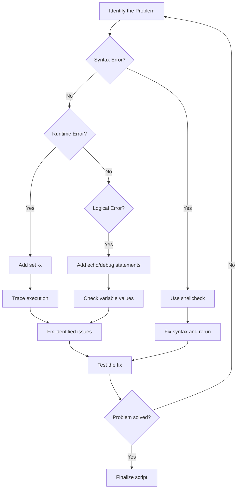

# Ubuntu Script Debugging

## Introduction

Debugging is an essential skill for any programmer, and shell script debugging is no exception. When writing shell scripts in Ubuntu, you'll inevitably encounter errors and unexpected behaviors that need troubleshooting. This guide will walk you through various techniques and tools to effectively debug your Ubuntu shell scripts, helping you identify and fix issues efficiently.

## Understanding Shell Script Errors

Before diving into debugging techniques, it's important to understand the common types of errors you might encounter in shell scripts:

1. **Syntax Errors**: Issues with the script's syntax that prevent it from executing
2. **Runtime Errors**: Errors that occur while the script is running
3. **Logical Errors**: The script runs without errors but doesn't produce the expected results

## Basic Debugging Techniques

### 1. Adding the `-x` Option

One of the simplest ways to debug a shell script is by using the `-x` option. This enables "tracing mode," which displays each command and its arguments as they are executed.

You can use it in two ways:

**Method 1**: Add it to the shebang line:

```bash
#!/bin/bash -x

# Your script
echo "Hello World"
name="John"
echo "My name is $name"
```

**Method 2**: Use it when executing the script:

```bash
bash -x myscript.sh
```

**Output example**:

```
+ echo 'Hello World'
Hello World
+ name=John
+ echo 'My name is John'
My name is John
```

The `+` sign at the beginning of each line indicates commands being executed, allowing you to follow the script's flow.

### 2. Using `set` Commands for Selective Debugging

Sometimes you may want to debug only specific parts of your script. The `set` command allows you to turn debugging on and off within your script.

```bash
#!/bin/bash

echo "Regular execution"
set -x  # Turn on debugging
echo "Debugging started"
name="John"
echo "My name is $name"
set +x  # Turn off debugging
echo "Back to normal execution"
```

**Output**:

```
Regular execution
+ echo 'Debugging started'
Debugging started
+ name=John
+ echo 'My name is John'
My name is John
+ set +x
Back to normal execution
```

### 3. Adding Echo Statements

A straightforward approach is to add `echo` statements throughout your script to track variable values and execution flow:

```bash
#!/bin/bash

filename="data.txt"
echo "DEBUG: filename = $filename"

if [ -f "$filename" ]; then
    echo "DEBUG: File exists, continuing..."
    # process file
else
    echo "DEBUG: File does not exist, exiting..."
    exit 1
fi
```

## Advanced Debugging Options

### 1. Using `-e` for Error Handling

The `-e` option makes your script exit immediately if any command returns a non-zero status:

```bash
#!/bin/bash -e

echo "This will execute"
nonexistentcommand    # This will cause the script to exit
echo "This will never execute"
```

### 2. Combining Options with `set`

You can combine multiple debugging options:

```bash
#!/bin/bash

# Enable error tracing and immediate exit on error
set -ex

echo "Command tracing is on"
# Your script commands here
```

Common useful options include:
- `-e`: Exit immediately on error
- `-u`: Treat unset variables as errors
- `-o pipefail`: Return the exit status of the last command in a pipe that failed
- `-v`: Print shell input lines as they are read

### 3. Using `trap` for Error Handling

The `trap` command allows you to capture signals and execute code when they occur:

```bash
#!/bin/bash

trap 'echo "Line $LINENO: Command failed with exit code $?"' ERR

echo "This command will succeed"
nonexistentcommand    # This will trigger the trap
echo "This might not execute depending on your script configuration"
```

## Practical Debugging Tools

### 1. `shellcheck` - Static Analysis Tool

`shellcheck` is a powerful static analysis tool that identifies potential issues in your shell scripts before you execute them.

**Installation**:

```bash
sudo apt-get install shellcheck
```

**Usage**:

```bash
shellcheck myscript.sh
```

**Example output**:

```
In myscript.sh line 10:
if [ $count -eq 0 ]
     ^----^ SC2086: Double quote to prevent globbing and word splitting.

Did you mean:
if [ "$count" -eq 0 ]
```

### 2. Using `PS4` for Enhanced Debugging Output

You can customize the debug output prefix by setting the `PS4` variable:

```bash
#!/bin/bash

# Customize debug output to include line numbers
export PS4='+(${BASH_SOURCE}:${LINENO}): '
set -x

echo "Hello World"
name="John"
echo "My name is $name"
```

**Output**:

```
+(myscript.sh:7): echo 'Hello World'
Hello World
+(myscript.sh:8): name=John
+(myscript.sh:9): echo 'My name is John'
My name is John
```

### 3. Creating a Debugging Function

For larger scripts, you might want to create a dedicated debugging function:

```bash
#!/bin/bash

# Debug level: 0=none, 1=errors, 2=warnings, 3=info
DEBUG_LEVEL=2

debug() {
    level=$1
    shift
    message="$@"
    
    if [ $level -le $DEBUG_LEVEL ]; then
        case $level in
            1) echo "[ERROR] $message" ;;
            2) echo "[WARNING] $message" ;;
            3) echo "[INFO] $message" ;;
        esac
    fi
}

# Using the debug function
debug 3 "Script started"
filename="data.txt"
debug 3 "Processing file: $filename"

if [ ! -f "$filename" ]; then
    debug 1 "File not found: $filename"
    exit 1
fi

debug 3 "Script completed successfully"
```

## Real-World Debugging Example

Let's apply these techniques to debug a practical script that processes log files:

```bash
#!/bin/bash

log_processor() {
    set -x  # Enable debugging for this function
    
    local log_dir=$1
    local output_file=$2
    
    debug 3 "Processing logs in directory: $log_dir"
    debug 3 "Output will be saved to: $output_file"
    
    # Create or clear output file
    > "$output_file"
    
    # Check if directory exists
    if [ ! -d "$log_dir" ]; then
        debug 1 "Directory does not exist: $log_dir"
        return 1
    fi
    
    # Process each log file
    for log_file in "$log_dir"/*.log; do
        debug 3 "Processing file: $log_file"
        
        # Skip if glob doesn't match any files
        if [ ! -f "$log_file" ]; then
            debug 2 "No log files found in $log_dir"
            break
        fi
        
        # Extract ERROR lines and append to output file
        grep "ERROR" "$log_file" >> "$output_file" || {
            debug 2 "No ERROR entries found in $log_file"
        }
    done
    
    set +x  # Disable debugging for this function
    return 0
}

# Setup debug function
DEBUG_LEVEL=3
debug() {
    level=$1
    shift
    message="$@"
    
    if [ $level -le $DEBUG_LEVEL ]; then
        timestamp=$(date "+%Y-%m-%d %H:%M:%S")
        case $level in
            1) echo "[$timestamp] [ERROR] $message" ;;
            2) echo "[$timestamp] [WARNING] $message" ;;
            3) echo "[$timestamp] [INFO] $message" ;;
        esac
    fi
}

# Main script execution
debug 3 "Script started"
log_processor "/var/log" "error_summary.txt"
exit_code=$?

if [ $exit_code -ne 0 ]; then
    debug 1 "Log processing failed with exit code: $exit_code"
    exit 1
fi

debug 3 "Script completed successfully"
```

## Debugging Shell Script Flow

Understanding the flow of your script is crucial for effective debugging. Here's a simple flowchart showing a typical debugging process:



## Common Debugging Scenarios and Solutions

### Scenario 1: Script Fails Silently

**Problem**: Your script exits without any error message

**Solution**:
```bash
#!/bin/bash
set -e          # Exit on error
set -o pipefail # Catch pipe errors
set -u          # Catch unset variables

# Add error trap
trap 'echo "Error on line $LINENO. Exit code: $?"' ERR

# Your script here
```

### Scenario 2: Debugging Variables

**Problem**: You're unsure if variables contain expected values

**Solution**:
```bash
#!/bin/bash

# Print all script variables
dump_vars() {
    echo "--- Variable Dump ---"
    echo "USER_INPUT = $USER_INPUT"
    echo "COUNT = $COUNT"
    echo "FILENAME = $FILENAME"
    echo "---------------------"
}

USER_INPUT="test"
COUNT=5
FILENAME="data.txt"

dump_vars

# Later in the script
process_data "$USER_INPUT" "$COUNT"
dump_vars  # Check if variables changed
```

### Scenario 3: Isolating Problems in Complex Scripts

**Problem**: A complex script has an issue, but you're not sure where

**Solution**: Comment out sections of code to isolate the problem

```bash
#!/bin/bash

# Section 1
echo "Executing Section 1"
# ...code for section 1...

# Section 2
echo "Executing Section 2"
# Comment out to isolate problems
# if [ some_condition ]; then
#    ...problematic code...
# fi

# Section 3
echo "Executing Section 3"
# ...code for section 3...
```

## Summary

Debugging shell scripts in Ubuntu involves a combination of built-in tools, custom functions, and systematic approaches to problem-solving. The key techniques we covered include:

1. Using bash options like `-x`, `-e`, and `-u` for tracing and error handling
2. Implementing selective debugging with `set -x` and `set +x`
3. Customizing debug output with `PS4`
4. Creating custom debugging functions
5. Utilizing external tools like `shellcheck`
6. Implementing error trapping with `trap`

By mastering these techniques, you'll be able to identify and fix issues in your shell scripts more efficiently, improving your productivity and the reliability of your scripts.

## Exercises for Practice

1. Debug a script that fails due to unquoted variables
2. Create a custom debugging function with different verbosity levels
3. Use `shellcheck` to identify potential issues in an existing script
4. Implement error trapping to handle specific error conditions
5. Debug a script that processes files in a directory, handling edge cases

## Additional Resources

- The bash manual (`man bash`)
- The "Advanced Bash-Scripting Guide" available in the Ubuntu documentation
- ShellCheck documentation: [shellcheck.net](https://www.shellcheck.net/)
- Bash Debugger (bashdb) for more advanced debugging needs