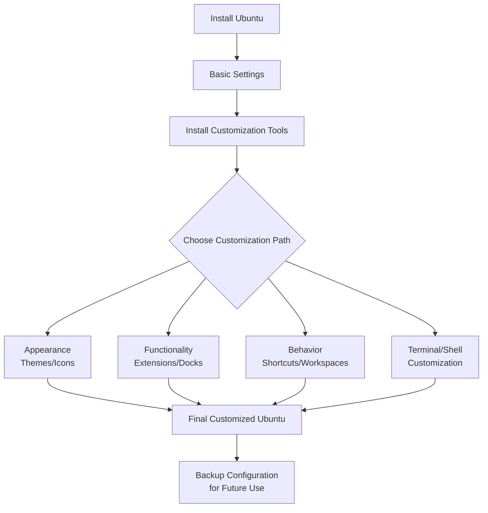

# Ubuntu Desktop Personalization

## Introduction

Ubuntu, one of the most popular Linux distributions, offers extensive customization options that allow users to personalize their desktop environment. Whether you're looking to improve productivity, create a more visually appealing workspace, or simply make your system feel more like home, Ubuntu provides numerous tools and techniques to achieve your goals.

This guide will walk you through the various aspects of Ubuntu desktop personalization, from changing themes and icons to configuring extensions and tweaking system behaviors. By the end, you'll have a solid understanding of how to transform your Ubuntu desktop into a unique and efficient working environment.

## Getting Started with Ubuntu Personalization

Before diving into specific customizations, it's helpful to understand the components that make up the Ubuntu desktop environment. Recent versions of Ubuntu use GNOME as the default desktop environment, which consists of:

- **Shell**: The core user interface
- **Window Manager**: Controls window placement and appearance
- **Theme Engine**: Handles visual styling
- **Extensions**: Add functionality to the desktop

Let's explore how to customize each of these components.

## Basic Appearance Settings

### Changing Theme and Icons

Ubuntu makes it easy to change the basic look and feel through the Settings application.

#### Step 1: Open the Settings application

You can find Settings in the Applications menu or by clicking on the system menu in the top-right corner.

#### Step 2: Navigate to Appearance settings

```
Settings → Appearance
```

From here, you can select from pre-installed themes (Light or Dark mode) and adjust accent colors.

#### Step 3: Install additional themes (optional)

For more theme options, you can install the GNOME Tweaks tool:

```bash
sudo apt install gnome-tweaks
```

Then install themes from sources like [GNOME-Look.org](https://www.gnome-look.org/):

```bash
# Create themes directory if it doesn't exist
mkdir -p ~/.themes

# For system-wide installation
sudo mkdir -p /usr/share/themes
```

After downloading a theme, extract it to either the `~/.themes` directory for user-specific installation or `/usr/share/themes` for system-wide installation.

#### Step 4: Apply custom themes using GNOME Tweaks

Launch GNOME Tweaks and navigate to the Appearance tab to select your installed themes:

```bash
gnome-tweaks
```

### Customizing Icons and Cursors

Custom icon themes can significantly change the look of your desktop.

#### Installing icon themes:

```bash
# Create icons directory if it doesn't exist
mkdir -p ~/.icons

# For system-wide installation
sudo mkdir -p /usr/share/icons

# Install popular icon themes
sudo apt install papirus-icon-theme
```

Apply the icon theme in GNOME Tweaks → Appearance → Icons.

## Advanced Desktop Customization

### GNOME Extensions

GNOME Extensions add functionality to your desktop. They can provide anything from weather information to system monitoring tools.

#### Step 1: Install GNOME Extensions support

```bash
sudo apt install gnome-shell-extensions chrome-gnome-shell
```

#### Step 2: Install Extensions application

```bash
sudo apt install gnome-shell-extension-manager
```

#### Step 3: Browse and install extensions

Launch the Extensions application from your applications menu.

Some popular extensions include:

- **Dash to Dock**: Transforms the dash into a dock
- **User Themes**: Allows loading shell themes from user directory
- **Weather**: Displays weather information in the top bar

Example: Installing Dash to Dock through terminal:

```bash
sudo apt install gnome-shell-extension-dash-to-dock
```

Then enable it using the Extensions application.

### Customizing the Dock

Ubuntu's dock (based on GNOME's dash-to-dock) can be customized extensively.

#### Adjusting dock settings:

1. Open Settings → Appearance
2. Scroll down to find Dock options
3. Customize:
   - Position on screen
   - Auto-hide behavior
   - Icon size

For more detailed customization:

```bash
# Install dconf-editor
sudo apt install dconf-editor
```

Navigate to `/org/gnome/shell/extensions/dash-to-dock` in dconf-editor to access all available options.

## Command-Line Personalization

### Terminal Customization

The terminal is a key tool for many Ubuntu users, and personalizing it can improve productivity.

#### Step 1: Choose your terminal

Ubuntu ships with GNOME Terminal by default, but alternatives like Tilix or Terminator offer more features:

```bash
# Install alternative terminals
sudo apt install tilix
# or
sudo apt install terminator
```

#### Step 2: Customize terminal profiles

In GNOME Terminal, go to Preferences → Profiles to:
- Change colors and transparency
- Adjust font and size
- Set terminal behavior

#### Step 3: Customize your shell

Bash is the default shell in Ubuntu, but you might want to try alternatives like Zsh or Fish:

```bash
# Install Zsh
sudo apt install zsh

# Install Oh My Zsh for enhanced customization
sh -c "$(curl -fsSL https://raw.githubusercontent.com/ohmyzsh/ohmyzsh/master/tools/install.sh)"

# Set Zsh as default shell
chsh -s $(which zsh)
```

Edit your `~/.zshrc` file to customize your Zsh configuration:

```bash
# Example .zshrc customization
ZSH_THEME="robbyrussell"
plugins=(git docker npm)
```

## Modifying System Behavior

### Keyboard Shortcuts

Custom keyboard shortcuts can significantly improve your workflow.

#### Step 1: Open Settings → Keyboard → Keyboard Shortcuts

#### Step 2: Browse existing shortcuts or add custom ones

To add a custom shortcut:
1. Scroll to the bottom and click "+"
2. Name your shortcut
3. Enter the command to execute
4. Assign a key combination

Example: Creating a shortcut to launch Firefox:
- Name: Launch Firefox
- Command: `firefox`
- Shortcut: `Ctrl+Alt+F`

### Workspace Management

Efficiently manage workspaces to organize your applications.

#### Static workspaces:

1. Open Settings → Multitasking
2. Enable "Fixed number of workspaces"
3. Set your preferred number of workspaces

#### Dynamic workspaces:

Enable "Dynamic workspaces" to have Ubuntu create new workspaces as needed.

Navigate between workspaces using:
- `Ctrl+Alt+Arrow Keys` (up/down)
- `Super+Page Up/Down`

## Customizing Login Screen

The login screen (GDM - GNOME Display Manager) can also be personalized.

```bash
# Install GDM customization tool
sudo apt install gdm3-login-screen
```

Change the login screen background:

```bash
# First, prepare an image (should be appropriate resolution for your screen)
sudo cp your-background.jpg /usr/share/backgrounds/

# Edit the GDM configuration
sudo -e /etc/gdm3/greeter.dconf-defaults
```

Add or modify these lines:

```
# GDM configuration
[org/gnome/desktop/background]
picture-uri='file:///usr/share/backgrounds/your-background.jpg'
```

Then update the dconf database and restart GDM:

```bash
sudo dpkg-reconfigure gdm3
```

## Creating Custom Application Launchers

Create desktop shortcuts for any application or script.

#### Step 1: Create a .desktop file

```bash
touch ~/.local/share/applications/my-app.desktop
```

#### Step 2: Edit the file with appropriate content

```
[Desktop Entry]
Name=My Custom Application
Comment=Description of my application
Exec=/path/to/executable or command
Icon=/path/to/icon.png
Terminal=false
Type=Application
Categories=Utility;
```

#### Step 3: Make it executable

```bash
chmod +x ~/.local/share/applications/my-app.desktop
```

Your custom launcher will now appear in the Applications menu.

## Using the Dconf Editor for Advanced Customization

The dconf editor provides access to all GNOME settings, including many that aren't exposed in the regular Settings application.

```bash
# Install dconf-editor
sudo apt install dconf-editor
```

Launch it from the Applications menu and navigate through the hierarchy to find and modify settings.

Example: To change the clock format in the top bar:

1. Navigate to `/org/gnome/desktop/interface/`
2. Find the `clock-format` key
3. Change it to your preferred format (`12h` or `24h`)

## Automating Customizations

You can script your customizations to easily apply them to a new installation or share with others.

Create a shell script with your customization commands:

```bash
#!/bin/bash

# Set dark theme
gsettings set org.gnome.desktop.interface gtk-theme 'Adwaita-dark'

# Set icon theme
gsettings set org.gnome.desktop.interface icon-theme 'Papirus'

# Set dock position to bottom
gsettings set org.gnome.shell.extensions.dash-to-dock dock-position 'BOTTOM'

# Add favorite applications to dock
gsettings set org.gnome.shell favorite-apps "['firefox.desktop', 'org.gnome.Terminal.desktop', 'code.desktop', 'org.gnome.Nautilus.desktop']"

# Install favorite extensions and applications
sudo apt install -y gnome-shell-extension-dash-to-dock gnome-tweaks

echo "Customization complete!"
```

Save this as `customize-ubuntu.sh`, make it executable, and run it:

```bash
chmod +x customize-ubuntu.sh
./customize-ubuntu.sh
```

## Ubuntu Theming with CSS

For advanced users, Ubuntu's GNOME Shell can be customized with CSS.

#### Step 1: Create a custom theme structure

```bash
mkdir -p ~/.themes/MyCustomTheme/gnome-shell
touch ~/.themes/MyCustomTheme/gnome-shell/gnome-shell.css
```

#### Step 2: Edit the CSS file

Here's a simple example that changes the panel color:

```css
/* Custom panel styling */
#panel {
  background-color: rgba(0, 0, 0, 0.8);
  font-size: 10pt;
}

/* Custom dash styling */
#dash {
  background-color: rgba(0, 0, 0, 0.7);
  padding: 4px;
}
```

#### Step 3: Apply your theme using GNOME Tweaks

Open GNOME Tweaks, go to Appearance, and select your custom theme from the Shell theme dropdown.

## Workflow Diagram

Here's a visual representation of a typical Ubuntu customization workflow:



## Summary

Ubuntu desktop personalization allows you to create a working environment that suits your specific needs and preferences. Through this guide, you've learned how to:

- Change themes and icons to customize the visual appearance
- Install and configure GNOME Extensions for added functionality
- Customize the dock for improved application access
- Set up keyboard shortcuts to enhance productivity
- Configure workspaces for better application organization
- Personalize the terminal and shell environment
- Create custom application launchers
- Use dconf-editor for advanced settings
- Automate customizations with scripts
- Apply CSS customizations for deeper theming

By applying these techniques, you can transform a standard Ubuntu installation into a personalized environment that enhances both the aesthetics and functionality of your system.

## Additional Resources

For further exploration, consider these resources:

- The GNOME Extensions website: [extensions.gnome.org](https://extensions.gnome.org/)
- GNOME-Look: [gnome-look.org](https://www.gnome-look.org/) for themes and icons
- The Ubuntu documentation: [help.ubuntu.com](https://help.ubuntu.com/)
- The GNOME User Guide: [help.gnome.org](https://help.gnome.org/)

## Exercises

1. Install and configure three different GNOME extensions that improve your workflow.
2. Create a custom theme by modifying an existing one with CSS changes.
3. Write a shell script that automatically applies all your preferred customizations.
4. Design a custom keyboard shortcuts scheme for your most-used applications and actions.
5. Create a custom workspace layout with specific applications assigned to each workspace.