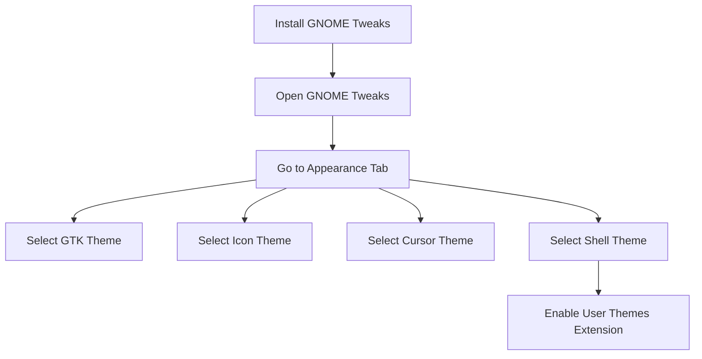

# Ubuntu Theme Installation

## Introduction

Customizing your Ubuntu desktop is a great way to make your computing environment more personal and productive. One of the most impactful ways to change the look and feel of Ubuntu is by installing custom themes. In this guide, we'll explore how to install, apply, and customize themes in Ubuntu, focusing on the GNOME desktop environment that comes with recent Ubuntu versions.

Themes in Ubuntu can modify various visual elements:
- Window borders and controls
- Icons
- Cursors
- Desktop backgrounds
- Color schemes

By the end of this guide, you'll understand how to transform your Ubuntu desktop's appearance to suit your preferences.

## Prerequisites

Before we begin, make sure you have:

- Ubuntu 20.04 or newer
- Basic knowledge of terminal commands
- An internet connection to download themes

## Understanding Theme Components in Ubuntu

In the GNOME desktop environment used by Ubuntu, themes are divided into several components:

- **GTK Themes**: Control the appearance of application windows, buttons, and menus
- **Icon Themes**: Define the look of file, folder, and application icons
- **Cursor Themes**: Change how your mouse pointer appears
- **Shell Themes**: Modify the appearance of the GNOME Shell (top bar, Activities overview, etc.)

Let's look at how to install and apply each of these components.

## Installing Theme Tools

First, let's install some essential tools for theme management:

```bash
sudo apt update
sudo apt install gnome-tweaks gnome-shell-extensions
```

The `gnome-tweaks` tool provides a user-friendly interface for applying themes, while `gnome-shell-extensions` enables additional customization options.

After installation, you need to install the User Themes extension:

1. Open Firefox and go to https://extensions.gnome.org/
2. Search for "User Themes" and toggle it to ON
3. You might need to install the browser extension if prompted

This extension allows you to change the GNOME Shell theme.

## Method 1: Installing Themes from Official Repositories

The easiest way to install themes is through Ubuntu's repositories:

```bash
sudo apt update
sudo apt install arc-theme papirus-icon-theme
```

This command installs the popular Arc GTK theme and Papirus icon theme.

## Method 2: Installing Themes Manually

For themes not available in the repositories, follow these steps:

1. Create theme directories if they don't exist:

```bash
mkdir -p ~/.themes ~/.icons
```

2. Download your desired theme (we'll use Materia theme as an example):

```bash
cd ~/Downloads
git clone https://github.com/nana-4/materia-theme.git
cd materia-theme
```

3. Install the theme:

```bash
./install.sh
```

For themes without an install script, you can simply extract the theme to the proper directory:

```bash
# For GTK themes
tar xf theme-name.tar.xz -C ~/.themes/

# For icon themes
tar xf icon-theme.tar.xz -C ~/.icons/
```

## Method 3: Using the Pling Store (Formerly GNOME Look)

The Pling Store provides a graphical interface for installing themes:

1. Install the Pling Store:

```bash
sudo apt install flatpak
flatpak install flathub org.kde.KStyle.Kvantum
flatpak install flathub org.kde.pling-store
```

2. Launch the Pling Store and browse for themes, icons, and more
3. Click the "Install" button to automatically install the theme

## Applying Themes

### Using GNOME Tweaks

1. Open GNOME Tweaks from the Applications menu or run:

```bash
gnome-tweaks
```

2. Navigate to the "Appearance" tab
3. Select your preferred themes:
   - Under "Themes" > "Applications" - choose your GTK theme
   - Under "Themes" > "Cursor" - choose your cursor theme  
   - Under "Themes" > "Icons" - choose your icon theme
   - Under "Themes" > "Shell" - choose your GNOME Shell theme (requires User Themes extension)



### Using the Command Line

For GTK theme:

```bash
gsettings set org.gnome.desktop.interface gtk-theme "Materia-dark"
```

For icon theme:

```bash
gsettings set org.gnome.desktop.interface icon-theme "Papirus-Dark"
```

For cursor theme:

```bash
gsettings set org.gnome.desktop.interface cursor-theme "Breeze_Snow"
```

## Customizing Individual Theme Components

### Customizing GTK Themes

GTK themes can be customized by editing their CSS files:

1. Locate your theme's directory (either in `/usr/share/themes/` or `~/.themes/`)
2. Navigate to the `gtk-3.0` or `gtk-4.0` directory
3. Create a backup of the `gtk.css` file:

```bash
cp ~/.themes/Materia-dark/gtk-3.0/gtk.css ~/.themes/Materia-dark/gtk-3.0/gtk.css.backup
```

4. Edit the CSS file with your preferred text editor:

```bash
nano ~/.themes/Materia-dark/gtk-3.0/gtk.css
```

5. Make your changes and save the file
6. Log out and log back in to apply the changes

Here's an example of modifying the button color in a theme:

```css
button {
    background-color: #3498db;
    color: #ffffff;
    border-radius: 4px;
    padding: 6px;
}

button:hover {
    background-color: #2980b9;
}
```

### Creating Color Variants

You can also create color variants of existing themes:

1. Copy an existing theme:

```bash
cp -r ~/.themes/Materia ~/.themes/Materia-Custom
```

2. Find and edit the color definitions in CSS files using find:

```bash
find ~/.themes/Materia-Custom -name "*.css" | xargs sed -i 's/#3498db/#e74c3c/g'
```

This command replaces the blue color (#3498db) with red (#e74c3c).

## Working with Icon Themes

### Mixing Icon Sets

You can combine elements from different icon themes:

1. Create a new icon theme folder:

```bash
mkdir -p ~/.icons/Mixed-Icons/apps/scalable
```

2. Create an `index.theme` file:

```bash
nano ~/.icons/Mixed-Icons/index.theme
```

3. Add the following content:

```
[Icon Theme]
Name=Mixed Icons
Comment=A mix of my favorite icon sets
Inherits=Papirus,Numix-Circle
```

4. Copy specific icons from other themes or download individual icons

### Testing Icon Changes

To see immediately if your icon changes worked, refresh the icon cache:

```bash
gtk-update-icon-cache -f ~/.icons/Mixed-Icons
```

## Troubleshooting Common Theme Issues

### Theme Not Applying Correctly

If your theme isn't applying properly:

1. Check if the theme is compatible with your Ubuntu version
2. Ensure the theme structure is correct (use `ls -la` to check directories)
3. Try restarting the GNOME Shell:
   - Press Alt+F2
   - Type `r` and press Enter

### Missing Theme Elements

If parts of your theme are missing:

1. Check if you need additional components:

```bash
ls -la ~/.themes/ThemeName/
```

Look for directories like `gnome-shell`, `gtk-3.0`, and `gtk-4.0`.

2. Install missing components or try a different theme

### Permissions Issues

If you encounter permission errors:

```bash
sudo chown -R $USER:$USER ~/.themes ~/.icons
sudo chmod -R 755 ~/.themes ~/.icons
```

## Advanced: Creating Your Own Theme

While creating a complete theme is beyond the scope of this guide, you can start by:

1. Copy an existing theme as a base:

```bash
cp -r /usr/share/themes/Adwaita ~/.themes/MyTheme
```

2. Edit the theme's CSS files to make changes
3. Test your changes incrementally

The theme structure typically looks like:

```
MyTheme/
├── gnome-shell/
│   └── gnome-shell.css
├── gtk-3.0/
│   └── gtk.css
├── gtk-4.0/
│   └── gtk.css
└── index.theme
```

## Recommended Themes for Beginners

Here are some popular themes to get you started:

- **Arc Theme**: Clean, modern theme with light and dark variants
- **Papirus Icons**: Colorful, modern icon set with good app coverage
- **Materia**: Material design-inspired theme with good contrast
- **Yaru**: Ubuntu's default theme - try the community variants
- **Nordic**: Dark theme with blue accents

## Summary

In this guide, we've covered how to:
- Install theme management tools
- Install themes from different sources
- Apply themes using GNOME Tweaks and command line
- Customize theme components
- Troubleshoot common theme issues

Theme installation in Ubuntu is a powerful way to personalize your desktop environment. By following these steps, you can transform your desktop to match your workflow preferences and aesthetic taste.

## Additional Resources

- [GNOME Look](https://www.gnome-look.org/): The largest collection of themes for GNOME
- [GNOME Wiki: Theme Development](https://wiki.gnome.org/Attic/GnomeArt/Tutorials/GtkThemes): Learn more about GTK theme development
- [Ubuntu Forums Theming Section](https://ubuntuforums.org/forumdisplay.php?f=334): Get help and share your themes

## Exercises

1. Install and apply three different themes and compare their appearances
2. Create a custom color variant of your favorite theme
3. Mix elements from different themes to create your unique desktop look
4. Write a short script that can switch between your favorite themes with a single command