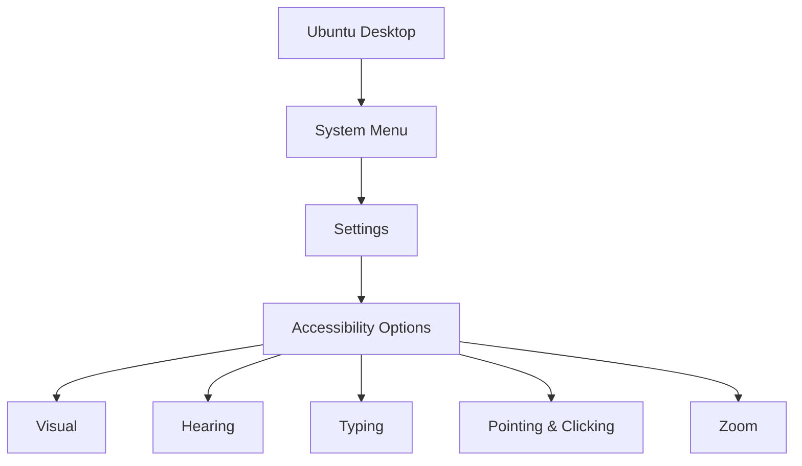

# Ubuntu Accessibility Options

## Introduction

Ubuntu is committed to making computing accessible to everyone, regardless of physical or visual abilities. The operating system comes with a robust set of accessibility tools that can be customized to meet various needs. These features help users with visual impairments, hearing difficulties, motor challenges, or cognitive needs to interact with their computer more effectively.

In this guide, we'll explore Ubuntu's accessibility options, how to enable them, and how to customize them to suit your specific requirements.

## Accessing Accessibility Features

Ubuntu provides an accessible way to reach these features right from the login screen. Let's start by learning how to access them:

### From the Login Screen

1. At the Ubuntu login screen, click on the accessibility icon (looks like a person) in the top-right corner.
2. This reveals a dropdown menu with various accessibility options that can be enabled before logging in.

### From the Desktop Environment

Once logged in, you can access the full suite of accessibility options through the Settings menu:

1. Click on the system menu in the top-right corner of the screen.
2. Select "Settings."
3. Navigate to "Accessibility" in the left sidebar.



## Visual Accessibility Features

Ubuntu offers several features for users with visual impairments:

### Screen Reader (Orca)

Orca is a powerful screen reader that provides spoken feedback and braille support.

#### Enabling Orca

1. Open Settings > Accessibility > Seeing.
2. Toggle "Screen Reader" to ON.

You can also quickly toggle the screen reader with the keyboard shortcut:

```bash
Alt + Super + S
```

#### Basic Orca Commands

| Command | Action |
|---------|--------|
| `Insert + Space` | Orca Preferences menu |
| `Insert + S` | Toggle speech on/off |
| `Insert + H` | Display help for current application |
| `Insert + Arrow keys` | Navigate content |

### High Contrast Mode

High contrast mode makes text and interface elements more distinct and easier to see.

To enable high contrast mode:

1. Open Settings > Accessibility > Seeing.
2. Toggle "High Contrast" to ON.

### Text Scaling

Increase the size of text throughout the interface:

1. Open Settings > Accessibility > Seeing.
2. Adjust the "Text Size" slider to your preferred level.

Example of using `gsettings` command to change text scaling from the terminal:

```bash
# Set text scaling factor to 1.5 (50% larger)
gsettings set org.gnome.desktop.interface text-scaling-factor 1.5
```

### Cursor Size

You can increase the size of the mouse cursor:

1. Open Settings > Accessibility > Seeing.
2. Adjust the "Cursor Size" slider to your preferred level.

### Color Filters

Ubuntu provides color filters that can help users with color vision deficiencies:

1. Open Settings > Accessibility > Seeing.
2. Toggle "Color Filters" to ON.
3. Select from different types of filters, including:
   - Protanopia (red blindness)
   - Deuteranopia (green blindness)
   - Tritanopia (blue blindness)
   - Grayscale

## Hearing Accessibility Features

### Visual Alerts

For users with hearing impairments, Ubuntu can flash the screen instead of playing sounds:

1. Open Settings > Accessibility > Hearing.
2. Toggle "Visual Alerts" to ON.

You can test this feature by clicking the "Test Flash" button.

## Motor Accessibility Features

### Keyboard Modifiers

#### Sticky Keys

Sticky Keys allows you to press key combinations (like Ctrl+Alt+T) one key at a time:

1. Open Settings > Accessibility > Typing.
2. Toggle "Sticky Keys" to ON.

You can also enable this feature by pressing Shift five times in a row.

#### Slow Keys

Slow Keys adds a delay between when a key is pressed and when it's accepted:

1. Open Settings > Accessibility > Typing.
2. Toggle "Slow Keys" to ON.
3. Adjust the delay using the slider.

#### Bounce Keys

Bounce Keys prevents accidental double-presses by ignoring rapid successive keystrokes:

1. Open Settings > Accessibility > Typing.
2. Toggle "Bounce Keys" to ON.

### Mouse Keys

Mouse Keys allows you to control the mouse pointer using the numeric keypad:

1. Open Settings > Accessibility > Pointing & Clicking.
2. Toggle "Mouse Keys" to ON.

Once enabled, you can use the numeric keypad to move the mouse cursor:

- `8`: Move up
- `2`: Move down
- `4`: Move left
- `6`: Move right
- `5`: Click
- `+`: Double-click
- `/`: Right-click

### On-Screen Keyboard

The on-screen keyboard (Onboard) provides a way to type without using a physical keyboard:

1. Open Settings > Accessibility > Typing.
2. Toggle "Screen Keyboard" to ON.

You can also launch it from the terminal:

```bash
onboard
```

#### Customizing Onboard

Onboard offers extensive customization options:

1. With Onboard open, click on the settings icon.
2. You can adjust:
   - Keyboard layout and size
   - Key appearance
   - Word prediction
   - Typing helpers

## Setting Up Accessibility Profiles

Ubuntu allows you to create profiles for different accessibility needs:

### Creating a Custom Profile

1. Open the terminal and install the dconf-editor:

```bash
sudo apt install dconf-editor
```

2. Launch dconf-editor:

```bash
dconf-editor
```

3. Navigate to `/org/gnome/desktop/a11y/`.
4. Here you can view and modify all accessibility settings.

### Using the Command Line for Accessibility

You can enable or disable accessibility features via the command line using `gsettings`:

#### Enable Screen Reader:

```bash
gsettings set org.gnome.desktop.a11y.applications screen-reader-enabled true
```

#### Enable High Contrast:

```bash
gsettings set org.gnome.desktop.a11y.interface high-contrast true
```

#### Enable Large Text:

```bash
gsettings set org.gnome.desktop.interface text-scaling-factor 1.5
```

## Practical Example: Setting Up Ubuntu for a Visually Impaired User

Let's walk through a real-world scenario of setting up Ubuntu for someone with low vision:

1. **Enable High Contrast Mode**:
   - Open Settings > Accessibility > Seeing.
   - Toggle "High Contrast" to ON.

2. **Increase Text Size**:
   - Open Settings > Accessibility > Seeing.
   - Set "Text Size" to about 1.5x.

3. **Enable Larger Cursor**:
   - Open Settings > Accessibility > Seeing.
   - Set "Cursor Size" to Large.

4. **Set Up Zoom Functionality**:
   - Open Settings > Accessibility > Seeing.
   - Toggle "Zoom" to ON.
   - Configure to zoom with Alt+Mouse Wheel.

5. **Install Additional Magnifier**:
   For even more powerful magnification:
   ```bash
   sudo apt install kmag
   ```

6. **Create Keyboard Shortcuts**:
   Create a shortcut to easily toggle the screen reader:
   ```bash
   gsettings set org.gnome.settings-daemon.plugins.media-keys.custom-keybinding:/org/gnome/settings-daemon/plugins/media-keys/custom-keybindings/custom0/ name 'Toggle Orca'
   gsettings set org.gnome.settings-daemon.plugins.media-keys.custom-keybinding:/org/gnome/settings-daemon/plugins/media-keys/custom-keybindings/custom0/ command 'orca'
   gsettings set org.gnome.settings-daemon.plugins.media-keys.custom-keybinding:/org/gnome/settings-daemon/plugins/media-keys/custom-keybindings/custom0/ binding '<Alt>o'
   ```

## Accessibility in Ubuntu Terminal

The terminal can also be made more accessible:

### Increasing Terminal Font Size

1. Open Terminal.
2. Go to Edit > Preferences.
3. Under the "Profiles" tab, select your profile.
4. Check "Custom font" and select a larger font size.

### Setting Terminal Colors

For users with color vision deficiencies:

1. Open Terminal.
2. Go to Edit > Preferences > Profiles.
3. Select the "Colors" tab.
4. Choose a high-contrast color scheme or create a custom one.

Example terminal command to set a more readable color scheme:

```bash
dconf write /org/gnome/terminal/legacy/profiles:/:$(gsettings get org.gnome.Terminal.ProfilesList default | tr -d \')/background-color "'#000000'"
dconf write /org/gnome/terminal/legacy/profiles:/:$(gsettings get org.gnome.Terminal.ProfilesList default | tr -d \')/foreground-color "'#FFFFFF'"
```

## Accessibility in Web Browsing

Ubuntu's Firefox browser comes with built-in accessibility features:

### Zoom Web Pages

- Press `Ctrl` and `+` to zoom in.
- Press `Ctrl` and `-` to zoom out.
- Press `Ctrl` and `0` to reset zoom.

### High Contrast Mode in Firefox

1. Open Firefox.
2. Go to Menu > Settings > General.
3. Scroll down to Language and Appearance.
4. Under Fonts and Colors, click "Colors".
5. Select "High Contrast" and click OK.

## Third-Party Accessibility Tools

Ubuntu's repositories contain additional accessibility tools you might find useful:

### Speech Recognition

Install Simon Speech Recognition:

```bash
sudo apt install simon
```

### Alternative Screen Readers

Try NVDA with Wine:

```bash
sudo apt install wine
# Then download and install NVDA through Wine
```

### Alternative Input Methods

For users who cannot use traditional keyboards or mice:

```bash
# Install Dasher, a predictive text entry system
sudo apt install dasher
```

## Summary

Ubuntu's accessibility features make computing accessible to people with a wide range of abilities. These tools can be customized extensively to meet specific needs:

- **Visual aids**: Screen readers, magnifiers, high contrast themes, and color filters
- **Motor aids**: Keyboard modifications, mouse alternatives, and on-screen keyboards
- **Hearing aids**: Visual alerts and captions

By understanding and using these tools, you can make Ubuntu more accessible for yourself or others with specific needs.

## Additional Resources

- [Ubuntu Accessibility Documentation](https://help.ubuntu.com/stable/ubuntu-help/a11y.html)
- [Orca Screen Reader Documentation](https://help.gnome.org/users/orca/stable/)
- [GNOME Accessibility Team](https://wiki.gnome.org/Accessibility)

## Exercises

1. Enable the screen reader and navigate your file system without looking at the screen.
2. Create a custom keyboard shortcut to enable high contrast mode.
3. Configure the on-screen keyboard to appear automatically at startup.
4. Create a bash script that toggles multiple accessibility features with a single command.
5. Design an accessibility profile for a user with both visual and motor impairments.