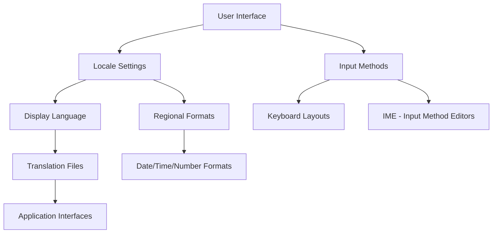

# Ubuntu Language Settings

## Introduction

Language settings are a fundamental aspect of customizing your Ubuntu operating system. Whether you're using Ubuntu in a multilingual environment, learning a new language, or working with international colleagues, understanding how to configure language settings can significantly enhance your user experience.

Ubuntu's robust language support allows you to change the display language, set up multiple languages, configure input methods for different writing systems, and even set specific formats for dates, time, and numbers based on regional preferences.

In this guide, we'll explore how to configure language settings in Ubuntu, understand the underlying system, and apply these configurations in real-world scenarios.

## Understanding Language Support in Ubuntu

Before diving into the configuration, it's important to understand how Ubuntu handles languages.

Ubuntu uses a standardized approach to language support through:

- **Locales**: Settings that define language, country, and character encoding
- **Input Methods**: Tools that allow typing in different writing systems
- **Translation Files**: Language-specific text for applications and the system

Here's a visual representation of how these components work together:



## Installing Language Support

Before configuring languages, you need to ensure that the appropriate language packages are installed on your system.

### Step 1: Open Language Support

You can access the language settings through the Settings application or directly via the terminal:

```bash
gnome-language-selector
```

### Step 2: Install Required Language Packages

When you open Language Support for the first time, Ubuntu may prompt you to install missing language packages. Click "Install" to proceed.

Alternatively, you can install language support packages via the terminal:

```bash
sudo apt update
sudo apt install language-pack-[language-code]
```

For example, to install French language support:

```bash
sudo apt install language-pack-fr
```

## Changing the Display Language

Changing the display language affects the text shown in menus, applications, and system notifications.

### Via Graphical Interface

1. Open Settings
2. Navigate to "Region & Language"
3. Click on "Language"
4. Select your preferred language from the list
5. Drag it to the top of the list to make it the primary language
6. Log out and log back in for the changes to take effect

### Via Terminal

You can also change the language settings via terminal:

```bash
# Check currently installed languages
locale -a

# Set a language as default
sudo update-locale LANG=en_US.UTF-8

# Replace en_US.UTF-8 with your preferred locale
```

## Configuring Input Methods

Input methods allow you to type in languages that may require special characters or different writing systems.

### Setting Up Multiple Keyboard Layouts

1. Open Settings
2. Navigate to "Region & Language"
3. Under "Input Sources," click the "+" button
4. Select a language and then choose a keyboard layout
5. You can add multiple keyboard layouts and switch between them using the keyboard shortcut (usually Super+Space)

### Example: Setting Up Japanese Input

Japanese input requires an Input Method Editor (IME). Here's how to set it up:

```bash
# Install Japanese language support and IME
sudo apt install language-pack-ja ibus-mozc
```

Then in the GUI:

1. Navigate to "Region & Language" settings
2. Under "Input Sources," click "+"
3. Add "Japanese (Mozc)" input method
4. Use Super+Space to switch between English and Japanese input

## Regional Formats

Regional formats determine how dates, times, numbers, and currency are displayed.

### Configuring Regional Formats

1. Open Settings
2. Navigate to "Region & Language"
3. Under "Format," select your preferred region
4. This will update date formats, time formats, number separators, and currency symbols

### Example: Date and Time Format Differences

Different regions display dates and times differently:

- US format: MM/DD/YYYY, 12-hour clock (e.g., 04/30/2023, 3:45 PM)
- European format: DD/MM/YYYY, 24-hour clock (e.g., 30/04/2023, 15:45)
- ISO format: YYYY-MM-DD, 24-hour clock (e.g., 2023-04-30, 15:45)

## Creating Custom Locales

Sometimes you might want to mix preferences from different regions. Ubuntu allows you to create custom locale settings.

```bash
# Generate a custom locale
sudo locale-gen en_US.UTF-8

# Edit locale configuration
sudo nano /etc/locale.gen

# After making changes, regenerate locales
sudo locale-gen
```

## Language Settings for Specific Users

On multi-user systems, each user can have their own language preferences:

```bash
# Set language for current user
echo 'export LANG=fr_FR.UTF-8' >> ~/.profile
echo 'export LANGUAGE=fr_FR:fr:en_US:en' >> ~/.profile
```

The `LANGUAGE` variable sets a priority list of languages to use.

## Practical Applications

### Example 1: Setting Up a Multilingual Development Environment

For a software developer working with international teams:

```bash
# Install multiple language supports
sudo apt install language-pack-en language-pack-fr language-pack-es

# Configure git to handle different character encodings properly
git config --global core.quotepath false
```

Then set up keyboard shortcuts to quickly switch between languages while coding or communicating with international team members.

### Example 2: Creating Localized Application Testing Environment

When developing applications that need to be tested in multiple languages:

```bash
# Create a test user with specific language settings
sudo adduser testuser

# Set language for the test user
sudo su - testuser
echo 'export LANG=de_DE.UTF-8' >> ~/.profile
echo 'export LC_ALL=de_DE.UTF-8' >> ~/.profile
exit
```

You can now switch to this user to test your application in German without changing your main system language.

### Example 3: Using Terminal in a Different Language

You can run a single command with a different language setting:

```bash
# Run a program with French locale
LANG=fr_FR.UTF-8 command_name

# Example with a simple date command
LANG=fr_FR.UTF-8 date
# Output: mer. avril 12 15:45:30 CEST 2023
```

## Troubleshooting Common Issues

### Missing Translations

Sometimes you may notice that some applications still show English text even after changing the language. This happens when:

- The application doesn't have translations for your language
- The language package is not completely installed

Solution:

```bash
# Check if translations are installed
apt list --installed | grep language-pack

# Update language packages
sudo apt update && sudo apt upgrade

# Install more complete language support
sudo apt install $(check-language-support -l your_language_code)
```

### Input Method Not Working

If your configured input method isn't working:

```bash
# Restart the input method framework
ibus restart

# Or for fcitx (another input method framework)
fcitx -r
```

### System Language Settings Not Applied

If you changed the language but don't see the changes:

1. Make sure you've logged out and logged back in
2. Check environment variables:

```bash
# Check current language settings
locale

# If variables are mixed, set them all:
sudo update-locale LANG=de_DE.UTF-8 LC_ALL=de_DE.UTF-8
```

## Advanced Configuration with Configuration Files

For more precise control, you can edit configuration files directly:

### System-Wide Default Locale

```bash
# Edit default locale
sudo nano /etc/default/locale

# Example content:
# LANG=en_US.UTF-8
# LC_TIME=de_DE.UTF-8
# LC_PAPER=de_DE.UTF-8
```

This example sets English as the default language but uses German formats for time and paper size.

### User-Specific Settings

Each user can have custom settings in their `~/.profile` or `~/.bashrc` file:

```bash
# Add to ~/.profile for user-specific settings
export LANG=es_ES.UTF-8
export LC_MESSAGES=en_US.UTF-8  # System messages in English
```

## Summary

Ubuntu's language settings provide a flexible system for customizing your operating system to suit your language preferences and regional standards. In this guide, we've covered:

- Basic understanding of Ubuntu's language system
- Installing language support packages
- Changing display languages
- Configuring input methods for different writing systems
- Setting regional formats for dates, times, and numbers
- Creating custom locale configurations
- User-specific language settings
- Practical real-world applications
- Troubleshooting common issues

By mastering these configurations, you can create a truly personalized Ubuntu experience that matches your linguistic needs and preferences.

## Additional Resources

- [Ubuntu Official Documentation on Language Support](https://help.ubuntu.com/community/Locale)
- [GNU C Library Locale Documentation](https://www.gnu.org/software/libc/manual/html_node/Locales.html)
- [IBus Input Method Documentation](https://github.com/ibus/ibus/wiki)

## Exercises

1. Change your system language to one you're learning, then use the system for a day to improve your vocabulary.
2. Configure your system to use different formats for date (DD/MM/YYYY) and time (24-hour) while keeping English as the interface language.
3. Set up a custom locale that uses your native language for the interface but international formats (ISO) for dates and numbers.
4. Create a script that temporarily changes the system language, runs a program, and then reverts to the original language.
5. Set up multiple input methods and practice switching between them with keyboard shortcuts.