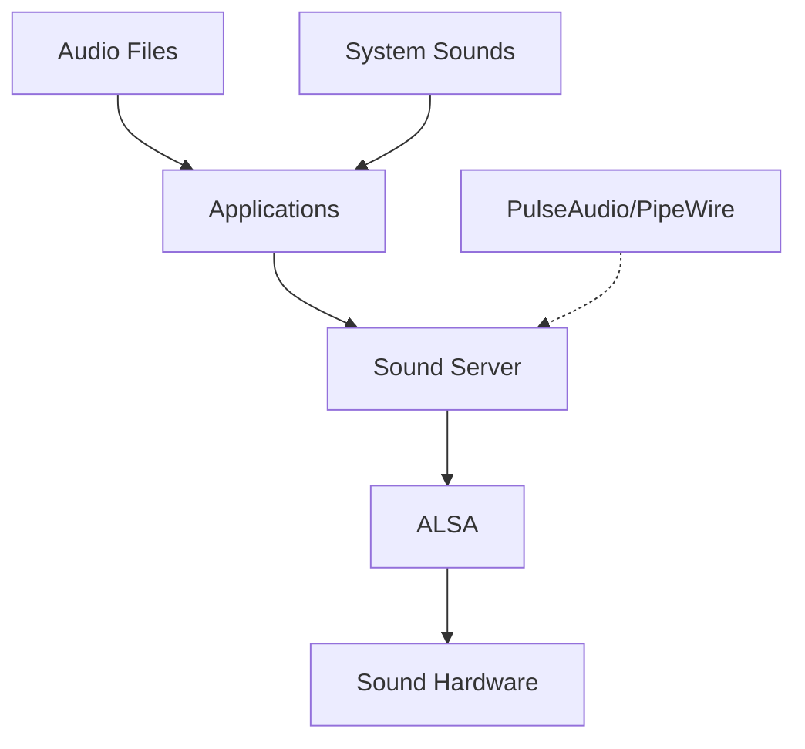

# Ubuntu Sound Customization

## Introduction

Sound customization is an important aspect of personalizing your Ubuntu system. Whether you're a developer who needs precise audio control for application testing, a content creator requiring optimal sound quality, or simply a user who wants a better audio experience, Ubuntu offers various ways to customize your sound settings.

This guide will walk you through different methods and tools to customize the sound system on Ubuntu, from basic configuration to advanced tweaking. We'll explore how to adjust sound settings, install sound themes, use sound servers, and solve common audio problems.

## Understanding Ubuntu's Sound Architecture

Before diving into customization, it's helpful to understand how sound works in Ubuntu:



Ubuntu primarily uses either PulseAudio or PipeWire (in newer versions) as the sound server, which sits on top of ALSA (Advanced Linux Sound Architecture). This stack provides flexibility for customization at different levels.

## Basic Sound Settings

### Adjusting Volume and Output Devices

Let's start with the basic sound settings available through the Ubuntu Settings app:

1. Open the Settings app (or type `gnome-control-center` in the terminal)
2. Navigate to "Sound" section
3. Here you can adjust:
   - Output device (speakers, headphones, HDMI)
   - Input device (microphone)
   - Output/input volume
   - Balance between left and right channels

```bash
# You can also use command line to adjust volume:
# Increase volume by 5%
pactl set-sink-volume @DEFAULT_SINK@ +5%

# Decrease volume by 5%
pactl set-sink-volume @DEFAULT_SINK@ -5%

# Mute/unmute
pactl set-sink-mute @DEFAULT_SINK@ toggle
```

### Setting Up System Sounds

Ubuntu allows you to customize system sounds for events like login, notifications, and errors:

1. Open Settings
2. Go to "Sound"
3. Navigate to the "Sound Effects" tab
4. Enable/disable system sounds or adjust their volume

## Installing and Configuring PulseAudio Volume Control

For more advanced sound customization, PulseAudio Volume Control (pavucontrol) is essential:

```bash
# Install PulseAudio Volume Control
sudo apt install pavucontrol
```

Once installed, open it by typing `pavucontrol` in the terminal or searching for "PulseAudio Volume Control" in the applications menu.

This tool provides five tabs for comprehensive audio control:

1. **Playback**: Adjust volume for individual applications
2. **Recording**: Control input sources and their volumes
3. **Output Devices**: Configure speakers, headphones, and other outputs
4. **Input Devices**: Set up microphones and other input sources
5. **Configuration**: Change sound profiles for your hardware

### Per-Application Volume Control

One of the most useful features of PulseAudio Volume Control is the ability to set different volumes for different applications:

1. Open PulseAudio Volume Control
2. Go to the "Playback" tab
3. Adjust the volume slider for each application independently

This allows you to, for example, lower the volume of a game while keeping your music player louder.

## Installing Custom Sound Themes

Ubuntu's system sounds can be replaced with custom sound themes for a personalized experience:

```bash
# First, create a directory for your custom sounds
mkdir -p ~/.local/share/sounds/my-custom-theme

# Then create the necessary configuration file
touch ~/.local/share/sounds/my-custom-theme/index.theme
```

Edit the `index.theme` file with content like:

```ini
[Sound Theme]
Name=My Custom Theme
Directories=stereo

[stereo]
OutputProfile=stereo
```

Now add your sound files to the `~/.local/share/sounds/my-custom-theme/stereo/` directory. Files should be named according to the events they represent, for example:
- `desktop-login.oga`
- `message.oga`
- `bell.oga`
- `complete.oga`

To activate your theme:

1. Open dconf-editor (install with `sudo apt install dconf-editor` if needed)
2. Navigate to `/org/gnome/desktop/sound/`
3. Change the `theme-name` value to "my-custom-theme"

```bash
# Alternatively, use this command:
gsettings set org.gnome.desktop.sound theme-name 'my-custom-theme'
```

## Advanced Audio Configuration with PulseAudio

### Creating Virtual Sound Devices

PulseAudio allows you to create virtual audio devices for advanced setups:

```bash
# Load the module-null-sink to create a virtual output device
pactl load-module module-null-sink sink_name=Virtual1 sink_properties=device.description="Virtual_Output"

# Create a virtual input device that monitors the virtual output
pactl load-module module-loopback source=Virtual1.monitor sink=@DEFAULT_SINK@
```

This setup allows you to route audio between applications in creative ways, which is useful for streaming, recording, or audio production.

### Persistent PulseAudio Configuration

To make your PulseAudio customizations persistent across reboots, edit the configuration file:

```bash
# Create a custom config file if it doesn't exist
mkdir -p ~/.config/pulse
touch ~/.config/pulse/default.pa
```

Add your customizations to this file, for example:

```
.include /etc/pulse/default.pa

# Automatically switch to newly connected devices
load-module module-switch-on-connect

# Create a virtual output device
load-module module-null-sink sink_name=Virtual1 sink_properties=device.description="Virtual_Output"
```

Restart PulseAudio to apply changes:

```bash
pulseaudio -k
pulseaudio --start
```

## PipeWire: The Modern Sound Server

Newer Ubuntu versions (22.04+) include PipeWire, which is designed to replace both PulseAudio and JACK. If your system uses PipeWire, you can customize it for better sound quality:

```bash
# Check if PipeWire is running
pactl info | grep "Server Name"
```

If it shows "PipeWire," you can customize it with the following steps:

### Installing PipeWire Tools

```bash
# Install PipeWire tools
sudo apt install pipewire-audio-client-libraries pipewire-pulse wireplumber
```

### Configuring Low Latency Audio

For better audio performance, especially for music production:

1. Create a custom configuration directory:

```bash
mkdir -p ~/.config/pipewire/
```

2. Copy the default configuration:

```bash
cp /usr/share/pipewire/pipewire.conf ~/.config/pipewire/
```

3. Edit `~/.config/pipewire/pipewire.conf` and adjust the following parameters:

```
default.clock.min-quantum = 32
default.clock.quantum = 64
default.clock.max-quantum = 8192
```

Lower values provide lower latency but may increase CPU usage.

## Equalizers and Sound Enhancement

### Installing PulseEffects/EasyEffects

For sound enhancement with equalizers, compressors, and more:

```bash
# For Ubuntu 20.04 (PulseAudio-based)
sudo apt install pulseeffects

# For Ubuntu 22.04+ (PipeWire-based)
sudo apt install easyeffects
```

Both tools offer:
- Equalizer with presets for different music genres
- Compressor for dynamic range control
- Reverb, bass enhancement, and more effects
- Presets that can be saved and loaded

### Using the Equalizer

1. Open PulseEffects or EasyEffects
2. Click on the "Equalizer" tab
3. Adjust the frequency bands to your preference or select a preset
4. Enable the equalizer with the power button in the top-right corner

Example configuration for bass boost:
- Increase the 30Hz, 60Hz, and 120Hz bands by 3-6dB
- Slightly increase the 250Hz band by 1-2dB
- Keep mid-range frequencies (500Hz-2kHz) flat
- Adjust high frequencies according to preference

## Troubleshooting Common Sound Issues

### No Sound After Updates

If you lose sound after an Ubuntu update:

```bash
# Restart the sound server
systemctl --user restart pulseaudio.service

# Or for PipeWire
systemctl --user restart pipewire pipewire-pulse
```

### Audio Crackling or Distortion

For crackling or distortion issues:

1. Edit PulseAudio configuration:

```bash
sudo nano /etc/pulse/daemon.conf
```

2. Find and modify these lines (uncomment if needed):

```
default-fragments = 8
default-fragment-size-msec = 10
```

3. Save and restart PulseAudio:

```bash
pulseaudio -k
pulseaudio --start
```

### HDMI Audio Not Working

If HDMI audio isn't working:

```bash
# List available audio sinks
pactl list sinks short

# Set the HDMI sink as default (replace X with the appropriate number)
pactl set-default-sink X
```

## Summary

Ubuntu offers extensive sound customization options through both graphical interfaces and command-line tools. We've explored:

- Basic sound settings in Ubuntu's Settings app
- Advanced control with PulseAudio Volume Control
- Creating and using custom sound themes
- Virtual audio devices for creative setups
- PipeWire configuration for modern Ubuntu systems
- Sound enhancement with equalizers and effects
- Troubleshooting common sound issues

With these tools and techniques, you can significantly improve your Ubuntu audio experience and tailor it to your specific needs.

## Additional Resources

- [Ubuntu Sound Documentation](https://help.ubuntu.com/community/Sound)
- [PulseAudio Documentation](https://www.freedesktop.org/wiki/Software/PulseAudio/Documentation/)
- [PipeWire Wiki](https://gitlab.freedesktop.org/pipewire/pipewire/-/wikis/home)

## Exercises

1. Create a custom sound theme with your favorite notification sounds
2. Set up a virtual audio device and route audio from one application to another
3. Create and save three different equalizer presets for different types of music
4. Configure keyboard shortcuts for volume control using `pactl` commands
5. Use PulseAudio or PipeWire to create a simple audio mixing setup for recording a podcast