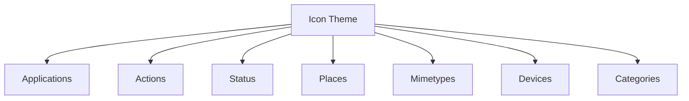

# Ubuntu Icon Themes

## Introduction

Icon themes are collections of graphical elements that replace the default system icons in Ubuntu. They provide a consistent visual language across applications, folders, and system elements, allowing you to personalize your desktop experience. Ubuntu's icon theming system is highly flexible, enabling you to install pre-made themes or create your own custom icon sets.

This guide will walk you through understanding, installing, and even creating your own Ubuntu icon themes.

## Understanding Icon Themes in Ubuntu

Icon themes in Ubuntu follow a standardized structure defined by the [freedesktop.org Icon Theme Specification](https://specifications.freedesktop.org/icon-theme-spec/icon-theme-spec-latest.html). These themes provide icons for:

- Applications (Firefox, Terminal, etc.)
- Actions (save, print, edit, etc.)
- Status indicators (battery, network, etc.)
- Places (home folder, desktop, etc.)
- File types (document, image, video, etc.)
- Devices (hard drive, USB, etc.)

Ubuntu's default icon theme is called "Yaru," which provides the orange and purple aesthetic you see after a fresh installation.



## Installing New Icon Themes

You can install icon themes in Ubuntu using multiple methods:

### Method 1: Using the Ubuntu Software Center

1. Open Ubuntu Software Center
2. Search for "icon themes"
3. Browse the available options and click "Install" on your preferred theme

### Method 2: Using the apt Package Manager

Many icon themes are available in Ubuntu's repositories:

```bash
# Install Papirus icon theme - one of the most popular themes
sudo apt install papirus-icon-theme

# Install elementary icons
sudo apt install elementary-icon-theme

# Install Numix icon theme
sudo apt install numix-icon-theme
```

### Method 3: Manual Installation

For themes not available in the repositories:

1. Download the icon theme (typically as a .tar.gz or .zip file)
2. Extract the theme to either:
   - System-wide location: `/usr/share/icons/`
   - User-specific location: `~/.local/share/icons/` or `~/.icons/`

```bash
# Example: Download and install Tela icon theme
mkdir -p ~/.local/share/icons
cd /tmp
wget https://github.com/vinceliuice/Tela-icon-theme/archive/refs/heads/master.zip
unzip master.zip
cd Tela-icon-theme-master
./install.sh -d ~/.local/share/icons
```

## Applying Icon Themes

Once installed, you can apply an icon theme using:

### Using GNOME Tweaks

1. Install GNOME Tweaks if not already installed:
```bash
sudo apt install gnome-tweaks
```

2. Open GNOME Tweaks
3. Navigate to the "Appearance" tab
4. Select your preferred icon theme from the "Icons" dropdown menu

### Using gsettings Command

You can also change the icon theme via the terminal:

```bash
# List available icon themes
ls /usr/share/icons ~/.local/share/icons ~/.icons 2>/dev/null

# Set the icon theme (replace "Papirus" with your theme name)
gsettings set org.gnome.desktop.interface icon-theme "Papirus"
```

## Icon Theme Structure

If you're interested in creating your own icon theme or modifying an existing one, it's important to understand the standard structure:

```
ThemeName/
├── index.theme           # Theme metadata
├── 16x16/                # Icons for 16x16 pixel size
│   ├── actions/          # Action icons
│   ├── apps/             # Application icons
│   ├── devices/          # Device icons
│   └── ...
├── 22x22/                # Icons for 22x22 pixel size
│   └── ...
├── 24x24/
│   └── ...
├── 32x32/
│   └── ...
├── 48x48/
│   └── ...
└── scalable/             # Vector icons (SVG format)
    └── ...
```

The `index.theme` file defines metadata about the theme:

```ini
[Icon Theme]
Name=My Custom Theme
Comment=A beautiful custom icon theme
Inherits=hicolor
Directories=16x16/actions,16x16/apps,...

[16x16/actions]
Size=16
Context=Actions
Type=Fixed

# More directory definitions...
```

## Creating a Simple Custom Icon Theme

Let's create a basic custom icon theme by overriding just a few icons:

1. Create the directory structure:

```bash
mkdir -p ~/.local/share/icons/MyCustomTheme/{16x16,22x22,24x24,32x32,48x48,scalable}/apps
```

2. Create the index.theme file:

```bash
cat > ~/.local/share/icons/MyCustomTheme/index.theme << 'EOF'
[Icon Theme]
Name=MyCustomTheme
Comment=My custom Ubuntu icon theme
Inherits=Yaru
Directories=16x16/apps,22x22/apps,24x24/apps,32x32/apps,48x48/apps,scalable/apps

[16x16/apps]
Size=16
Context=Applications
Type=Fixed

[22x22/apps]
Size=22
Context=Applications
Type=Fixed

[24x24/apps]
Size=24
Context=Applications
Type=Fixed

[32x32/apps]
Size=32
Context=Applications
Type=Fixed

[48x48/apps]
Size=48
Context=Applications
Type=Fixed

[scalable/apps]
Size=48
Context=Applications
MinSize=8
MaxSize=512
Type=Scalable
EOF
```

3. Create or download a custom icon (SVG format is recommended):

```bash
# Example: Create a custom terminal icon
# Save this SVG code to a file
cat > ~/.local/share/icons/MyCustomTheme/scalable/apps/terminal.svg << 'EOF'
<svg xmlns="http://www.w3.org/2000/svg" width="48" height="48" viewBox="0 0 48 48">
  <rect width="44" height="34" x="2" y="7" rx="2" ry="2" fill="#333" />
  <path d="M6 15l6 6-6 6" stroke="#3f3" stroke-width="2" fill="none" />
  <path d="M14 27h12" stroke="#3f3" stroke-width="2" />
</svg>
EOF
```

4. Update the icon cache:

```bash
gtk-update-icon-cache -f ~/.local/share/icons/MyCustomTheme
```

5. Apply your new theme using GNOME Tweaks or gsettings:

```bash
gsettings set org.gnome.desktop.interface icon-theme "MyCustomTheme"
```

Since our theme inherits from Yaru, it will use Yaru icons for everything except the custom terminal icon we created.

## Modifying Existing Themes

If you want to modify an existing theme rather than creating one from scratch:

1. Copy the theme to your user directory:

```bash
# Example with Papirus
cp -r /usr/share/icons/Papirus ~/.local/share/icons/Papirus-Custom
```

2. Edit the index.theme file to change the name:

```bash
sed -i 's/Name=Papirus/Name=Papirus-Custom/' ~/.local/share/icons/Papirus-Custom/index.theme
```

3. Replace icons as needed:

```bash
# Replace Firefox icon with a custom one
cp my-custom-firefox.svg ~/.local/share/icons/Papirus-Custom/scalable/apps/firefox.svg
```

4. Update the icon cache and apply the theme.

## Advanced: Creating a Complete Icon Theme

Creating a complete icon theme is a significant undertaking, but here are the basic steps:

1. Plan your theme (style, colors, design principles)
2. Create a template icon in SVG format
3. Create the directory structure
4. Create the most common icons first:
   - Apps: firefox, terminal, settings, file-manager
   - Places: folder, home, desktop
   - Actions: save, edit, delete
5. Use symbol links for similar icons
6. Test on different backgrounds and sizes
7. Share your theme with the community

## Troubleshooting

### Icons Not Showing After Installation

If icons don't appear after installation:

```bash
# Update icon cache
sudo gtk-update-icon-cache -f /usr/share/icons/ThemeName
# OR for user themes
gtk-update-icon-cache -f ~/.local/share/icons/ThemeName

# Restart GNOME Shell (in X11 session)
Alt+F2, type "r", press Enter

# Or log out and log back in
```

### Mixed Icons Appearing

If you see a mix of different icon styles:

1. Check the "Inherits" line in your theme's index.theme file
2. Ensure you've created icons for all necessary sizes
3. Check file permissions (should be readable)

## Summary

Ubuntu icon themes provide a powerful way to customize your desktop experience. In this guide, we've covered:

- Understanding how icon themes work in Ubuntu
- Installing pre-made icon themes through different methods
- Applying icon themes using GNOME Tweaks and gsettings
- The structure of icon themes
- Creating a simple custom icon theme
- Modifying existing themes
- Troubleshooting common issues

By mastering icon themes, you can create a unique and personalized Ubuntu desktop that reflects your style and preferences.

## Additional Resources

- [freedesktop.org Icon Theme Specification](https://specifications.freedesktop.org/icon-theme-spec/icon-theme-spec-latest.html)
- [GNOME Human Interface Guidelines](https://developer.gnome.org/hig/)
- [Inkscape](https://inkscape.org/) - Free vector graphics editor for creating SVG icons

## Exercises

1. Install three different icon themes and compare their styles and completeness.
2. Create a custom folder icon and add it to an existing theme.
3. Design a simple app icon in SVG format and add it to your custom theme.
4. Create a script that switches between different icon themes based on the time of day.
5. Contribute an icon to an open-source icon theme project on GitHub.