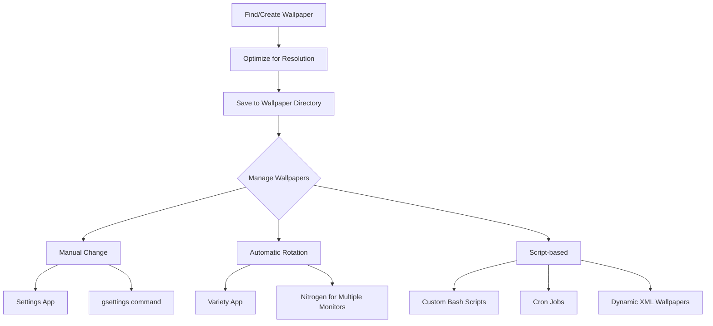

# Ubuntu Wallpaper Management

## Introduction

Personalizing your Ubuntu desktop with custom wallpapers is one of the simplest yet most effective ways to make your working environment feel more comfortable and visually appealing. Ubuntu provides several methods to change, manage, and even automate wallpaper changes. In this guide, we'll explore everything from basic wallpaper changes to advanced automation techniques.

## Basic Wallpaper Management

### Changing Wallpaper Through Settings

The most straightforward way to change your wallpaper in Ubuntu is through the Settings application:

1. Open the **Settings** application (look for the gear icon in the application menu)
2. Select **Background** from the sidebar
3. Choose from the available wallpapers or click the **Add Picture...** button to select a custom image

```bash
# You can also launch the background settings directly from the terminal
gnome-control-center background
```

### Default Wallpaper Locations

Ubuntu stores its default wallpapers in specific system directories:

```bash
# System-wide wallpapers
/usr/share/backgrounds/

# Contest wallpapers from each Ubuntu release
/usr/share/backgrounds/contest/
```

### Setting Wallpaper from Terminal

For those who prefer using the terminal or want to include wallpaper changes in scripts, you can use the `gsettings` command:

```bash
# Set a wallpaper from a specific path
gsettings set org.gnome.desktop.background picture-uri 'file:///path/to/your/image.jpg'

# For dark mode wallpaper (Ubuntu 20.04+)
gsettings set org.gnome.desktop.background picture-uri-dark 'file:///path/to/your/dark-image.jpg'
```

Example output:
```
# No output means the command executed successfully
```

## Creating a Wallpaper Collection

### Recommended Image Specifications

For the best results, follow these specifications when preparing wallpaper images:

- **Resolution**: Match or exceed your screen resolution
- **Aspect Ratio**: Match your screen's aspect ratio (commonly 16:9 or 16:10)
- **File Format**: JPG or PNG (PNG supports transparency)
- **Color Profile**: sRGB for consistent colors

### Organizing Your Wallpapers

Creating a dedicated directory for your wallpapers makes them easier to manage:

```bash
# Create a wallpapers directory in your Pictures folder
mkdir -p ~/Pictures/Wallpapers

# Create themed subdirectories (optional)
mkdir -p ~/Pictures/Wallpapers/{Nature,Abstract,Space,Minimal}
```

## Advanced Wallpaper Features

### Automatic Wallpaper Rotation

You can set up your wallpaper to change automatically using the Variety wallpaper manager:

```bash
# Install Variety
sudo apt install variety
```

After installing Variety, you can configure it to:
- Change wallpapers at specified intervals
- Pull wallpapers from different sources (local folders, online services)
- Apply various effects to wallpapers

### Creating Dynamic Wallpapers

Ubuntu's GNOME desktop supports XML-based dynamic wallpapers that change based on time of day. Here's how to create a basic dynamic wallpaper:

1. Create a new XML file:

```xml
<background>
  <starttime>
    <year>2023</year>
    <month>1</month>
    <day>1</day>
    <hour>0</hour>
    <minute>0</minute>
    <second>0</second>
  </starttime>

  <!-- Morning wallpaper -->
  <static>
    <duration>28800.0</duration>
    <file>/path/to/morning.jpg</file>
  </static>
  
  <!-- Transition to afternoon -->
  <transition>
    <duration>7200.0</duration>
    <from>/path/to/morning.jpg</from>
    <to>/path/to/afternoon.jpg</to>
  </transition>
  
  <!-- Afternoon wallpaper -->
  <static>
    <duration>21600.0</duration>
    <file>/path/to/afternoon.jpg</file>
  </static>
  
  <!-- Transition to evening -->
  <transition>
    <duration>7200.0</duration>
    <from>/path/to/afternoon.jpg</from>
    <to>/path/to/evening.jpg</to>
  </transition>
  
  <!-- Evening wallpaper -->
  <static>
    <duration>28800.0</duration>
    <file>/path/to/evening.jpg</file>
  </static>
  
  <!-- Transition to morning -->
  <transition>
    <duration>7200.0</duration>
    <from>/path/to/evening.jpg</from>
    <to>/path/to/morning.jpg</to>
  </transition>
</background>
```

2. Save this file with a `.xml` extension in `/usr/share/backgrounds/` (requires sudo privileges) or in your personal wallpapers directory

3. To use it as your wallpaper:

```bash
gsettings set org.gnome.desktop.background picture-uri 'file:///path/to/your/dynamic-wallpaper.xml'
```

## Implementing Wallpaper Management in Scripts

### Bash Script for Random Wallpaper

Here's a simple bash script that sets a random wallpaper from your collection:

```bash
#!/bin/bash

# Directory containing wallpapers
WALLPAPER_DIR="$HOME/Pictures/Wallpapers"

# Get a random wallpaper
WALLPAPER=$(find "$WALLPAPER_DIR" -type f \( -name "*.jpg" -o -name "*.png" \) | shuf -n 1)

# Set the wallpaper
gsettings set org.gnome.desktop.background picture-uri "file://$WALLPAPER"

echo "Wallpaper changed to: $WALLPAPER"
```

Save this script as `random-wallpaper.sh`, make it executable with `chmod +x random-wallpaper.sh` and run it whenever you want a new wallpaper.

### Setting Up a Cron Job for Automatic Changes

To automatically change your wallpaper at specific intervals:

1. Make sure you have the script from above saved and executable
2. Edit your crontab:

```bash
crontab -e
```

3. Add a line to run the script every hour:

```
0 * * * * DISPLAY=:0 DBUS_SESSION_BUS_ADDRESS=unix:path=/run/user/$(id -u)/bus $HOME/path/to/random-wallpaper.sh
```

## Troubleshooting Wallpaper Issues

### Wallpaper Not Displaying Correctly

If your wallpaper appears stretched, zoomed, or has black bars:

```bash
# Check the current scaling option
gsettings get org.gnome.desktop.background picture-options

# Set a different scaling option (choose one)
gsettings set org.gnome.desktop.background picture-options 'zoom'      # Zoom and crop
gsettings set org.gnome.desktop.background picture-options 'stretched' # Stretch to fill
gsettings set org.gnome.desktop.background picture-options 'spanned'   # Span across monitors
gsettings set org.gnome.desktop.background picture-options 'centered'  # Center without scaling
gsettings set org.gnome.desktop.background picture-options 'scaled'    # Scale with aspect ratio
gsettings set org.gnome.desktop.background picture-options 'wallpaper' # Tile the image
```

### Wallpaper Reset After Reboot

If your custom wallpaper reverts after reboot, add your wallpaper-setting command to startup applications:

1. Open "Startup Applications"
2. Click "Add"
3. Give it a name like "Set Wallpaper"
4. For the command, enter your gsettings command or path to your wallpaper script
5. Click "Add" and close

## Multiple Monitor Wallpaper Setup

GNOME in Ubuntu doesn't natively support different wallpapers on different monitors, but you can achieve this using third-party tools:

```bash
# Install nitrogen for multi-monitor wallpaper management
sudo apt install nitrogen
```

To use Nitrogen:
1. Launch it with `nitrogen /path/to/wallpapers/directory`
2. Select different wallpapers for each monitor
3. Click "Apply"

## Wallpaper Management Workflow

Here's a diagram showing a typical wallpaper management workflow in Ubuntu:



## Summary

Ubuntu provides a range of options for wallpaper management, from simple GUI-based changes to advanced scripting and automation. You've learned how to:

- Change wallpapers using both the Settings application and terminal commands
- Organize wallpapers effectively and understand image specifications
- Create dynamic wallpapers that change throughout the day
- Write scripts for automated wallpaper changes
- Troubleshoot common wallpaper issues
- Set up different wallpapers on multiple monitors

## Additional Resources

To further enhance your Ubuntu customization skills, consider exploring:

- The `dconf-editor` tool for more advanced desktop settings
- GNOME Shell extensions for additional customization options
- Image manipulation tools like GIMP to create your own wallpapers
- Online wallpaper communities to find high-quality images

## Practice Exercises

1. Create a bash script that changes your wallpaper based on the time of day (morning, afternoon, evening)
2. Set up a cron job to change your wallpaper every day at noon
3. Create a dynamic wallpaper XML file with at least four time-based transitions
4. Write a script that chooses wallpapers based on weather data (hint: use a weather API)