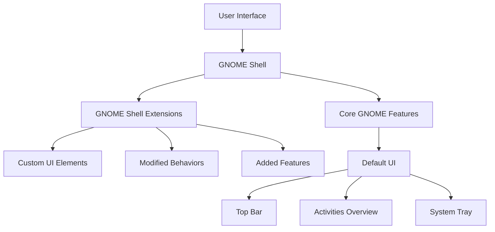

# Ubuntu Desktop Extensions

## Introduction

Ubuntu Desktop Extensions (also known as GNOME Extensions) are powerful tools that allow you to customize and enhance your Ubuntu desktop environment. These extensions are small pieces of software that modify the functionality of the GNOME desktop environment, which is the default graphical interface in Ubuntu.

Extensions can add new features, change existing behaviors, or completely transform the look and feel of your desktop. They're similar to browser extensions but for your operating system's interface. Whether you want to improve productivity, add system monitoring tools, or simply make your desktop more visually appealing, there's likely an extension that can help.

## Prerequisites

Before diving into Ubuntu Desktop Extensions, you should:

- Be running Ubuntu with the GNOME desktop environment (default in Ubuntu 17.10 and later)
- Have basic knowledge of using the terminal
- Be comfortable navigating the Ubuntu desktop interface

## Understanding GNOME Shell Extensions

GNOME Shell Extensions are written in JavaScript and use the GNOME Shell's built-in API to modify the desktop environment. They can:

- Add new elements to the top panel
- Create desktop widgets
- Modify system menus
- Change window management behavior
- Add new keyboard shortcuts
- Much more!

## Installing the Extensions Manager

The easiest way to manage GNOME Extensions is through the Extensions Manager application. Let's install it:

```bash
# Install Extensions Manager via apt
sudo apt update
sudo apt install gnome-shell-extension-manager
```

Alternatively, you can install it from the Ubuntu Software Center by searching for "Extensions" or "Extension Manager".

## Method 1: Installing Extensions via the Extension Manager

1. Open the Extensions Manager application from your applications menu
2. Click on the "Browse" tab
3. Search for extensions using the search field
4. When you find an extension you like, click on it and press the "Install" button

Here's how you might install the popular "Dash to Dock" extension:

```bash
# You can also install some extensions via apt
sudo apt install gnome-shell-extension-dash-to-dock
```

After installation, you'll need to enable the extension by toggling the switch next to its name in the Extensions Manager.

## Method 2: Installing Extensions from the GNOME Extensions Website

You can also install extensions directly from the [GNOME Extensions website](https://extensions.gnome.org/):

1. First, install the browser integration:

```bash
sudo apt install chrome-gnome-shell
```

2. Install the browser extension for either Firefox or Chrome
3. Visit https://extensions.gnome.org/
4. Browse or search for extensions
5. Toggle the switch on the extension page from "OFF" to "ON" to install

## Popular Ubuntu Desktop Extensions

Let's explore some popular extensions that can enhance your Ubuntu experience:

### 1. Dash to Dock

Transforms the dash into a dock that's always visible on your desktop.

```bash
sudo apt install gnome-shell-extension-dash-to-dock
```

After enabling this extension, you can configure it by right-clicking on the dock and selecting "Dash to Dock Settings".

### 2. System Monitor

Displays system information like CPU, memory, network usage in the top panel.

```bash
sudo apt install gnome-shell-extension-system-monitor
```

Once enabled, you'll see system statistics in your top panel. You can configure what's displayed by right-clicking on the indicators.

### 3. Clipboard Indicator

Keeps a history of your clipboard items for quick access.

```bash
sudo apt install gnome-shell-extension-clipboard-indicator
```

After enabling, you'll see a clipboard icon in your top panel. Click it to access your clipboard history.

### 4. Weather

Displays current weather information in the top panel.

To install from Extensions Manager, search for "OpenWeather" and click install.

After enabling, you can configure your location and other settings by clicking on the weather display and selecting preferences.

## Creating a Simple Custom Extension

Let's create a very simple GNOME extension that adds a "Hello World" button to the top panel:

1. First, create the directory structure:

```bash
mkdir -p ~/.local/share/gnome-shell/extensions/hello@example.com
cd ~/.local/share/gnome-shell/extensions/hello@example.com
```

2. Create the metadata.json file:

```bash
cat > metadata.json << EOF
{
  "name": "Hello World",
  "description": "A simple example extension",
  "uuid": "hello@example.com",
  "shell-version": ["42", "43", "44"]
}
EOF
```

3. Create the extension.js file:

```bash
cat > extension.js << EOF
/* extension.js */
const St = imports.gi.St;
const Main = imports.ui.main;
const GObject = imports.gi.GObject;
const PanelMenu = imports.ui.panelMenu;
const PopupMenu = imports.ui.popupMenu;

let button;

function init() {
    // Constructor
}

function enable() {
    button = new St.Bin({
        style_class: 'panel-button',
        reactive: true,
        can_focus: true,
        track_hover: true
    });
    
    let buttonText = new St.Label({
        text: 'Hello!',
        style_class: 'system-status-icon'
    });
    
    button.set_child(buttonText);
    button.connect('button-press-event', _showHello);
    
    Main.panel._rightBox.insert_child_at_index(button, 0);
}

function disable() {
    Main.panel._rightBox.remove_child(button);
    button = null;
}

function _showHello() {
    let text = new St.Label({
        text: 'Hello, World!'
    });
    
    let monitor = Main.layoutManager.primaryMonitor;
    
    let notification = new St.Bin({
        style_class: 'notification',
        x: monitor.width / 2,
        y: monitor.height / 2,
        child: text
    });
    
    Main.uiGroup.add_child(notification);
    
    setTimeout(() => {
        Main.uiGroup.remove_child(notification);
    }, 2000);
}
EOF
```

4. Enable your extension:
   - Press Alt+F2
   - Type `r` and press Enter to restart GNOME Shell
   - Open Extensions Manager and enable your "Hello World" extension

Now you should see a "Hello!" button in your top panel. When clicked, it will display a "Hello, World!" message in the center of your screen for 2 seconds.

## Managing Extensions

### Enabling and Disabling Extensions

You can enable or disable extensions using the Extensions Manager by toggling the switch next to each extension.

From the terminal, you can use the GNOME Shell Extensions CLI:

```bash
# List installed extensions
gnome-extensions list

# Enable an extension
gnome-extensions enable extension-id

# Disable an extension
gnome-extensions disable extension-id
```

### Updating Extensions

Extensions may need updating when you upgrade your Ubuntu version. You can update them:

1. Through the Extensions Manager application
2. From the GNOME Extensions website
3. Manually by replacing the extension files

### Troubleshooting Extensions

If an extension causes problems:

1. Press Alt+F2, type `r` and press Enter to restart GNOME Shell
2. If that doesn't work, log out and log back in
3. If still having issues, disable the problematic extension:

```bash
gnome-extensions disable problematic-extension-id
```

For more detailed troubleshooting, check the extension's log:

```bash
journalctl -f -o cat /usr/bin/gnome-shell
```

## Visualizing the Extension Architecture

Let's understand how GNOME Shell Extensions fit into the Ubuntu desktop architecture:



## Advanced Customization with Extensions

Beyond individual extensions, you can create powerful desktop environments by combining multiple extensions. Here are some popular combinations:

### Creating a macOS-like Experience
- Dash to Dock (configured with dock at bottom)
- TopIcons Plus
- Unite (removes window titlebars when maximized)

### Creating a Windows-like Experience
- Dash to Panel
- Arc Menu
- Desktop Icons NG

### Creating a Productivity Powerhouse
- System Monitor
- GSConnect (connect to Android devices)
- Clipboard Indicator
- Caffeine (prevent screen from going to sleep)

## Summary

Ubuntu Desktop Extensions provide a powerful way to customize your Ubuntu experience without modifying core system files. Through extensions, you can:

- Enhance productivity with custom tools and shortcuts
- Modify the appearance to suit your preferences
- Add functionality that doesn't exist in the default installation
- Create a desktop environment that matches your workflow

The extensibility of the GNOME Shell makes Ubuntu a highly customizable operating system while maintaining stability. By using the right combinations of extensions, you can create a desktop environment that is truly your own.

## Additional Resources

For further exploration of Ubuntu Desktop Extensions:

- The [GNOME Extensions website](https://extensions.gnome.org/)
- [GNOME Shell Extensions documentation](https://gjs.guide/extensions/)
- [Creating GNOME Shell Extensions](https://gjs.guide/extensions/development/)

## Exercises

1. Install the Dash to Dock extension and customize it to match your preferences.
2. Install the Weather extension and configure it for your location.
3. Try creating the simple "Hello World" extension following the guide above.
4. Combine three extensions to create your ideal desktop environment.
5. Advanced: Modify the "Hello World" extension to display the current time instead of "Hello World" when clicked.

Remember that customizing your desktop is about creating an environment that works best for you. Experiment with different extensions to find the perfect combination!