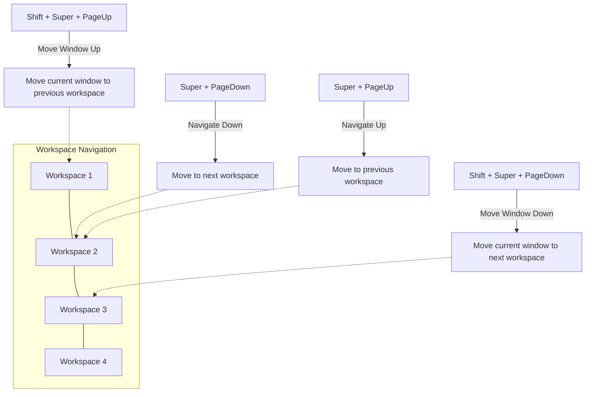

# Ubuntu Keyboard Shortcuts

## Introduction

Keyboard shortcuts are combinations of two or more keys that, when pressed simultaneously or in sequence, perform a specific task that would typically require a mouse or other input device. In Ubuntu, these shortcuts can significantly boost your productivity by reducing the time spent navigating through menus and performing common actions.

Ubuntu, like other Linux distributions, offers a rich set of keyboard shortcuts that can help you navigate the desktop environment, manage windows, launch applications, and perform system operations efficiently. Whether you're a beginner just starting with Ubuntu or looking to enhance your productivity, mastering these keyboard shortcuts will make your Ubuntu experience smoother and more efficient.

## Essential Ubuntu Keyboard Shortcuts

### Desktop Navigation

These shortcuts help you navigate around the Ubuntu desktop environment:

| Shortcut | Action |
|----------|--------|
| `Super` (Windows key) | Open Activities overview |
| `Super + A` | Show the applications menu |
| `Super + Tab` | Switch between applications |
| `Super + PageUp/PageDown` | Switch between workspaces |
| `Super + Home` | Switch to the first workspace |
| `Super + End` | Switch to the last workspace |
| `Alt + Tab` | Switch between windows |
| `Alt + Escape` | Cycle windows directly (without the popup) |
| `Ctrl + Alt + Arrow keys` | Navigate between workspaces |

### Window Management

These shortcuts allow you to control and manipulate windows:

| Shortcut | Action |
|----------|--------|
| `Alt + F4` | Close the current window |
| `Alt + F7` | Move the current window |
| `Alt + F8` | Resize the current window |
| `Alt + F10` | Toggle maximize/restore window |
| `Super + Left arrow` | Snap window to the left half of the screen |
| `Super + Right arrow` | Snap window to the right half of the screen |
| `Super + Up arrow` | Maximize window |
| `Super + Down arrow` | Restore/minimize window |
| `Super + H` | Minimize window |
| `Super + M` | Toggle notification tray |

### System Shortcuts

These shortcuts control system-level operations:

| Shortcut | Action |
|----------|--------|
| `Ctrl + Alt + T` | Open terminal |
| `Ctrl + Alt + Delete` | Show the power off/restart dialog |
| `Ctrl + Alt + L` | Lock the screen |
| `Super + L` | Lock the screen (alternative) |
| `PrtScn` | Take a screenshot of the entire screen |
| `Alt + PrtScn` | Take a screenshot of the current window |
| `Shift + PrtScn` | Take a screenshot of a selected area |

## Customizing Keyboard Shortcuts

One of the powerful features of Ubuntu is the ability to customize keyboard shortcuts to suit your workflow. Here's how to customize your shortcuts:

### Viewing and Modifying Default Shortcuts

1. Open the Settings application either from the applications menu or by pressing `Super` and typing "Settings".
2. Navigate to "Keyboard" or "Keyboard Shortcuts".
3. Here you'll find a list of all available shortcuts categorized by their functions.

### Adding Custom Shortcuts

Let's create a custom shortcut to open Firefox:

1. In the Keyboard Shortcuts settings, scroll down to find the "Custom Shortcuts" section.
2. Click on the "+" button to add a new shortcut.
3. Give your shortcut a name (e.g., "Open Firefox").
4. Enter the command to execute (e.g., `firefox`).
5. Click "Add".
6. Click on "Disabled" or "Set Shortcut" next to your new entry.
7. Press the key combination you want to use (e.g., `Ctrl+Alt+F`).

```bash
# Command to open Firefox
firefox
```

### Example: Creating a Shortcut for Taking Screenshots with Delay

Let's create a more advanced custom shortcut that takes a screenshot with a 5-second delay:

1. Follow steps 1-3 from above.
2. Enter "Delayed Screenshot" as the name.
3. Enter this command: `gnome-screenshot --delay=5`
4. Set a shortcut like `Ctrl+Shift+PrtScn`.

```bash
# Command for delayed screenshot
gnome-screenshot --delay=5
```

## Terminal Shortcuts

The terminal is a powerful tool in Ubuntu, and knowing these shortcuts can make your command-line experience much more efficient:

| Shortcut | Action |
|----------|--------|
| `Ctrl + C` | Interrupt/kill the current process |
| `Ctrl + Z` | Suspend the current process |
| `Ctrl + D` | Log out of the current terminal |
| `Ctrl + L` | Clear the terminal screen |
| `Ctrl + A` | Move cursor to the beginning of the line |
| `Ctrl + E` | Move cursor to the end of the line |
| `Ctrl + U` | Delete from cursor to the beginning of the line |
| `Ctrl + K` | Delete from cursor to the end of the line |
| `Ctrl + W` | Delete the word before the cursor |
| `Ctrl + R` | Search command history |
| `Up/Down arrows` | Navigate through command history |
| `Tab` | Auto-complete commands, filenames, and directories |

## Working with Multiple Workspaces

Workspaces in Ubuntu are virtual desktops that help you organize your open applications and windows. Here's how to use them effectively:

1. Press `Super + PageUp/PageDown` to navigate between workspaces.
2. To move a window to another workspace, press `Shift + Super + PageUp/PageDown`.
3. You can also create a dynamic workspace by dragging a window to the right edge of the screen in the Activities overview (press `Super` to open).

## Text Editing Shortcuts

These shortcuts work in most text editors and text fields across Ubuntu:

| Shortcut | Action |
|----------|--------|
| `Ctrl + X` | Cut selected text |
| `Ctrl + C` | Copy selected text |
| `Ctrl + V` | Paste text from clipboard |
| `Ctrl + Z` | Undo last action |
| `Ctrl + Shift + Z` or `Ctrl + Y` | Redo last undone action |
| `Ctrl + A` | Select all content |
| `Shift + Arrow keys` | Select text character by character |
| `Ctrl + Shift + Arrow keys` | Select text word by word |
| `Home` | Move cursor to beginning of line |
| `End` | Move cursor to end of line |

## Real-World Examples

### Example 1: Efficient Multitasking

Scenario: You're working on a web development project with multiple applications open:
- A text editor with your code
- Firefox with documentation
- Terminal for executing commands
- File manager for organizing project files

Here's how to efficiently navigate between these:

1. Press `Alt + Tab` to quickly switch between applications.
2. Use `Super + Left` and `Super + Right` to arrange Firefox and your text editor side by side.
3. Use `Ctrl + Alt + T` to quickly open terminal when needed.
4. Use `Super + PageDown` to move to a new workspace for file management.
5. Use `Shift + Super + PageUp` to move windows between workspaces as needed.

### Example 2: Taking and Editing Screenshots for Documentation

Scenario: You need to capture and annotate screenshots for a tutorial:

1. Use `Shift + PrtScn` to select a specific area of the screen.
2. The screenshot is automatically saved to your Pictures folder.
3. Use `Alt + Tab` to switch to an image editor.
4. Use `Ctrl + O` to open the screenshot.
5. After editing, use `Ctrl + S` to save it.

## Visualizing Workspace Navigation

Here's a diagram showing how workspaces are organized in Ubuntu:



## Summary

Mastering keyboard shortcuts in Ubuntu can significantly enhance your productivity and efficiency. They allow you to perform tasks quickly without having to navigate through menus or use the mouse, saving you valuable time during your work.

We've covered essential shortcuts for desktop navigation, window management, system operations, terminal usage, and text editing. Remember that practice is key to internalizing these shortcuts - start with a few that you find most useful and gradually expand your repertoire.

## Additional Resources

- **Ubuntu Documentation**: The official Ubuntu documentation provides comprehensive information about keyboard shortcuts and customization.
- **Keyboard Shortcut Manager**: Explore more advanced customization with tools like `dconf-editor`.
- **GNOME Tweaks**: Install the GNOME Tweaks tool for additional customization options:
  ```bash
  sudo apt install gnome-tweaks
  ```

## Practice Exercises

1. **Time yourself**: Try performing common tasks first with the mouse, then with keyboard shortcuts, and compare the time difference.
2. **Create custom shortcuts**: Set up at least three custom shortcuts for applications you use frequently.
3. **Workspace challenge**: Practice organizing your applications across multiple workspaces, using only keyboard shortcuts to navigate.
4. **Terminal mastery**: Open a terminal and practice using the terminal shortcuts to navigate command history and edit command lines.
5. **Window arrangement**: Practice snapping windows to different parts of the screen using keyboard shortcuts to create an efficient workspace layout.

By regularly using these shortcuts, they'll become second nature, making your Ubuntu experience more efficient and enjoyable.