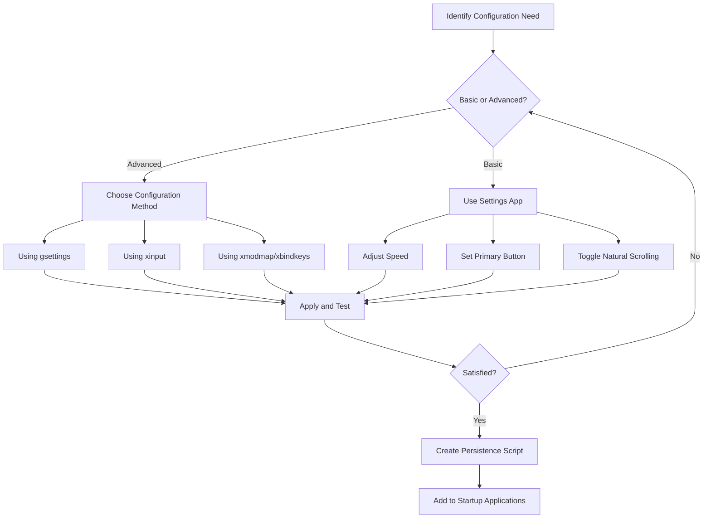

# Ubuntu Mouse Configuration

## Introduction

Mouse configuration is an essential aspect of personalizing your Ubuntu desktop environment. Whether you're a programmer who needs precise cursor control or a casual user seeking comfort during extended computer sessions, Ubuntu provides various options to customize your mouse behavior. This guide will walk you through the different methods and tools available for configuring your mouse in Ubuntu, from basic settings to advanced customizations.

## Basic Mouse Configuration

Ubuntu offers a straightforward graphical interface for adjusting common mouse settings. This is the perfect starting point for beginners.

### Using the Settings Application

The Settings application provides a user-friendly interface for basic mouse configuration:

1. Open the **Settings** application (you can find it in the application menu or by searching for "Settings" in the Activities overview)
2. Click on **Mouse & Touchpad** in the sidebar


Here, you'll find several options to adjust:

- **Primary Button**: Choose between left or right as your primary mouse button
- **Mouse Speed**: Adjust how quickly the pointer moves across the screen
- **Natural Scrolling**: Toggle between standard and natural (reversed) scrolling direction
- **Double-Click Speed**: Set how quickly you need to click twice for a double-click to register

### Example: Changing Mouse Speed via GUI

When you adjust the mouse speed slider in Settings:

1. Move the slider to the right to increase sensitivity (faster movement)
2. Move the slider to the left to decrease sensitivity (slower movement)

The changes take effect immediately, allowing you to test and find your preferred setting.

## Command-Line Configuration

For users who prefer terminal-based solutions or need to script their configurations, Ubuntu provides command-line tools.

### Using `gsettings` for Mouse Configuration

The `gsettings` command allows you to view and change mouse settings from the terminal:

```bash
# View current mouse speed
gsettings get org.gnome.desktop.peripherals.mouse speed

# Set mouse speed (values range from -1.0 to 1.0)
gsettings set org.gnome.desktop.peripherals.mouse speed 0.5

# Toggle natural scrolling (true/false)
gsettings set org.gnome.desktop.peripherals.mouse natural-scroll true

# Change primary button (1 = left, 3 = right)
gsettings set org.gnome.desktop.peripherals.mouse left-handed true
```

### Example: Creating a Script for Mouse Configuration

You can create a simple script to apply your preferred mouse settings:

```bash
#!/bin/bash
# File: configure-mouse.sh

# Set mouse speed
gsettings set org.gnome.desktop.peripherals.mouse speed 0.7

# Enable natural scrolling
gsettings set org.gnome.desktop.peripherals.mouse natural-scroll true

# Set acceleration profile (default, adaptive, flat)
gsettings set org.gnome.desktop.peripherals.mouse accel-profile 'adaptive'

echo "Mouse configuration applied successfully!"
```

Make the script executable:

```bash
chmod +x configure-mouse.sh
```

Run it to apply your settings:

```bash
./configure-mouse.sh
```

Output:
```
Mouse configuration applied successfully!
```

## Advanced Mouse Configuration

For more granular control, Ubuntu provides advanced configuration options through specific tools and configuration files.

### Using `xinput` for Detailed Mouse Properties

The `xinput` command provides fine-grained control over input devices:

```bash
# List all input devices
xinput list

# ⎡ Virtual core pointer                     id=2    [master pointer  (3)]
# ⎜   ↳ Virtual core XTEST pointer           id=4    [slave  pointer  (2)]
# ⎜   ↳ Logitech USB Optical Mouse           id=10   [slave  pointer  (2)]
# ⎣ Virtual core keyboard                    id=3    [master keyboard (2)]
#     ↳ Virtual core XTEST keyboard          id=5    [slave  keyboard (3)]
#     ↳ Power Button                         id=6    [slave  keyboard (3)]
#     ↳ Video Bus                            id=7    [slave  keyboard (3)]
#     ↳ Power Button                         id=8    [slave  keyboard (3)]
#     ↳ AT Translated Set 2 keyboard         id=9    [slave  keyboard (3)]

# List properties for a specific device (using the ID from the list command)
xinput list-props 10

# Change a property (example: mouse acceleration)
xinput set-prop 10 "libinput Accel Speed" 0.5
```

### Configuring Mouse Acceleration

Mouse acceleration affects how the pointer speed changes based on how quickly you move the mouse:

```bash
# Set acceleration profile to flat (no acceleration)
gsettings set org.gnome.desktop.peripherals.mouse accel-profile 'flat'

# For more precise control using xinput:
xinput set-prop "Logitech USB Optical Mouse" "libinput Accel Profile Enabled" 0, 1
```

The second command disables the default profile (0) and enables the flat profile (1).

## Mouse Button Mapping

Ubuntu allows you to remap mouse buttons to perform different actions.

### Using `xmodmap` for Button Remapping

The `xmodmap` utility can remap mouse buttons:

```bash
# View current button mappings
xmodmap -pp

# Create an .Xmodmap file in your home directory
echo "pointer = 3 2 1 4 5" > ~/.Xmodmap

# Apply the configuration
xmodmap ~/.Xmodmap
```

This example swaps the left and right mouse buttons (buttons 1 and 3).

### Example: Configuring a Multi-Button Mouse

For a mouse with additional buttons (like a gaming mouse), you can use the `xbindkeys` tool:

1. Install the required packages:

```bash
sudo apt-get install xbindkeys xautomation
```

2. Create or edit the configuration file:

```bash
# Create the default configuration
xbindkeys --defaults > ~/.xbindkeysrc
```

3. Add custom bindings to `~/.xbindkeysrc`:

```
# Map mouse button 8 to copy (Ctrl+C)
"xte 'keydown Control_L' 'key c' 'keyup Control_L'"
  b:8

# Map mouse button 9 to paste (Ctrl+V)
"xte 'keydown Control_L' 'key v' 'keyup Control_L'"
  b:9
```

4. Restart xbindkeys to apply changes:

```bash
killall xbindkeys
xbindkeys
```

## Working with Mouse Configuration Workflow

This diagram illustrates the typical workflow for mouse configuration in Ubuntu:



## Creating Persistent Configurations

To make your mouse settings persist across reboots:

### Method 1: Using Startup Applications

1. Open **Startup Applications**
2. Click **Add**
3. Fill in:
   - Name: Mouse Configuration
   - Command: `/path/to/your/configure-mouse.sh`
   - Comment: Apply custom mouse settings at login

### Method 2: Using X11 Configuration

For system-wide settings, create a file in `/etc/X11/xorg.conf.d/`:

```bash
sudo mkdir -p /etc/X11/xorg.conf.d/
```

Create a configuration file:

```bash
sudo nano /etc/X11/xorg.conf.d/50-mouse-acceleration.conf
```

Add the following content:

```
Section "InputClass"
    Identifier "Mouse Configuration"
    MatchDriver "libinput"
    MatchIsPointer "yes"
    Option "AccelProfile" "flat"
    Option "AccelSpeed" "0.5"
EndSection
```

Save and close the file, then restart your system for changes to take effect.

## Troubleshooting Mouse Issues

Here are some common mouse issues and solutions:

### Mouse is Too Slow/Fast

```bash
# Adjust speed directly
gsettings set org.gnome.desktop.peripherals.mouse speed 0.7
```

### Mouse Double-Click Not Working Properly

```bash
# Adjust double-click timing (in milliseconds)
gsettings set org.gnome.desktop.peripherals.mouse double-click-timeout 400
```

### Mouse Acceleration Feels Off

```bash
# Try a flat acceleration profile
gsettings set org.gnome.desktop.peripherals.mouse accel-profile 'flat'
```

## Mouse Configuration for Programmers

Programmers often benefit from specific mouse configurations:

### Precision Mode for Coding

Create a toggle script to switch between normal and precision modes:

```bash
#!/bin/bash
# File: toggle-precision-mode.sh

# Get current mouse speed
CURRENT_SPEED=$(gsettings get org.gnome.desktop.peripherals.mouse speed)

# Define speeds
NORMAL_SPEED=0.7
PRECISION_SPEED=0.3

# Toggle between speeds
if [ "$CURRENT_SPEED" = "$NORMAL_SPEED" ]; then
    gsettings set org.gnome.desktop.peripherals.mouse speed $PRECISION_SPEED
    notify-send "Precision Mode Enabled" "Mouse speed reduced for detailed work"
else
    gsettings set org.gnome.desktop.peripherals.mouse speed $NORMAL_SPEED
    notify-send "Normal Mode Enabled" "Mouse speed restored to normal"
fi
```

Make it executable and bind it to a keyboard shortcut for quick toggling.

## Summary

Ubuntu offers a versatile range of options for configuring your mouse, from simple graphical settings to advanced command-line tools. By understanding these configuration methods, you can create a comfortable and efficient mouse experience tailored to your needs.

Here's a quick recap of what we've covered:
- Basic configuration through the Settings application
- Command-line configuration using `gsettings`
- Advanced configuration with `xinput` and `xmodmap`
- Creating persistent configurations
- Troubleshooting common mouse issues
- Specialized configurations for programmers

## Additional Resources

- [Ubuntu Documentation on Input Devices](https://help.ubuntu.com/)
- [Arch Wiki on Mouse Configuration](https://wiki.archlinux.org/title/Mouse_acceleration) (applicable to Ubuntu as well)
- [GNOME Desktop Settings Documentation](https://help.gnome.org/)

## Exercises

1. Create a script that toggles between left-handed and right-handed mouse configuration.
2. Configure your mouse with different profiles for gaming, programming, and general use.
3. Set up a multi-button mouse with custom shortcuts for your favorite applications.
4. Create a system-wide configuration file that applies your preferred mouse settings to all users.
5. Investigate how to configure mouse settings for a specific application only.