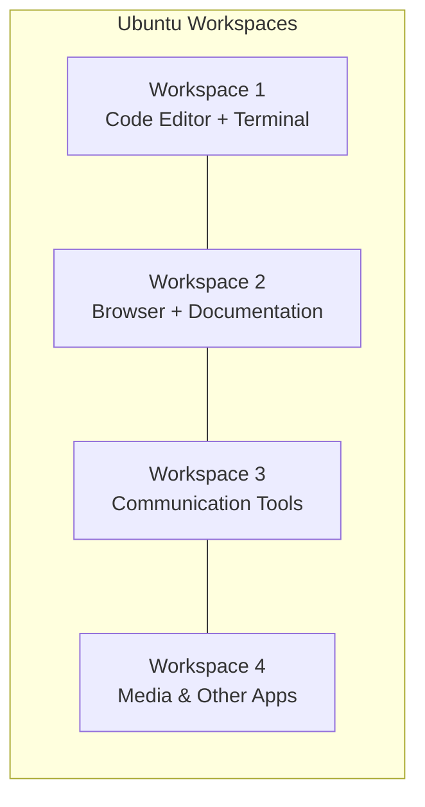

# Ubuntu Workspace Management

Workspaces in Ubuntu are one of the most powerful productivity features that many beginners overlook. They allow you to organize your applications into different virtual desktops, keeping your work environment clean and focused.

## What are Workspaces?

Workspaces (sometimes called virtual desktops) are separate screen environments where you can run applications independently from other workspaces. Think of them as having multiple monitors, but instead of physical screens, you switch between them with keyboard shortcuts or gestures.



## Benefits of Using Workspaces

- **Reduced clutter**: Keep related applications grouped together
- **Improved focus**: Minimize distractions by separating work and leisure applications
- **Better organization**: Create a dedicated workspace for each project or task type
- **Enhanced productivity**: Quickly switch between different contexts without closing applications

## Basic Workspace Navigation

Ubuntu typically comes with workspace functionality enabled by default. Here's how to navigate between them:

- **Switch between workspaces**: `Super + Page Up/Page Down` or `Ctrl + Alt + ↑/↓/←/→`
- **Move current window to another workspace**: `Shift + Super + Page Up/Page Down` or `Shift + Ctrl + Alt + ↑/↓/←/→`
- **View all workspaces**: `Super` key (press and hold)

:::tip
The `Super` key is usually the Windows key on most keyboards or the Command key on Mac keyboards.
:::

## Configuring Workspaces in Ubuntu

By default, Ubuntu workspaces are arranged in a 2×2 grid. You can customize this arrangement using the Settings application.

### Changing Workspace Settings

1. Open the **Settings** application
2. Navigate to **Multitasking**
3. Find the **Workspaces** section

Here you can configure:

- **Fixed number of workspaces** or **Dynamic workspaces**
- **Workspace arrangement** (horizontal/vertical)
- Enable/disable workspace thumbnails in the activities overview

```bash
# You can also configure workspaces using the gsettings command line tool
# For example, to change the number of workspaces to 6:
gsettings set org.gnome.mutter dynamic-workspaces false
gsettings set org.gnome.desktop.wm.preferences num-workspaces 6

# To check the current number of workspaces:
gsettings get org.gnome.desktop.wm.preferences num-workspaces
```

## Practical Workspace Strategies for Developers

### Strategy 1: Project-Based Workspaces

Assign each workspace to a specific project:

| Workspace | Purpose |
|-----------|---------|
| 1 | Project A development (editor, terminal, documentation) |
| 2 | Project B development |
| 3 | Email, Slack, and other communications |
| 4 | Research and reference materials |

### Strategy 2: Function-Based Workspaces

Organize workspaces by function rather than project:

| Workspace | Purpose |
|-----------|---------|
| 1 | All code editors and IDEs |
| 2 | All terminal windows |
| 3 | Web browsers and documentation |
| 4 | Communication tools |

### Strategy 3: Pomodoro Technique Integration

Use workspaces to implement the Pomodoro technique:

| Workspace | Purpose |
|-----------|---------|
| 1 | Current work focus (25 minutes) |
| 2 | Break activities (5 minutes) |
| 3 | Planning and task management |
| 4 | Reference materials |

## Advanced Workspace Management

### Custom Keyboard Shortcuts

You can create custom keyboard shortcuts for more efficient workspace management:

1. Open **Settings**
2. Navigate to **Keyboard** → **Keyboard Shortcuts**
3. Scroll to the **Navigation** section or click **+** to add a new shortcut

Common shortcuts to consider:

- Direct access to specific workspaces (e.g., `Ctrl + 1` for Workspace 1)
- Move active window to a specific workspace (e.g., `Ctrl + Shift + 1`)

```bash
# You can also configure shortcuts via command line:
# Set Ctrl+Alt+1 to switch to workspace 1
gsettings set org.gnome.desktop.wm.keybindings switch-to-workspace-1 "['<Ctrl><Alt>1']"

# Set Ctrl+Alt+Shift+1 to move window to workspace 1
gsettings set org.gnome.desktop.wm.keybindings move-to-workspace-1 "['<Ctrl><Alt><Shift>1']"
```

### Workspace Extensions

GNOME extensions can enhance workspace functionality. Here are some useful extensions:

1. **Workspace Matrix**: Arrange workspaces in a customizable grid
2. **Workspace Indicator**: Shows workspace number in the top panel
3. **Auto Move Windows**: Automatically move specific applications to designated workspaces

To install GNOME extensions:

1. Install the GNOME Shell Extensions browser integration
2. Visit [extensions.gnome.org](https://extensions.gnome.org)
3. Search for and install desired extensions

```bash
# Install GNOME Shell integration for extensions
sudo apt install gnome-shell-extensions chrome-gnome-shell
```

## Workspace Automation with Scripts

You can automate workspace setup using scripts. This is particularly useful for quickly setting up your development environment at the start of your day.

Here's a simple script that opens different applications in specific workspaces:

```bash
#!/bin/bash

# Open VS Code in workspace 1
wmctrl -s 0  # Switch to workspace 1 (0-indexed)
code ~/projects/my-project &
sleep 1

# Open terminal in workspace 1 as well
gnome-terminal --working-directory=~/projects/my-project &
sleep 1

# Open Firefox with documentation in workspace 2
wmctrl -s 1  # Switch to workspace 2
firefox https://docs.example.com &
sleep 1

# Open communication tools in workspace 3
wmctrl -s 2  # Switch to workspace 3
slack &
thunderbird &

# Return to workspace 1
wmctrl -s 0
```

Save this script as `setup-workspaces.sh`, make it executable with `chmod +x setup-workspaces.sh`, and run it to automatically set up your workspaces.

:::note
The script above requires `wmctrl` which can be installed using:
```bash
sudo apt install wmctrl
```
:::

## Troubleshooting Workspace Issues

### Workspaces Not Working

If workspace switching shortcuts don't work:

1. Check if workspaces are enabled in Settings → Multitasking
2. Verify your keyboard shortcuts in Settings → Keyboard
3. Restart GNOME Shell with `Alt + F2`, then type `r` and press Enter

### Applications Not Remembering Workspace

By default, Ubuntu doesn't remember which workspace an application was on. To fix this:

1. Use the "Auto Move Windows" GNOME extension
2. Or create startup scripts like the one shown above

## Summary

Ubuntu workspaces provide a powerful way to organize your development environment and increase productivity. By effectively managing your workspaces, you can:

- Reduce visual clutter
- Organize applications by project or function
- Switch quickly between different tasks
- Maintain focus on your current activity

As you become more familiar with workspaces, you can further customize them with keyboard shortcuts, extensions, and automation scripts to create a development environment that perfectly suits your workflow.

## Exercises to Practice

1. Set up four workspaces with different wallpapers to visually distinguish them
2. Create a custom keyboard shortcut to directly access workspace 3
3. Write a simple startup script that launches your favorite development tools across different workspaces
4. Try the three workspace strategies mentioned above for one day each and determine which works best for you

## Additional Resources

- [GNOME Extensions Website](https://extensions.gnome.org)
- [Ubuntu Desktop Guide](https://help.ubuntu.com/stable/ubuntu-help/shell-workspaces.html)
- [GNOME Shell Cheat Sheet](https://wiki.gnome.org/Projects/GnomeShell/CheatSheet)