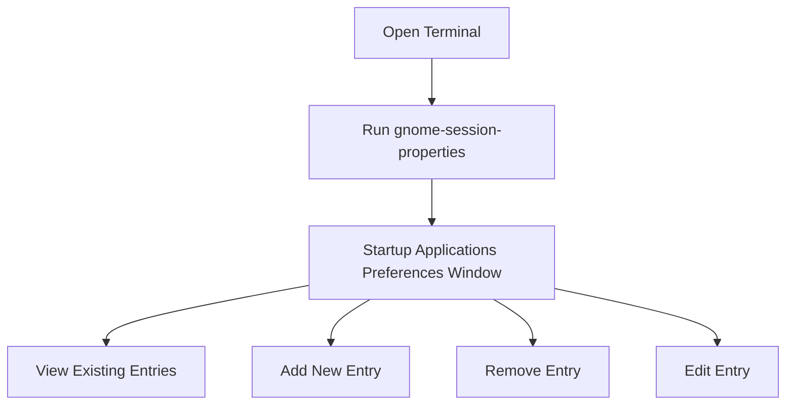

# Ubuntu Startup Applications

## Introduction

When you log into your Ubuntu system, several applications automatically start in the background. These are called **startup applications** and they can include system services, application launchers, or background processes that enhance your desktop experience. Understanding how to manage these startup applications is an essential skill for customizing your Ubuntu experience and optimizing system performance.

In this guide, we'll explore how to:
- View currently configured startup applications
- Add new applications to your startup sequence
- Remove unnecessary startup applications
- Create custom startup entries
- Delay startup applications for better system performance

## Understanding the Startup Applications Manager

Ubuntu provides a built-in tool called the **Startup Applications Preferences** that allows you to manage which applications launch automatically when you log in. 

### Accessing the Startup Applications Manager

You can access the Startup Applications manager through:

1. **GUI Method**: 
   - Open the Applications menu (or Activities overview)
   - Search for "Startup Applications"
   - Click on the "Startup Applications Preferences" icon

2. **Terminal Method**:
   - Open a terminal
   - Type the following command:

```bash
gnome-session-properties
```

This will open the Startup Applications Preferences window:



## Viewing Existing Startup Applications

When you open the Startup Applications Preferences, you'll see a list of all applications currently configured to start automatically. Each entry includes:

- **Name**: A descriptive name for the startup item
- **Command**: The actual command that gets executed
- **Delay**: (If configured) How many seconds to wait before launching

Some default startup applications in Ubuntu include:
- GNOME Settings Daemon
- Network Manager
- Power Manager
- Screen Reader
- Volume Control

## Adding New Startup Applications

You can add your favorite applications to the startup sequence so they're ready to use as soon as you log in.

### Method 1: Using the Startup Applications Manager

1. Open Startup Applications Preferences
2. Click the "Add" button
3. Fill in the details:
   - **Name**: A descriptive name for the application
   - **Command**: The command to launch the application
   - **Comment**: Optional description

For example, to add Firefox to your startup applications:
- **Name**: Firefox Web Browser
- **Command**: firefox
- **Comment**: Launch Firefox automatically at login

### Method 2: Creating .desktop Files Manually

For more advanced configuration, you can create desktop entry files manually:

1. Create a new `.desktop` file in `~/.config/autostart/`:

```bash
touch ~/.config/autostart/myapplication.desktop
```

2. Edit the file with your favorite text editor:

```bash
nano ~/.config/autostart/myapplication.desktop
```

3. Add the following content:

```
[Desktop Entry]
Type=Application
Exec=application-command
Hidden=false
NoDisplay=false
X-GNOME-Autostart-enabled=true
Name[en_US]=My Application Name
Name=My Application Name
Comment[en_US]=Description of my application
Comment=Description of my application
```

Replace `application-command` with the actual command to launch your application.

## Finding Command Names for Applications

If you're unsure what command launches a specific application, there are several ways to find out:

1. **Check the application's menu entry**:
   - Right-click on the application in the menu
   - Select "Properties" or similar option
   - Look for the "Command" field

2. **Use the which command**:
   - If you know the approximate name, use:

```bash
which application-name
```

For example:

```bash
which firefox
```

Output:
```
/usr/bin/firefox
```

3. **Check desktop files**:
   - Look in `/usr/share/applications/` for the application's `.desktop` file
   - Open it with a text editor to find the `Exec=` line

## Removing Startup Applications

To prevent an application from starting automatically:

1. Open Startup Applications Preferences
2. Select the application you want to remove
3. Click the "Remove" button

Alternatively, you can disable an application without removing it completely:

1. Select the application
2. Click "Edit"
3. Add `sleep 999999999` before the command, which will delay it for an extremely long time

## Creating Advanced Startup Entries

### Delaying Application Startup

You can delay applications to improve login performance by adding a sleep command:

```bash
sleep 10 && application-command
```

This will wait 10 seconds before launching the application.

### Running Applications with Arguments

You can pass additional arguments to applications:

```bash
firefox --private-window https://ubuntu.com
```

This will start Firefox in private browsing mode and open Ubuntu's website.

### Running Multiple Commands

To run multiple commands in sequence:

```bash
command1 && command2
```

To run them in parallel:

```bash
command1 & command2
```

## Viewing Hidden Startup Applications

By default, Ubuntu hides some system startup applications to prevent accidental modifications. To show all startup applications:

1. Open a terminal
2. Run the following command:

```bash
sudo sed -i 's/NoDisplay=true/NoDisplay=false/g' /etc/xdg/autostart/*.desktop
```

3. Reopen the Startup Applications Preferences to see all entries

## Creating a Startup Script

For more complex startup requirements, you can create a shell script:

1. Create a new script file:

```bash
touch ~/startup-script.sh
```

2. Make it executable:

```bash
chmod +x ~/startup-script.sh
```

3. Edit the file:

```bash
#!/bin/bash

# Wait for network connection
sleep 5

# Start applications
firefox &
thunderbird &

# Set screen resolution
xrandr --output HDMI-1 --mode 1920x1080

# Mount network drives
mount -t cifs //server/share /mnt/share -o credentials=/home/user/.smbcredentials

echo "Startup script completed at $(date)" >> ~/startup.log
```

4. Add this script to your startup applications with the command:

```
/home/yourusername/startup-script.sh
```

## Troubleshooting Startup Applications

If you're experiencing issues with startup applications:

### Applications Don't Start

1. Verify the command works when run manually in terminal
2. Check system logs for errors:

```bash
journalctl -b | grep application-name
```

### System Boots Slowly

1. Consider using delayed startup for non-essential applications
2. Remove unnecessary startup applications
3. Use the `htop` command during startup to see which processes are consuming resources:

```bash
sudo apt install htop
htop
```

## Startup Applications vs. System Services

It's important to understand the difference between startup applications and system services:

- **Startup applications** run at the user level when you log in
- **System services** run at the system level, often before the user interface loads

To manage system services, you would use the `systemctl` command:

```bash
# Check status of a service
systemctl status service-name

# Enable a service to start on boot
sudo systemctl enable service-name

# Disable a service from starting on boot
sudo systemctl disable service-name
```

## Summary

Managing startup applications in Ubuntu gives you control over your desktop environment and system performance. By carefully selecting which applications start automatically, you can create a customized experience that balances convenience with system resources.

Key takeaways:
- Use the Startup Applications Preferences tool to manage startup applications
- Add applications that you use frequently to save time
- Remove or delay non-essential applications to improve login speed
- Create custom scripts for more complex startup requirements
- Distinguish between user startup applications and system services

## Exercises

1. Open the Startup Applications Preferences and identify which applications are currently set to start automatically on your system.
2. Add your favorite text editor to your startup applications.
3. Create a custom startup script that:
   - Creates a daily backup of an important folder
   - Opens your most commonly used applications
   - Displays a welcome message
4. Research and list three system services that start automatically on your Ubuntu system.
5. Measure your system's boot time before and after optimizing your startup applications.

## Additional Resources

- Ubuntu Documentation: [Startup Applications](https://help.ubuntu.com/stable/ubuntu-help/startup-applications.html)
- The Linux Command Line by William Shotts (for advanced scripting)
- ArchWiki: [Autostarting](https://wiki.archlinux.org/title/Autostarting) (for advanced users)