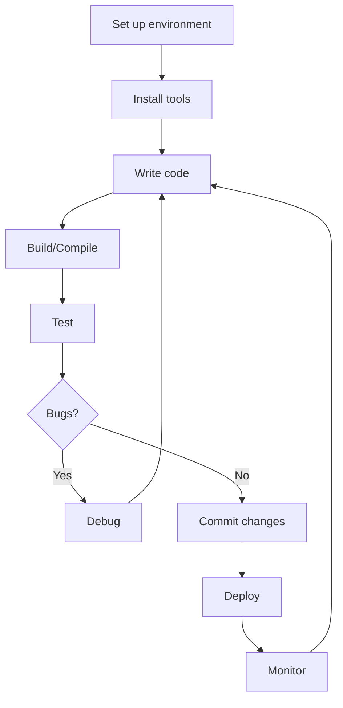

# Ubuntu Development Tools

## Introduction

Ubuntu provides a rich ecosystem of development tools that make it an excellent platform for programmers of all skill levels. Whether you're building web applications, developing system software, or learning to code, Ubuntu offers a comprehensive set of tools to support your development journey.

This guide introduces the essential development tools available in Ubuntu, how to install them, and how to use them effectively in your projects. By the end of this guide, you'll be equipped with knowledge about the fundamental tools needed to start developing software on Ubuntu.

## Getting Started with Ubuntu for Development

Ubuntu's package management system makes it easy to install and update development tools. Before diving into specific tools, let's ensure your system is up-to-date:

```bash
sudo apt update
sudo apt upgrade
```

This ensures your system has the latest package information and updates, providing a solid foundation for your development environment.

## Essential Development Tools

### 1. Build Essential Tools

The `build-essential` package includes the necessary tools for compiling software in Ubuntu, including the GNU Compiler Collection (GCC), GNU debugger (GDB), and make utility.

To install:

```bash
sudo apt install build-essential
```

Once installed, you can verify your GCC version:

```bash
gcc --version
```

**Output example:**
```
gcc (Ubuntu 11.4.0-1ubuntu1~22.04) 11.4.0
Copyright (C) 2021 Free Software Foundation, Inc.
This is free software; see the source for copying conditions.  There is NO
warranty; not even for MERCHANTABILITY or FITNESS FOR A PARTICULAR PURPOSE.
```

### 2. Version Control Systems

#### Git

Git is essential for modern software development, enabling version control and collaboration.

Installation:

```bash
sudo apt install git
```

Basic configuration:

```bash
git config --global user.name "Your Name"
git config --global user.email "your.email@example.com"
```

Simple git workflow example:

```bash
# Create a new repository
mkdir my_project
cd my_project
git init

# Create and commit a file
echo "# My Project" > README.md
git add README.md
git commit -m "Initial commit"

# Create and switch to a feature branch
git branch feature-branch
git checkout feature-branch

# Or with a single command
git checkout -b another-feature
```

### 3. Text Editors and IDEs

Ubuntu offers several powerful text editors and Integrated Development Environments (IDEs).

#### Visual Studio Code

VS Code is a versatile and popular editor with extensive plugin support.

Installation via apt:

```bash
sudo apt install software-properties-common apt-transport-https wget
wget -q https://packages.microsoft.com/keys/microsoft.asc -O- | sudo apt-key add -
sudo add-apt-repository "deb [arch=amd64] https://packages.microsoft.com/repos/vscode stable main"
sudo apt update
sudo apt install code
```

Launch it from the terminal:

```bash
code
```

#### Vim

A powerful and lightweight text editor available by default on most Ubuntu installations.

If not installed:

```bash
sudo apt install vim
```

Basic Vim commands:
- Press `i` to enter insert mode
- Press `Esc` to exit insert mode
- Type `:w` to save
- Type `:q` to quit
- Type `:wq` to save and quit

#### Gedit

A simple, user-friendly text editor included with Ubuntu.

```bash
sudo apt install gedit
```

### 4. Programming Language Support

Ubuntu makes it easy to set up various programming languages:

#### Python

Ubuntu comes with Python pre-installed, but you may want to install Python development tools:

```bash
sudo apt install python3-dev python3-pip python3-venv
```

Creating a virtual environment example:

```bash
# Create a virtual environment
python3 -m venv myenv

# Activate it
source myenv/bin/activate

# Install packages
pip install requests

# Deactivate when done
deactivate
```

#### Node.js and npm

For web development:

```bash
sudo apt install nodejs npm
```

Verify installation:

```bash
nodejs --version
npm --version
```

Simple Node.js script example (`hello.js`):

```javascript
console.log('Hello, Ubuntu development!');
```

Run it:

```bash
node hello.js
```

**Output:**
```
Hello, Ubuntu development!
```

#### Java Development Kit

For Java development:

```bash
sudo apt install default-jdk
```

Verify installation:

```bash
javac -version
java -version
```

Example Java program (`HelloUbuntu.java`):

```java
public class HelloUbuntu {
    public static void main(String[] args) {
        System.out.println("Hello, Ubuntu development!");
    }
}
```

Compile and run:

```bash
javac HelloUbuntu.java
java HelloUbuntu
```

**Output:**
```
Hello, Ubuntu development!
```

### 5. Database Tools

#### SQLite

A lightweight database engine:

```bash
sudo apt install sqlite3
```

Basic usage:

```bash
# Create a database
sqlite3 mydb.sqlite

# Inside SQLite shell
sqlite> CREATE TABLE users (id INTEGER PRIMARY KEY, name TEXT, email TEXT);
sqlite> INSERT INTO users (name, email) VALUES ('John Doe', 'john@example.com');
sqlite> SELECT * FROM users;
sqlite> .quit
```

#### PostgreSQL

A powerful open-source relational database:

```bash
sudo apt install postgresql postgresql-contrib
```

Basic setup:

```bash
# Start the service
sudo systemctl start postgresql

# Create a database user
sudo -u postgres createuser --interactive

# Create a database
sudo -u postgres createdb mydb
```

### 6. Docker

Docker allows you to create, deploy, and run applications in containers:

```bash
# Install prerequisites
sudo apt install apt-transport-https ca-certificates curl software-properties-common

# Add Docker's official GPG key
curl -fsSL https://download.docker.com/linux/ubuntu/gpg | sudo apt-key add -

# Add the Docker repository
sudo add-apt-repository "deb [arch=amd64] https://download.docker.com/linux/ubuntu $(lsb_release -cs) stable"

# Install Docker
sudo apt update
sudo apt install docker-ce

# Add your user to the docker group to run Docker without sudo
sudo usermod -aG docker $USER
```

Simple Docker example:

```bash
# Run a hello-world container
docker run hello-world

# Run an Ubuntu container interactively
docker run -it ubuntu bash
```

## Development Workflow Example

Let's put these tools together in a simple workflow for a Python web application:

```bash
# Create project directory
mkdir flask_app
cd flask_app

# Set up virtual environment
python3 -m venv venv
source venv/bin/activate

# Install Flask
pip install flask

# Create app.py
cat > app.py << 'EOF'
from flask import Flask, jsonify

app = Flask(__name__)

@app.route('/')
def hello():
    return jsonify({"message": "Hello, Ubuntu Development!"})

if __name__ == '__main__':
    app.run(debug=True)
EOF

# Initialize Git repository
git init
echo "venv/" > .gitignore
git add .
git commit -m "Initial commit with Flask app"

# Run the application
python app.py
```

Visit `http://127.0.0.1:5000/` in your browser to see the JSON response.

## Debugging Tools

### GNU Debugger (GDB)

GDB is powerful for debugging C and C++ programs:

```bash
sudo apt install gdb
```

Simple debugging example for a C program (`buggy.c`):

```c
#include <stdio.h>

int main() {
    int numbers[3] = {1, 2, 3};
    printf("The fourth element is: %d
", numbers[3]); // Bug: out of bounds
    return 0;
}
```

Compile with debugging symbols and debug:

```bash
gcc -g buggy.c -o buggy
gdb ./buggy
```

GDB commands:
```
(gdb) run
(gdb) backtrace
(gdb) quit
```

### Valgrind

For memory debugging, memory leak detection, and profiling:

```bash
sudo apt install valgrind
```

Usage example:

```bash
valgrind --leak-check=yes ./my_program
```

## Development Workflow Visualization

Here's a typical development workflow on Ubuntu:



## Tips for Efficient Development in Ubuntu

1. **Use keyboard shortcuts**: Learn terminal and editor shortcuts to boost productivity.
2. **Create aliases**: Set up aliases for commonly used commands in your `.bashrc` or `.zshrc` file.
   
   ```bash
   # Add to ~/.bashrc
   alias ll='ls -la'
   alias python=python3
   ```

3. **Use tmux for terminal multitasking**:
   
   ```bash
   sudo apt install tmux
   ```
   
   Start a session with `tmux`, create panes with `Ctrl+b %` (vertical split) or `Ctrl+b "` (horizontal split).

4. **Set up SSH keys for GitHub/GitLab**:
   
   ```bash
   ssh-keygen -t ed25519 -C "your.email@example.com"
   cat ~/.ssh/id_ed25519.pub
   # Copy the output to GitHub/GitLab
   ```

## Summary

Ubuntu provides a rich ecosystem of development tools that can support nearly any programming task. In this guide, we've covered:

- Essential build tools and compilers
- Version control with Git
- Text editors and IDEs
- Programming language support
- Database tools
- Containerization with Docker
- Debugging tools

By mastering these tools, you'll have a solid foundation for developing software on Ubuntu. The open-source nature of Ubuntu means you have access to a vast array of development resources, and the strong community support ensures help is always available when you encounter challenges.

## Additional Resources

1. Official Ubuntu documentation: [https://help.ubuntu.com/](https://help.ubuntu.com/)
2. Ask Ubuntu Q&A site: [https://askubuntu.com/](https://askubuntu.com/)
3. Ubuntu Developer portal: [https://ubuntu.com/developer](https://ubuntu.com/developer)

## Exercises

1. Set up a complete development environment for your preferred programming language.
2. Create a simple "Hello World" application and set up version control with Git.
3. Practice debugging a program using GDB or a language-specific debugger.
4. Create a Docker container for your application and run it.
5. Set up a CI/CD pipeline using GitHub Actions or GitLab CI for an existing project.

By completing these exercises, you'll gain practical experience with Ubuntu's development tools and be well-prepared for more complex software development projects.