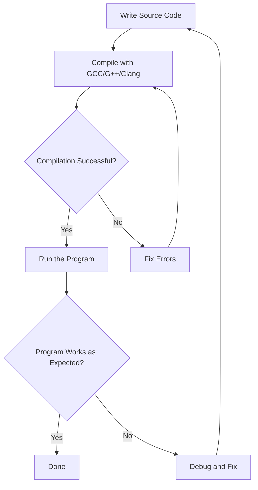

# Ubuntu Compiler Installation

## Introduction

Compilers are essential tools for software development that transform human-readable source code into machine-executable programs. For beginners starting their programming journey on Ubuntu, understanding how to install and use different compilers is a crucial first step before diving into actual coding.

This guide will walk you through the process of installing popular compilers on Ubuntu, focusing on the C and C++ compilers (GCC/G++), along with alternatives like Clang. We'll also cover some basic compiler usage to get you started with your first programs.

## Understanding Compilers in Ubuntu

Before we dive into installation, let's understand what compilers do and which ones are commonly used in Ubuntu:

1. **GCC (GNU Compiler Collection)** - The standard compiler for C programming in Linux
2. **G++** - The C++ compiler component of GCC
3. **Clang** - A modern compiler for C/C++ developed by Apple as part of the LLVM project
4. **Other language-specific compilers** - For languages like Fortran, Java, etc.

Ubuntu's package management system makes installing these tools straightforward.

## Installing the Build Essential Package

The easiest way to get started with compilation tools in Ubuntu is to install the `build-essential` package. This meta-package includes the GCC/G++ compilers and other libraries and tools necessary for compiling software.

```bash
# Update package lists first
sudo apt update

# Install build-essential package
sudo apt install build-essential -y
```

After running these commands, you'll have:
- GCC (C compiler)  
- G++ (C++ compiler)
- Make (build automation tool)
- libc6-dev (C standard library development files)

### Verifying the Installation

To verify that the compilers are installed correctly, check their versions:

```bash
# Check GCC version
gcc --version

# Check G++ version
g++ --version
```

You should see output similar to:

```
gcc (Ubuntu 11.4.0-1ubuntu1~22.04) 11.4.0
Copyright (C) 2021 Free Software Foundation, Inc.
This is free software; see the source for copying conditions.  There is NO
warranty; not even for MERCHANTABILITY or FITNESS FOR A PARTICULAR PURPOSE.
```

## Installing Clang (Alternative C/C++ Compiler)

Clang is an alternative to GCC that often provides more user-friendly error messages, making it popular among beginners.

```bash
# Install Clang compiler
sudo apt install clang -y
```

Verify the installation:

```bash
# Check Clang version
clang --version
```

## Your First Compilation

Let's put our newly installed compilers to work with a simple "Hello, World!" program.

### Using GCC (C Compiler)

Create a file named `hello.c` with the following content:

```c
#include <stdio.h>

int main() {
    printf("Hello, World!
");
    return 0;
}
```

Compile and run the program:

```bash
# Compile with GCC
gcc hello.c -o hello

# Run the program
./hello
```

Output:
```
Hello, World!
```

### Using G++ (C++ Compiler)

Create a file named `hello.cpp` with the following content:

```cpp
#include <iostream>

int main() {
    std::cout << "Hello, World from C++!" << std::endl;
    return 0;
}
```

Compile and run the program:

```bash
# Compile with G++
g++ hello.cpp -o hello_cpp

# Run the program
./hello_cpp
```

Output:
```
Hello, World from C++!
```

### Using Clang

You can compile the same files using Clang:

```bash
# For C programs
clang hello.c -o hello_clang

# For C++ programs
clang++ hello.cpp -o hello_cpp_clang
```

## Understanding Compiler Flags

Compilers accept various flags to modify their behavior. Here are some common flags you'll use:

### Common GCC/G++ Flags

```bash
# Compile with warnings enabled
gcc -Wall hello.c -o hello

# Compile with optimization level 2
gcc -O2 hello.c -o hello

# Compile with debugging information
gcc -g hello.c -o hello

# Compile with specific C standard
gcc -std=c11 hello.c -o hello

# Compile with multiple flags combined
gcc -Wall -g -O2 hello.c -o hello
```

## Installing Compilers for Other Languages

### Java - OpenJDK

```bash
# Install Java Development Kit
sudo apt install default-jdk -y

# Verify installation
javac --version
java --version
```

### Python

Python comes pre-installed on most Ubuntu distributions, but you might want the latest version:

```bash
# Install Python 3 and development tools
sudo apt install python3 python3-dev python3-pip -y

# Verify installation
python3 --version
```

## Common Compilation Workflow

Here's a typical workflow diagram for compilation in Ubuntu:



## Managing Multiple Compiler Versions

Ubuntu allows you to have multiple versions of compilers installed simultaneously. You can manage them using the `update-alternatives` system:

```bash
# List available GCC alternatives
sudo update-alternatives --config gcc

# Set a specific version as default
sudo update-alternatives --set gcc /usr/bin/gcc-9
```

## Practical Examples

### Example 1: Compiling a Multi-File C Project

Let's create a simple calculator project with multiple files:

**math_operations.h**:
```c
#ifndef MATH_OPERATIONS_H
#define MATH_OPERATIONS_H

int add(int a, int b);
int subtract(int a, int b);

#endif
```

**math_operations.c**:
```c
#include "math_operations.h"

int add(int a, int b) {
    return a + b;
}

int subtract(int a, int b) {
    return a - b;
}
```

**main.c**:
```c
#include <stdio.h>
#include "math_operations.h"

int main() {
    int x = 10, y = 5;
    
    printf("Addition: %d + %d = %d
", x, y, add(x, y));
    printf("Subtraction: %d - %d = %d
", x, y, subtract(x, y));
    
    return 0;
}
```

Compile the multi-file project:

```bash
# Compile individual object files
gcc -c math_operations.c -o math_operations.o
gcc -c main.c -o main.o

# Link object files into executable
gcc math_operations.o main.o -o calculator

# Run the program
./calculator
```

Output:
```
Addition: 10 + 5 = 15
Subtraction: 10 - 5 = 5
```

### Example 2: Creating a Makefile

For larger projects, using `make` simplifies the build process. Create a `Makefile`:

```makefile
CC=gcc
CFLAGS=-Wall -g

calculator: main.o math_operations.o
	$(CC) $(CFLAGS) main.o math_operations.o -o calculator

main.o: main.c math_operations.h
	$(CC) $(CFLAGS) -c main.c

math_operations.o: math_operations.c math_operations.h
	$(CC) $(CFLAGS) -c math_operations.c

clean:
	rm -f *.o calculator
```

Now you can simply run:

```bash
# Build the project
make

# Run the program
./calculator

# Clean up object files and executables
make clean
```

## Troubleshooting Common Compiler Issues

### Missing Header Files

If you encounter an error like `fatal error: some_library.h: No such file or directory`:

```bash
# Install the development package containing the missing header
sudo apt install libsome-dev
```

### Linking Errors

For undefined reference errors:

```bash
# Link with the required library
gcc your_program.c -o your_program -lsome_library
```

## Summary

In this guide, we've covered:

1. How to install essential compilers on Ubuntu using the package manager
2. Basic usage of GCC, G++, and Clang compilers
3. Creating and compiling simple programs
4. Working with compiler flags and options
5. Managing multi-file projects and makefiles
6. Troubleshooting common compilation issues

Having these compilers installed is the first step in your programming journey on Ubuntu. With these tools, you're ready to tackle more complex programming tasks and explore various programming languages and paradigms.

## Additional Resources

- [GCC Online Documentation](https://gcc.gnu.org/onlinedocs/)
- [Clang Documentation](https://clang.llvm.org/docs/index.html)
- [GNU Make Manual](https://www.gnu.org/software/make/manual/make.html)

## Exercises for Practice

1. Create a simple C program that calculates the factorial of a number and compile it using GCC.
2. Write a C++ program that implements a basic stack data structure and compile it with G++.
3. Try compiling the same program with different optimization levels (-O0, -O1, -O2, -O3) and compare the execution speed.
4. Create a multi-file project with headers and implementation files, then build it using a Makefile.
5. Try installing and using a compiler for a different language, such as Rust or Go.