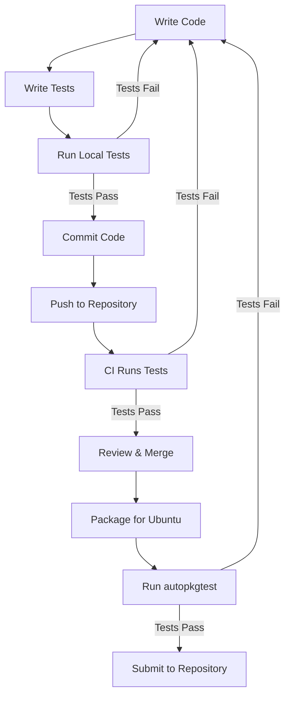

# Ubuntu Testing Tools

## Introduction

Testing is a critical part of the software development process, especially in Ubuntu development where reliability and stability are paramount. Testing helps identify bugs and ensures that your software works as expected across different environments. 

Ubuntu provides a rich ecosystem of testing tools that can help developers validate their applications before deployment. This guide introduces you to the most important testing tools available in the Ubuntu environment, demonstrating how to use them effectively to improve your software quality.

## Why Testing Matters in Ubuntu Development

Before diving into specific tools, let's understand why testing is particularly important in the Ubuntu ecosystem:

1. **Distribution Compatibility**: Ubuntu software must work across different Ubuntu versions
2. **Package Integration**: Applications often interact with other system packages
3. **System Resource Management**: Ubuntu applications need to properly manage system resources
4. **Update Safety**: Ensuring updates don't break existing functionality

## Essential Testing Tools for Ubuntu

### 1. Pytest: A Powerful Python Testing Framework

Pytest is a feature-rich Python testing framework that makes it easy to write small, readable tests while scaling to support complex functional testing.

#### Installation

```bash
sudo apt update
sudo apt install python3-pytest
```

#### Basic Example

Let's write a simple test for a function that adds two numbers:

```python
# math_functions.py
def add(a, b):
    return a + b

# test_math_functions.py
import pytest
from math_functions import add

def test_add():
    assert add(2, 3) == 5
    assert add(-1, 1) == 0
    assert add(-1, -1) == -2
```

Run the test:

```bash
pytest -v test_math_functions.py
```

Output:

```
============================= test session starts ==============================
platform linux -- Python 3.10.4, pytest-6.2.5, py-1.10.0, pluggy-0.13.0
collected 1 item                                                               

test_math_functions.py::test_add PASSED                                  [100%]

============================== 1 passed in 0.01s ===============================
```

#### Advanced Pytest Features

Pytest offers several features that are particularly useful for Ubuntu development:

**Fixtures for Setup and Teardown**:

```python
import pytest
import os
import tempfile

@pytest.fixture
def temp_file():
    # Setup
    fd, path = tempfile.mkstemp()
    with os.fdopen(fd, 'w') as f:
        f.write("test data")
    
    yield path  # Provide the fixture value
    
    # Teardown
    os.unlink(path)

def test_read_file(temp_file):
    with open(temp_file, 'r') as f:
        content = f.read()
    assert content == "test data"
```

**Parameterized Tests**:

```python
import pytest
from math_functions import add

@pytest.mark.parametrize("a,b,expected", [
    (1, 2, 3),
    (-1, 1, 0),
    (0, 0, 0),
    (-5, -5, -10)
])
def test_add_params(a, b, expected):
    assert add(a, b) == expected
```

### 2. Autopkgtest: Testing Debian/Ubuntu Packages

Autopkgtest (also known as `adt-run`) is a tool specifically designed to test Debian/Ubuntu packages. It helps ensure that a package functions correctly when installed into a clean system.

#### Installation

```bash
sudo apt update
sudo apt install autopkgtest
```

#### Setting Up Tests for a Package

Create a `debian/tests` directory in your package source:

```bash
mkdir -p debian/tests
```

Then create a control file and test script:

```bash
# debian/tests/control
Tests: basic-test
Depends: @, python3

# debian/tests/basic-test
#!/bin/sh
set -e

# Run your application's tests
python3 -m pytest /usr/lib/python3/dist-packages/yourpackage/tests/
```

#### Running Autopkgtest

```bash
autopkgtest -- null
```

This will build and install your package, then run the specified tests in a clean environment.

### 3. unittest: Python's Standard Testing Library

Python's built-in `unittest` framework provides another option for testing Python applications on Ubuntu.

#### Basic Example

```python
# calculator.py
class Calculator:
    def add(self, a, b):
        return a + b
    
    def subtract(self, a, b):
        return a - b

# test_calculator.py
import unittest
from calculator import Calculator

class TestCalculator(unittest.TestCase):
    def setUp(self):
        self.calc = Calculator()
    
    def test_add(self):
        self.assertEqual(self.calc.add(3, 4), 7)
    
    def test_subtract(self):
        self.assertEqual(self.calc.subtract(10, 5), 5)

if __name__ == '__main__':
    unittest.main()
```

Run with:

```bash
python3 -m unittest test_calculator.py
```

Output:

```
..
----------------------------------------------------------------------
Ran 2 tests in 0.001s

OK
```

### 4. Tox: Testing in Multiple Environments

Tox is particularly useful for Ubuntu developers who need to ensure compatibility across different Python versions and environments.

#### Installation

```bash
sudo apt update
sudo apt install python3-tox
```

#### Configuration (tox.ini)

```ini
[tox]
envlist = py36, py38, py310

[testenv]
deps =
    pytest
    pytest-cov
commands =
    pytest --cov=myproject {posargs:tests}
```

#### Running Tox

```bash
tox
```

This will automatically create virtual environments for each Python version, install dependencies, and run your tests.

### 5. Desktop Testing with Autopilot

Autopilot is a tool for testing graphical applications on Ubuntu desktop.

#### Installation

```bash
sudo apt update
sudo apt install python3-autopilot
```

#### Example Test for a GTK Application

```python
from autopilot.testcase import AutopilotTestCase
from autopilot.matchers import Eventually
from autopilot.display import Display
import os

class MyAppTests(AutopilotTestCase):
    def setUp(self):
        super(MyAppTests, self).setUp()
        self.display = Display.create()
        # Start the application
        self.app = self.launch_test_application('myapp')
    
    def test_window_title(self):
        window = self.app.select_single('GtkWindow')
        self.assertThat(window.title, Eventually(Equals('My Application')))
    
    def test_button_click(self):
        button = self.app.select_single('GtkButton', label='Click Me')
        self.mouse.click_object(button)
        result_label = self.app.select_single('GtkLabel', name='result_label')
        self.assertThat(result_label.text, Eventually(Equals('Button Clicked!')))
```

## Continuous Integration for Ubuntu Applications

Testing becomes even more effective when integrated into a continuous integration (CI) pipeline. Here's how to set up CI for your Ubuntu project:

### GitHub Actions Example

Create a `.github/workflows/ubuntu-test.yml` file:

```yaml
name: Ubuntu Tests

on:
  push:
    branches: [ main ]
  pull_request:
    branches: [ main ]

jobs:
  test:
    runs-on: ubuntu-latest
    strategy:
      matrix:
        ubuntu-version: [20.04, 22.04]
        python-version: [3.8, 3.10]
    
    steps:
    - uses: actions/checkout@v2
    
    - name: Set up Python ${{ matrix.python-version }}
      uses: actions/setup-python@v2
      with:
        python-version: ${{ matrix.python-version }}
    
    - name: Install dependencies
      run: |
        python -m pip install --upgrade pip
        if [ -f requirements.txt ]; then pip install -r requirements.txt; fi
        pip install pytest pytest-cov
    
    - name: Test with pytest
      run: |
        pytest --cov=./ --cov-report=xml
    
    - name: Upload coverage report
      uses: codecov/codecov-action@v1
      with:
        file: ./coverage.xml
```

## Testing Workflow Visualization

Here's a visualization of a typical Ubuntu testing workflow:



## Best Practices for Testing Ubuntu Applications

1. **Test in Clean Environments**: Use tools like autopkgtest and containers to test in clean environments.

2. **Test Multiple Ubuntu Versions**: Ensure your software works on supported Ubuntu releases.

3. **Mock External Dependencies**: Use mocking frameworks to isolate your tests from external services.

4. **Test Installation and Removal**: Verify that your package installs and removes cleanly.

5. **Use Coverage Analysis**: Monitor test coverage to ensure your tests are comprehensive.

6. **Integrate With CI/CD**: Automate testing with continuous integration.

7. **Test Configuration Files**: Ensure your application handles configuration files correctly.

8. **Include Performance Tests**: Test for performance regressions.

## Real-World Example: Testing a Simple Ubuntu Package

Let's walk through testing a simple package that provides a command-line utility:

### 1. Create the Package

```bash
# Create package structure
mkdir -p myubuntuapp/debian/tests
cd myubuntuapp

# Create a simple Python application
cat > myubuntuapp.py << 'EOF'
#!/usr/bin/env python3

def process_file(filename):
    """Read a file and count lines, words, and characters."""
    try:
        with open(filename, 'r') as f:
            content = f.read()
        lines = content.count('
') + (0 if content == '' else 1)
        words = len(content.split())
        chars = len(content)
        return lines, words, chars
    except FileNotFoundError:
        return None

if __name__ == "__main__":
    import sys
    if len(sys.argv) != 2:
        print("Usage: myubuntuapp FILENAME")
        sys.exit(1)
    
    result = process_file(sys.argv[1])
    if result is None:
        print(f"Error: File '{sys.argv[1]}' not found")
        sys.exit(1)
    
    lines, words, chars = result
    print(f"{lines} {words} {chars} {sys.argv[1]}")
EOF

chmod +x myubuntuapp.py
```

### 2. Create Tests

```bash
# Create a test file
cat > test_myubuntuapp.py << 'EOF'
import pytest
import tempfile
import os
from myubuntuapp import process_file

@pytest.fixture
def sample_file():
    fd, path = tempfile.mkstemp()
    with os.fdopen(fd, 'w') as f:
        f.write("Hello world
This is a test
Ubuntu testing")
    
    yield path
    os.unlink(path)

def test_process_file(sample_file):
    lines, words, chars = process_file(sample_file)
    assert lines == 3
    assert words == 7
    assert chars == 39

def test_nonexistent_file():
    result = process_file("/nonexistent/file/path")
    assert result is None
EOF
```

### 3. Set Up autopkgtest

```bash
# Create debian/tests/control
cat > debian/tests/control << 'EOF'
Tests: run-unit-tests
Depends: @, python3-pytest

Test-Command: ./myubuntuapp.py debian/tests/testfile
Depends: @
EOF

# Create debian/tests/run-unit-tests
cat > debian/tests/run-unit-tests << 'EOF'
#!/bin/sh
set -e
cd "$AUTOPKGTEST_TMP"
cp -r "$AUTOPKGTEST_ARTIFACTS"/* .
python3 -m pytest
EOF

chmod +x debian/tests/run-unit-tests

# Create a test file for the functional test
mkdir -p debian/tests
echo "This is a test file
with some content
for testing." > debian/tests/testfile
```

### 4. Run the Tests

```bash
# Run unit tests locally
python3 -m pytest -v

# Simulate autopkgtest
autopkgtest . -- null
```

## Summary

Testing is an essential part of Ubuntu software development. By using the right testing tools and methodologies, you can ensure your applications work as expected across different Ubuntu environments. This guide introduced several key testing frameworks and tools for Ubuntu:

- **Pytest**: For Python application testing
- **unittest**: Python's built-in testing library
- **Autopkgtest**: For testing Debian/Ubuntu packages
- **Tox**: For testing in multiple environments
- **Autopilot**: For GUI application testing

Remember that consistent and comprehensive testing leads to higher quality software, fewer bugs, and easier maintenance. Testing should be integrated into your development workflow from the beginning.

## Additional Resources

- [Ubuntu Developer Portal](https://developer.ubuntu.com/)
- [Debian Policy Manual](https://www.debian.org/doc/debian-policy/)
- [Pytest Documentation](https://docs.pytest.org/)
- [Autopkgtest Documentation](https://autopkgtest.ubuntu.com/documentation/)

## Exercises

1. Create a simple Python application and write pytest tests for it.
2. Package your application using Debian packaging tools and create autopkgtest tests.
3. Set up a CI pipeline using GitHub Actions to test your package on multiple Ubuntu versions.
4. Add code coverage analysis to your tests and aim for at least 80% coverage.
5. Create a GUI application using GTK and write Autopilot tests for it.