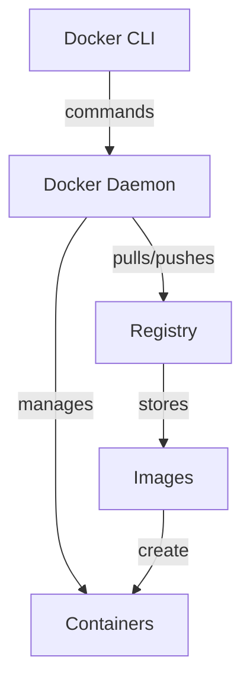

# Ubuntu Docker Integration

## Introduction

Docker has revolutionized how developers build, share, and run applications by using containerization technology. In this guide, we'll explore how to integrate Docker with Ubuntu, one of the most popular Linux distributions for development environments.

Containers allow you to package an application with all its dependencies and run it in isolation from other processes. Unlike virtual machines, containers share the host system's kernel, making them lightweight and fast to start.

## Why Use Docker on Ubuntu?

Ubuntu provides excellent compatibility with Docker due to its:

- Regular kernel updates supporting the latest container features
- Large community support for both technologies
- Official Docker packages maintained for Ubuntu releases
- Strong integration with cloud platforms where both are widely used

## Prerequisites

Before we begin, you should have:

- Ubuntu 20.04 LTS or newer
- A user account with sudo privileges
- Terminal access
- Basic familiarity with command-line operations

## Installing Docker on Ubuntu

Let's install Docker on your Ubuntu system.

### Removing Old Versions

First, remove any older installations:

```bash
sudo apt-get remove docker docker-engine docker.io containerd runc
```

### Setting Up the Repository

Install packages to allow apt to use a repository over HTTPS:

```bash
sudo apt-get update
sudo apt-get install \
    ca-certificates \
    curl \
    gnupg \
    lsb-release
```

Add Docker's official GPG key:

```bash
sudo mkdir -p /etc/apt/keyrings
curl -fsSL https://download.docker.com/linux/ubuntu/gpg | sudo gpg --dearmor -o /etc/apt/keyrings/docker.gpg
```

Set up the repository:

```bash
echo \
  "deb [arch=$(dpkg --print-architecture) signed-by=/etc/apt/keyrings/docker.gpg] https://download.docker.com/linux/ubuntu \
  $(lsb_release -cs) stable" | sudo tee /etc/apt/sources.list.d/docker.list > /dev/null
```

### Installing Docker Engine

Update the apt package index and install Docker:

```bash
sudo apt-get update
sudo apt-get install docker-ce docker-ce-cli containerd.io docker-compose-plugin
```

### Verifying Installation

Verify Docker installation by running a test container:

```bash
sudo docker run hello-world
```

Expected output:

```
Hello from Docker!
This message shows that your installation appears to be working correctly.

To generate this message, Docker took the following steps:
 1. The Docker client contacted the Docker daemon.
 2. The Docker daemon pulled the "hello-world" image from the Docker Hub.
 3. The Docker daemon created a new container from that image which runs the
    executable that produces the output you are currently reading.
 4. The Docker daemon streamed that output to the Docker client, which sent it
    to your terminal.
...
```

## Post-Installation Steps

### Running Docker Without Sudo

To run Docker commands without `sudo`, add your user to the Docker group:

```bash
sudo groupadd docker
sudo usermod -aG docker $USER
```

Apply the new group membership:

```bash
newgrp docker
```

Test that you can run Docker without sudo:

```bash
docker run hello-world
```

### Configuring Docker to Start on Boot

Enable Docker to start on system boot:

```bash
sudo systemctl enable docker.service
sudo systemctl enable containerd.service
```

## Docker Basic Concepts

### Images and Containers

In Docker:
- **Image**: A read-only template containing instructions for creating a container
- **Container**: A runnable instance of an image

### Architecture



## Working with Docker Images

### Pulling Images

Pull an Ubuntu image from Docker Hub:

```bash
docker pull ubuntu
```

Output:

```
Using default tag: latest
latest: Pulling from library/ubuntu
677076032cca: Pull complete 
Digest: sha256:6e9f67fa63b0323e9a1e587fd71c561ba48a034504fb804fd26fd8800039835d
Status: Downloaded newer image for ubuntu:latest
docker.io/library/ubuntu:latest
```

### Listing Images

List locally available images:

```bash
docker images
```

Output:

```
REPOSITORY    TAG       IMAGE ID       CREATED         SIZE
ubuntu        latest    825d55fb6340   2 weeks ago     72.8MB
hello-world   latest    bf756fb1ae65   13 months ago   13.3kB
```

## Running Containers

### Starting a Container

Run an Ubuntu container with an interactive terminal:

```bash
docker run -it ubuntu bash
```

This command:
- `-i` keeps STDIN open
- `-t` allocates a pseudo-TTY
- `ubuntu` is the image name
- `bash` is the command to run inside the container

You'll enter the Ubuntu container's shell, where you can execute commands.

### Container Lifecycle

Start, stop, and remove containers:

```bash
# List running containers
docker ps

# List all containers (including stopped)
docker ps -a

# Stop a container
docker stop container_id

# Start a stopped container
docker start container_id

# Remove a container
docker rm container_id
```

## Building Custom Docker Images

### Creating a Dockerfile

A Dockerfile defines how to build a custom image. Create a file named `Dockerfile`:

```bash
mkdir my-ubuntu-app
cd my-ubuntu-app
nano Dockerfile
```

Add the following content:

```dockerfile
# Base image
FROM ubuntu:latest

# Update packages and install curl
RUN apt-get update && apt-get install -y curl

# Set working directory
WORKDIR /app

# Copy local files to container
COPY . .

# Command to run when container starts
CMD ["bash"]
```

### Building the Image

Build your custom image:

```bash
docker build -t my-ubuntu-app .
```

Output:

```
Sending build context to Docker daemon  2.048kB
Step 1/5 : FROM ubuntu:latest
 ---> 825d55fb6340
Step 2/5 : RUN apt-get update && apt-get install -y curl
 ---> Running in a89b2266d41b
Get:1 http://archive.ubuntu.com/ubuntu jammy InRelease [270 kB]
...
Removing intermediate container a89b2266d41b
 ---> 3c39b57eb9ab
Step 3/5 : WORKDIR /app
 ---> Running in 319e2b8e81b1
Removing intermediate container 319e2b8e81b1
 ---> 9b60d64992a9
Step 4/5 : COPY . .
 ---> 6e03e968f9db
Step 5/5 : CMD ["bash"]
 ---> Running in 1179b0a2a9fc
Removing intermediate container 1179b0a2a9fc
 ---> d83e9801b07e
Successfully built d83e9801b07e
Successfully tagged my-ubuntu-app:latest
```

### Running Your Custom Image

Run a container using your custom image:

```bash
docker run -it my-ubuntu-app
```

## Practical Project: Creating a Simple Web Server

Let's create a simple Node.js web server in a Docker container.

### Project Structure

Create a new project:

```bash
mkdir node-docker-app
cd node-docker-app
```

Create a simple server file `app.js`:

```bash
nano app.js
```

Add this content:

```javascript
const http = require('http');

const server = http.createServer((req, res) => {
  res.statusCode = 200;
  res.setHeader('Content-Type', 'text/plain');
  res.end('Hello from Docker on Ubuntu!');
});

const port = 3000;
server.listen(port, () => {
  console.log(`Server running at http://localhost:${port}/`);
});
```

Create a `package.json` file:

```bash
nano package.json
```

Add this content:

```json
{
  "name": "node-docker-app",
  "version": "1.0.0",
  "description": "A simple Node.js app in Docker",
  "main": "app.js",
  "scripts": {
    "start": "node app.js"
  }
}
```

### Creating the Dockerfile

Create a Dockerfile:

```bash
nano Dockerfile
```

Add this content:

```dockerfile
FROM node:14

WORKDIR /usr/src/app

COPY package*.json ./

RUN npm install

COPY . .

EXPOSE 3000

CMD ["node", "app.js"]
```

### Building and Running the Application

Build the Docker image:

```bash
docker build -t node-docker-app .
```

Run the container, mapping port 3000 from the container to port 8080 on the host:

```bash
docker run -p 8080:3000 -d --name my-node-app node-docker-app
```

Test the application:

```bash
curl http://localhost:8080
```

Output:

```
Hello from Docker on Ubuntu!
```

## Docker Compose for Multi-Container Applications

For applications with multiple services, Docker Compose simplifies management.

### Installing Docker Compose

Docker Compose is included with Docker Desktop for Windows and Mac, but on Ubuntu, we need to install it separately:

```bash
sudo apt-get install docker-compose-plugin
```

Verify installation:

```bash
docker compose version
```

### Creating a Multi-Container Application

Let's create a web application with Node.js and MongoDB:

```bash
mkdir node-mongo-docker
cd node-mongo-docker
```

Create `docker-compose.yml`:

```bash
nano docker-compose.yml
```

Add this content:

```yaml
version: '3'

services:
  web:
    build: .
    ports:
      - "8080:3000"
    environment:
      - MONGODB_URI=mongodb://mongo:27017/nodeapp
    depends_on:
      - mongo
    restart: always

  mongo:
    image: mongo
    ports:
      - "27017:27017"
    volumes:
      - mongodb_data:/data/db

volumes:
  mongodb_data:
```

Create `app.js`:

```bash
nano app.js
```

Add this content:

```javascript
const express = require('express');
const mongoose = require('mongoose');
const app = express();
const port = 3000;

// Connect to MongoDB
mongoose.connect(process.env.MONGODB_URI, { useNewUrlParser: true })
  .then(() => console.log('MongoDB connected'))
  .catch(err => console.log(err));

// Create a schema and model
const visitorSchema = new mongoose.Schema({
  date: { type: Date, default: Date.now }
});

const Visitor = mongoose.model('Visitor', visitorSchema);

// Routes
app.get('/', async (req, res) => {
  // Create a new visitor record
  const visitor = new Visitor();
  await visitor.save();
  
  // Count all visitors
  const count = await Visitor.countDocuments();
  
  res.send(`Hello from Docker on Ubuntu! You are visitor number ${count}`);
});

app.listen(port, () => {
  console.log(`Server running at http://localhost:${port}`);
});
```

Create `package.json`:

```bash
nano package.json
```

Add this content:

```json
{
  "name": "node-mongo-docker",
  "version": "1.0.0",
  "description": "Node.js with MongoDB in Docker",
  "main": "app.js",
  "scripts": {
    "start": "node app.js"
  },
  "dependencies": {
    "express": "^4.17.1",
    "mongoose": "^5.13.7"
  }
}
```

Create `Dockerfile`:

```bash
nano Dockerfile
```

Add this content:

```dockerfile
FROM node:14

WORKDIR /usr/src/app

COPY package*.json ./

RUN npm install

COPY . .

EXPOSE 3000

CMD ["node", "app.js"]
```

### Running the Multi-Container Application

Start the application:

```bash
docker compose up -d
```

Test the application:

```bash
curl http://localhost:8080
```

Output:

```
Hello from Docker on Ubuntu! You are visitor number 1
```

Refresh a few times, and the visitor count will increase.

### Managing the Application

Stop the application:

```bash
docker compose down
```

To stop and remove volumes:

```bash
docker compose down -v
```

## Docker Volumes for Persistent Data

Docker volumes provide a way to persist data generated by containers.

### Creating and Managing Volumes

Create a volume:

```bash
docker volume create my_data
```

List volumes:

```bash
docker volume ls
```

Use a volume with a container:

```bash
docker run -it --name ubuntu-with-volume -v my_data:/data ubuntu bash
```

Inside the container, you can now create files in `/data` that will persist even after the container is removed:

```bash
echo "Hello, persistent data!" > /data/test.txt
exit
```

Remove the container:

```bash
docker rm ubuntu-with-volume
```

Create a new container using the same volume:

```bash
docker run -it --name new-ubuntu-container -v my_data:/data ubuntu bash
```

Verify the data persists:

```bash
cat /data/test.txt
```

Output:

```
Hello, persistent data!
```

## Docker Networking

Docker provides several network types for container communication.

### Network Types

- **bridge**: Default network for containers on a single host
- **host**: Uses the host's networking directly
- **none**: No networking
- **overlay**: For multi-host communication in Swarm mode
- **macvlan**: Assigns a MAC address to a container

### Working with Networks

Create a custom network:

```bash
docker network create my-network
```

List networks:

```bash
docker network ls
```

Run containers in a custom network:

```bash
docker run -d --name container1 --network my-network ubuntu sleep infinity
docker run -d --name container2 --network my-network ubuntu sleep infinity
```

These containers can now communicate using their container names as hostnames.

## Best Practices for Docker on Ubuntu

1. **Use official images** when possible
2. **Keep images small** by using multi-stage builds and minimal base images
3. **Use volumes** for persistent data
4. **Don't run containers as root** when possible
5. **Use Docker Compose** for multi-container applications
6. **Regularly update** your Docker installation
7. **Use .dockerignore** files to exclude unnecessary files
8. **Set resource limits** on containers in production

## Troubleshooting Common Issues

### Permission Denied

If you see `permission denied` errors:

```bash
sudo chown $USER:$USER ~/.docker -R
sudo chmod g+rwx /var/run/docker.sock
```

### Cannot Connect to Docker Daemon

If Docker daemon isn't running:

```bash
sudo systemctl start docker
```

### Disk Space Issues

Clean up unused Docker resources:

```bash
docker system prune -a
```

## Summary

In this guide, we've learned how to:

- Install and configure Docker on Ubuntu
- Work with Docker images and containers
- Build custom Docker images
- Use Docker Compose for multi-container applications
- Manage persistent data with volumes
- Configure Docker networking
- Follow best practices

Docker and Ubuntu provide a powerful combination for modern application development. With containers, you can ensure consistent environments across development, testing, and production, making your software more reliable and easier to deploy.

## Additional Resources

- [Official Docker Documentation](https://docs.docker.com/)
- [Docker Hub](https://hub.docker.com/) for finding official and community images
- [Docker Compose Documentation](https://docs.docker.com/compose/)

## Practice Exercises

1. Create a Docker image for a simple Python Flask application
2. Set up a WordPress site with MySQL using Docker Compose
3. Create a CI/CD pipeline using Docker for an application of your choice
4. Compare container performance between different Ubuntu versions
5. Set up Docker Swarm for container orchestration across multiple Ubuntu hosts