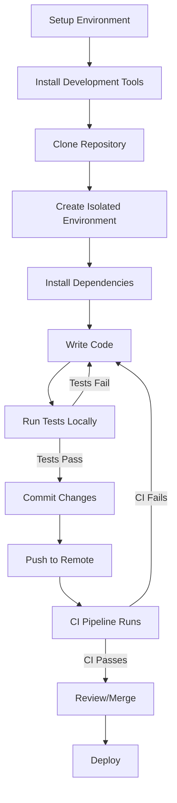

# Ubuntu Development Workflows

## Introduction

Ubuntu has become one of the most popular operating systems for software development due to its stability, security, and extensive package ecosystem. Whether you're building web applications, creating system tools, or developing in languages like Python, JavaScript, or C++, Ubuntu provides a robust foundation for your development workflow.

This guide will walk you through setting up and optimizing your Ubuntu development environment, introducing essential tools, and establishing efficient workflows that will help you become more productive as a software developer.

## Setting Up Your Development Environment

### Essential Development Tools

Before diving into specific workflows, let's ensure you have the fundamental tools installed on your Ubuntu system.

```bash
# Update package lists
sudo apt update

# Install essential build tools
sudo apt install build-essential git curl wget

# Install development libraries
sudo apt install libssl-dev zlib1g-dev libbz2-dev libreadline-dev libsqlite3-dev libffi-dev
```

These packages provide the core utilities needed for compiling code, managing source files, and downloading resources.

### Terminal Customization

As a developer, you'll spend considerable time in the terminal. Let's enhance it for better productivity:

1. **Install a better shell**: ZSH with Oh-My-Zsh provides improved features over the default Bash shell.

```bash
# Install ZSH
sudo apt install zsh

# Install Oh-My-Zsh
sh -c "$(curl -fsSL https://raw.githubusercontent.com/ohmyzsh/ohmyzsh/master/tools/install.sh)"
```

2. **Terminal multiplexer**: Tmux allows you to manage multiple terminal sessions within a single window.

```bash
# Install Tmux
sudo apt install tmux

# Create a basic config file
cat > ~/.tmux.conf << 'EOF'
# Enable mouse mode
set -g mouse on

# Set prefix to Ctrl-Space
unbind C-b
set -g prefix C-Space
bind Space send-prefix

# Start window numbering at 1
set -g base-index 1
EOF
```

### Version Control Setup

Git is essential for any developer. Let's configure it properly:

```bash
# Set your Git user information
git config --global user.name "Your Name"
git config --global user.email "your.email@example.com"

# Set default branch name to main
git config --global init.defaultBranch main

# Setup some helpful aliases
git config --global alias.co checkout
git config --global alias.br branch
git config --global alias.ci commit
git config --global alias.st status
```

## Language-Specific Development Environments

### Python Development Workflow

Python is widely used in Ubuntu development. Let's set up a proper Python environment:

1. **Install pyenv for Python version management**:

```bash
# Install pyenv dependencies
sudo apt install -y make libreadline-dev libncursesw5-dev libssl-dev \
libsqlite3-dev tk-dev libgdbm-dev libc6-dev libbz2-dev libffi-dev zlib1g-dev

# Install pyenv
curl https://pyenv.run | bash

# Add to your shell configuration (~/.zshrc or ~/.bashrc)
echo 'export PATH="$HOME/.pyenv/bin:$PATH"' >> ~/.zshrc
echo 'eval "$(pyenv init --path)"' >> ~/.zshrc
echo 'eval "$(pyenv virtualenv-init -)"' >> ~/.zshrc

# Reload shell configuration
source ~/.zshrc
```

2. **Install and use a specific Python version**:

```bash
# Install Python 3.11.4
pyenv install 3.11.4

# Set as global default
pyenv global 3.11.4
```

3. **Create isolated environments for your projects**:

```bash
# Navigate to your project directory
cd ~/projects/my-python-app

# Create a virtual environment for this project
python -m venv .venv

# Activate the environment
source .venv/bin/activate

# Install project dependencies
pip install -r requirements.txt
```

### Node.js Development Workflow

For JavaScript and Node.js development:

1. **Install NVM (Node Version Manager)**:

```bash
curl -o- https://raw.githubusercontent.com/nvm-sh/nvm/v0.39.5/install.sh | bash

# Add to your shell configuration (if not automatically added)
echo 'export NVM_DIR="$HOME/.nvm"' >> ~/.zshrc
echo '[ -s "$NVM_DIR/nvm.sh" ] && \. "$NVM_DIR/nvm.sh"' >> ~/.zshrc

# Reload shell configuration
source ~/.zshrc
```

2. **Install and use Node.js**:

```bash
# Install the latest LTS version
nvm install --lts

# Install a specific version
nvm install 18.17.1

# Use a specific version
nvm use 18.17.1

# Set default version
nvm alias default 18.17.1
```

3. **Manage project dependencies with npm or yarn**:

```bash
# Initialize a new project
mkdir my-node-app && cd my-node-app
npm init -y

# Install dependencies
npm install express dotenv

# Add development dependencies
npm install --save-dev jest nodemon
```

## Integrated Development Environments (IDEs)

While many Ubuntu developers use terminal-based editors like Vim or Emacs, GUI IDEs can enhance productivity.

### Visual Studio Code

VS Code has become the go-to IDE for many developers due to its performance and extension ecosystem.

```bash
# Install VS Code
sudo apt install software-properties-common apt-transport-https wget
wget -q https://packages.microsoft.com/keys/microsoft.asc -O- | sudo apt-key add -
sudo add-apt-repository "deb [arch=amd64] https://packages.microsoft.com/repos/vscode stable main"
sudo apt update
sudo apt install code
```

Essential VS Code extensions for Ubuntu development:

- Remote - SSH: Edit code on remote machines
- Docker: Manage Docker containers
- GitLens: Enhanced Git integration
- Python: Python language support
- ESLint: JavaScript linting

### JetBrains IDEs

For language-specific development, JetBrains offers specialized IDEs:

```bash
# Install JetBrains Toolbox App
wget -cO jetbrains-toolbox.tar.gz "https://data.services.jetbrains.com/products/download?platform=linux&code=TBA"
tar -xzf jetbrains-toolbox.tar.gz
cd jetbrains-toolbox-*/
./jetbrains-toolbox
```

Through the Toolbox App, you can install:
- PyCharm for Python development
- IntelliJ IDEA for Java/Kotlin
- WebStorm for JavaScript/Web development
- CLion for C/C++ development

## Docker Development Workflow

Docker is essential for creating consistent development environments and deploying applications.

```bash
# Install Docker
sudo apt update
sudo apt install apt-transport-https ca-certificates curl software-properties-common
curl -fsSL https://download.docker.com/linux/ubuntu/gpg | sudo apt-key add -
sudo add-apt-repository "deb [arch=amd64] https://download.docker.com/linux/ubuntu $(lsb_release -cs) stable"
sudo apt update
sudo apt install docker-ce

# Add your user to the docker group to avoid using sudo
sudo usermod -aG docker $USER

# Install Docker Compose
sudo curl -L "https://github.com/docker/compose/releases/download/v2.20.3/docker-compose-$(uname -s)-$(uname -m)" -o /usr/local/bin/docker-compose
sudo chmod +x /usr/local/bin/docker-compose
```

Example Docker workflow for a web application:

1. Create a `Dockerfile` in your project:

```dockerfile
FROM node:18-alpine

WORKDIR /app

COPY package*.json ./
RUN npm install

COPY . .

EXPOSE 3000
CMD ["npm", "start"]
```

2. Create a `docker-compose.yml` file for multi-container setup:

```yaml
version: '3'
services:
  app:
    build: .
    ports:
      - "3000:3000"
    volumes:
      - .:/app
      - /app/node_modules
    environment:
      - NODE_ENV=development
    depends_on:
      - db
  db:
    image: mongo:latest
    ports:
      - "27017:27017"
    volumes:
      - mongo-data:/data/db
volumes:
  mongo-data:
```

3. Run your application with Docker Compose:

```bash
docker-compose up
```

## Continuous Integration Workflow

Setting up CI/CD pipelines is crucial for modern development. Here's how to integrate GitHub Actions with your Ubuntu projects:

1. Create a `.github/workflows` directory in your repository
2. Add a workflow file like `main.yml`:

```yaml
name: CI Pipeline

on:
  push:
    branches: [ main ]
  pull_request:
    branches: [ main ]

jobs:
  build:
    runs-on: ubuntu-latest
    
    steps:
    - uses: actions/checkout@v3
    
    - name: Set up Python
      uses: actions/setup-python@v4
      with:
        python-version: '3.11'
    
    - name: Install dependencies
      run: |
        python -m pip install --upgrade pip
        if [ -f requirements.txt ]; then pip install -r requirements.txt; fi
        pip install pytest pytest-cov
    
    - name: Lint with flake8
      run: |
        pip install flake8
        flake8 . --count --select=E9,F63,F7,F82 --show-source --statistics
    
    - name: Test with pytest
      run: |
        pytest --cov=./ --cov-report=xml
    
    - name: Upload coverage to Codecov
      uses: codecov/codecov-action@v3
```

## Development Workflow Visualization

Here's a visualization of a typical Ubuntu development workflow:



## Productivity Enhancements

### Shell Aliases and Functions

Add these to your `~/.zshrc` or `~/.bashrc` to streamline common tasks:

```bash
# Quick navigation
alias ..='cd ..'
alias ...='cd ../..'
alias proj='cd ~/projects'

# Git shortcuts
alias gs='git status'
alias gp='git pull'
alias gpp='git push'
alias gc='git commit'

# Python virtual environment
alias venv='python -m venv .venv'
alias activate='source .venv/bin/activate'

# Docker shortcuts
alias dc='docker-compose'
alias dcu='docker-compose up'
alias dcd='docker-compose down'

# Function to create a new project directory with git
function mkproj() {
    mkdir -p ~/projects/$1
    cd ~/projects/$1
    git init
    touch README.md
    echo "# $1" > README.md
    git add README.md
    git commit -m "Initial commit"
}
```

### Time-Saving Tools

Install these utilities to enhance your workflow:

```bash
# ripgrep - faster alternative to grep
sudo apt install ripgrep

# fd - faster alternative to find
sudo apt install fd-find

# bat - better cat with syntax highlighting
sudo apt install bat

# fzf - fuzzy finder
sudo apt install fzf

# htop - better system monitor
sudo apt install htop
```

## Debugging and Troubleshooting

### Python Debugging

For Python projects, use `pdb` or `ipdb` for interactive debugging:

```bash
# Install ipdb (enhanced debugger)
pip install ipdb

# Add this line in your code where you want to set a breakpoint
import ipdb; ipdb.set_trace()
```

Alternatively, configure VS Code for visual debugging by creating a `.vscode/launch.json` file:

```json
{
    "version": "0.2.0",
    "configurations": [
        {
            "name": "Python: Current File",
            "type": "python",
            "request": "launch",
            "program": "${file}",
            "console": "integratedTerminal",
            "justMyCode": true
        },
        {
            "name": "Python: Flask",
            "type": "python",
            "request": "launch",
            "module": "flask",
            "env": {
                "FLASK_APP": "app.py",
                "FLASK_ENV": "development"
            },
            "args": [
                "run",
                "--no-debugger"
            ],
            "jinja": true
        }
    ]
}
```

### Node.js Debugging

For Node.js applications, use the built-in debugger:

```bash
# Run your app in debug mode
node --inspect app.js

# Break on first line
node --inspect-brk app.js
```

Then open Chrome and navigate to `chrome://inspect` to connect to the debugger.

## System Monitoring

Monitor your development environment's resource usage:

```bash
# Install the utilities
sudo apt install htop iotop iftop

# Monitor system resources
htop

# Monitor disk I/O
sudo iotop

# Monitor network usage
sudo iftop
```

## Summary

In this guide, we've covered essential Ubuntu development workflows that will help you become a more efficient developer:

1. Setting up a robust development environment with essential tools
2. Configuring language-specific environments for Python and Node.js
3. Installing and using IDEs for increased productivity
4. Implementing Docker-based development workflows for consistency
5. Setting up continuous integration pipelines
6. Enhancing productivity with aliases, functions, and time-saving tools
7. Debugging applications effectively
8. Monitoring system performance

By following these workflows, you'll create a development environment that's not only powerful but also tailored to your specific needs. Remember that the best workflow is one that works for you, so feel free to customize these recommendations based on your preferences and requirements.

## Additional Resources

- [Ubuntu Official Documentation](https://help.ubuntu.com/)
- [Git Documentation](https://git-scm.com/doc)
- [Docker Documentation](https://docs.docker.com/)
- [Python Documentation](https://docs.python.org/)
- [Node.js Documentation](https://nodejs.org/en/docs/)

## Exercises

1. Set up a complete development environment following the guide, and document any issues you encounter and how you solved them.
2. Create a sample project with a Docker setup that includes both a frontend and backend service.
3. Write a shell script that automates your project setup workflow, including creating directories, initializing git, and setting up virtual environments.
4. Configure a CI pipeline for one of your existing projects using GitHub Actions.
5. Create a set of custom aliases and functions that match your specific development needs.