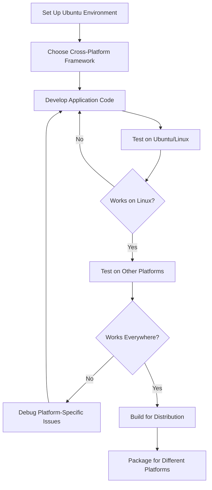

# Ubuntu Cross-Platform Development

## Introduction

Cross-platform development is the practice of creating software applications that can run on multiple operating systems and platforms with minimal code changes. Ubuntu provides an excellent environment for cross-platform development due to its robust toolchain, package management system, and compatibility with various programming languages and frameworks.

In this guide, we'll explore how to set up Ubuntu for cross-platform development, examine popular frameworks and tools, and walk through practical examples to help you build applications that work across Windows, macOS, Linux, and mobile platforms.

## Why Choose Ubuntu for Cross-Platform Development?

Ubuntu offers several advantages for developers working on cross-platform projects:

1. **Stability and Support**: As a long-term support (LTS) distribution, Ubuntu provides a stable development environment with regular updates.
2. **Rich Package Ecosystem**: The APT package manager gives access to thousands of development tools and libraries.
3. **Native Linux Testing**: You can test Linux builds natively while using tools to build and test for other platforms.
4. **Container Support**: Excellent Docker and container integration for consistent development environments.
5. **WSL Support**: Windows users can leverage Ubuntu through Windows Subsystem for Linux.

## Setting Up Your Ubuntu Development Environment

Let's start by configuring Ubuntu with essential tools for cross-platform development.

### Basic Development Tools

Install the basic development packages:

```bash
sudo apt update
sudo apt install build-essential git cmake python3 python3-pip
```

This installs compilers, build automation tools, and version control software necessary for most development workflows.

### Language-Specific Setup

Depending on your preferred programming language, you'll need different tools:

#### For JavaScript/Node.js Development

```bash
# Install Node.js and npm
sudo apt install nodejs npm

# Or use nvm for better version management
curl -o- https://raw.githubusercontent.com/nvm-sh/nvm/v0.39.3/install.sh | bash
source ~/.bashrc
nvm install --lts
```

#### For Python Development

```bash
# Install Python development tools
sudo apt install python3-dev python3-venv

# Set up a virtual environment
python3 -m venv myproject
source myproject/bin/activate
```

#### For Java Development

```bash
# Install JDK
sudo apt install default-jdk

# Verify installation
java -version
javac -version
```

#### For C# and .NET Development

```bash
# Install .NET SDK
wget https://packages.microsoft.com/config/ubuntu/$(lsb_release -rs)/packages-microsoft-prod.deb -O packages-microsoft-prod.deb
sudo dpkg -i packages-microsoft-prod.deb
sudo apt update
sudo apt install -y dotnet-sdk-7.0
```

## Popular Cross-Platform Frameworks

Let's explore some of the most popular frameworks for cross-platform development:

### Electron for Desktop Applications

Electron allows you to build cross-platform desktop applications using web technologies.

```bash
# Create an Electron project
npx create-electron-app my-electron-app
cd my-electron-app
npm start
```

A simple Electron application might look like this:

```javascript
// main.js
const { app, BrowserWindow } = require('electron')

function createWindow() {
  const mainWindow = new BrowserWindow({
    width: 800,
    height: 600,
    webPreferences: {
      nodeIntegration: true
    }
  })

  mainWindow.loadFile('index.html')
}

app.whenReady().then(() => {
  createWindow()
})
```

### React Native for Mobile Applications

React Native lets you build mobile apps for iOS and Android using JavaScript and React.

```bash
# Install React Native CLI
npm install -g react-native-cli

# Create a new React Native project
npx react-native init MyRNApp
cd MyRNApp

# Run the application
npx react-native run-android  # For Android
# For iOS, you'd need macOS
```

A basic React Native component:

```jsx
import React from 'react';
import { Text, View, StyleSheet } from 'react-native';

const HelloWorld = () => {
  return (
    <View style={styles.container}>
      <Text style={styles.text}>Hello, cross-platform world!</Text>
    </View>
  );
};

const styles = StyleSheet.create({
  container: {
    flex: 1,
    justifyContent: 'center',
    alignItems: 'center',
  },
  text: {
    fontSize: 24,
    fontWeight: 'bold',
  },
});

export default HelloWorld;
```

### Flutter for Mobile and Desktop

Flutter is Google's UI toolkit for building natively compiled applications across mobile, web, and desktop.

```bash
# Install Flutter on Ubuntu
sudo snap install flutter --classic

# Verify installation
flutter doctor

# Create a new Flutter project
flutter create my_flutter_app
cd my_flutter_app
flutter run
```

A simple Flutter app:

```dart
import 'package:flutter/material.dart';

void main() {
  runApp(MyApp());
}

class MyApp extends StatelessWidget {
  @override
  Widget build(BuildContext context) {
    return MaterialApp(
      title: 'Flutter Demo',
      theme: ThemeData(
        primarySwatch: Colors.blue,
      ),
      home: Scaffold(
        appBar: AppBar(
          title: Text('Flutter on Ubuntu'),
        ),
        body: Center(
          child: Text(
            'Hello, Cross-Platform World!',
            style: TextStyle(fontSize: 24),
          ),
        ),
      ),
    );
  }
}
```

### Qt for Desktop Applications

Qt is a powerful C++ framework for developing cross-platform applications.

```bash
# Install Qt development tools
sudo apt install qt5-default qtcreator
```

Creating a simple Qt application:

```cpp
// main.cpp
#include <QApplication>
#include <QLabel>

int main(int argc, char *argv[]) {
    QApplication app(argc, argv);
    
    QLabel label("Hello, Cross-Platform World!");
    label.setWindowTitle("Qt on Ubuntu");
    label.resize(300, 200);
    label.show();
    
    return app.exec();
}
```

## Cross-Platform Development Workflow

Let's look at a typical workflow for cross-platform development on Ubuntu:



## Practical Example: Building a Cross-Platform Todo App

Let's create a simple Todo application that works on multiple platforms using Electron.

### Project Setup

```bash
# Create a new Electron project
mkdir todo-app
cd todo-app
npm init -y
npm install --save electron

# Create necessary files
touch main.js index.html renderer.js styles.css
```

### Main Process File (main.js)

```javascript
const { app, BrowserWindow, ipcMain } = require('electron');
const path = require('path');
const fs = require('fs');

let mainWindow;
const dataPath = path.join(app.getPath('userData'), 'todos.json');

function createWindow() {
  mainWindow = new BrowserWindow({
    width: 800,
    height: 600,
    webPreferences: {
      nodeIntegration: true,
      contextIsolation: false,
    }
  });

  mainWindow.loadFile('index.html');
}

app.whenReady().then(() => {
  createWindow();
});

// Load todos from file
ipcMain.handle('load-todos', async () => {
  try {
    if (fs.existsSync(dataPath)) {
      const data = fs.readFileSync(dataPath, 'utf8');
      return JSON.parse(data);
    }
    return [];
  } catch (error) {
    console.error('Failed to load todos:', error);
    return [];
  }
});

// Save todos to file
ipcMain.handle('save-todos', async (event, todos) => {
  try {
    fs.writeFileSync(dataPath, JSON.stringify(todos));
    return true;
  } catch (error) {
    console.error('Failed to save todos:', error);
    return false;
  }
});
```

### HTML UI (index.html)

```html
<!DOCTYPE html>
<html>
<head>
  <meta charset="UTF-8">
  <title>Cross-Platform Todo App</title>
  <link rel="stylesheet" href="styles.css">
</head>
<body>
  <div class="container">
    <h1>Todo App</h1>
    <div class="input-container">
      <input type="text" id="todoInput" placeholder="Enter a new task...">
      <button id="addTodo">Add</button>
    </div>
    <ul id="todoList"></ul>
  </div>
  <script src="renderer.js"></script>
</body>
</html>
```

### Renderer Process (renderer.js)

```javascript
const { ipcRenderer } = require('electron');

let todos = [];

// DOM Elements
const todoInput = document.getElementById('todoInput');
const addTodoButton = document.getElementById('addTodo');
const todoList = document.getElementById('todoList');

// Load todos when app starts
async function loadTodos() {
  todos = await ipcRenderer.invoke('load-todos');
  renderTodos();
}

// Save todos to file
async function saveTodos() {
  await ipcRenderer.invoke('save-todos', todos);
}

// Render todos to the DOM
function renderTodos() {
  todoList.innerHTML = '';
  
  todos.forEach((todo, index) => {
    const li = document.createElement('li');
    li.className = todo.completed ? 'completed' : '';
    
    const checkbox = document.createElement('input');
    checkbox.type = 'checkbox';
    checkbox.checked = todo.completed;
    checkbox.addEventListener('change', () => {
      toggleTodo(index);
    });
    
    const span = document.createElement('span');
    span.textContent = todo.text;
    
    const deleteButton = document.createElement('button');
    deleteButton.textContent = 'Delete';
    deleteButton.className = 'delete-btn';
    deleteButton.addEventListener('click', () => {
      deleteTodo(index);
    });
    
    li.appendChild(checkbox);
    li.appendChild(span);
    li.appendChild(deleteButton);
    
    todoList.appendChild(li);
  });
}

// Add a new todo
function addTodo() {
  const text = todoInput.value.trim();
  if (text) {
    todos.push({ text, completed: false });
    todoInput.value = '';
    renderTodos();
    saveTodos();
  }
}

// Toggle todo completion status
function toggleTodo(index) {
  todos[index].completed = !todos[index].completed;
  renderTodos();
  saveTodos();
}

// Delete a todo
function deleteTodo(index) {
  todos.splice(index, 1);
  renderTodos();
  saveTodos();
}

// Event listeners
addTodoButton.addEventListener('click', addTodo);
todoInput.addEventListener('keypress', (e) => {
  if (e.key === 'Enter') {
    addTodo();
  }
});

// Initialize
loadTodos();
```

### CSS Styling (styles.css)

```css
body {
  font-family: -apple-system, BlinkMacSystemFont, "Segoe UI", Roboto, Helvetica, Arial, sans-serif;
  margin: 0;
  padding: 0;
  background-color: #f5f5f5;
}

.container {
  max-width: 600px;
  margin: 50px auto;
  background-color: white;
  border-radius: 8px;
  box-shadow: 0 2px 10px rgba(0, 0, 0, 0.1);
  padding: 20px;
}

h1 {
  text-align: center;
  color: #333;
}

.input-container {
  display: flex;
  margin-bottom: 20px;
}

input[type="text"] {
  flex: 1;
  padding: 10px;
  border: 1px solid #ddd;
  border-radius: 4px 0 0 4px;
  font-size: 16px;
}

button {
  padding: 10px 20px;
  background-color: #4CAF50;
  color: white;
  border: none;
  border-radius: 0 4px 4px 0;
  cursor: pointer;
  font-size: 16px;
}

button:hover {
  background-color: #45a049;
}

ul {
  list-style-type: none;
  padding: 0;
}

li {
  display: flex;
  align-items: center;
  padding: 10px 0;
  border-bottom: 1px solid #eee;
}

li span {
  flex: 1;
  margin-left: 10px;
}

li.completed span {
  text-decoration: line-through;
  color: #888;
}

.delete-btn {
  background-color: #f44336;
  border-radius: 4px;
  padding: 5px 10px;
  font-size: 14px;
}

.delete-btn:hover {
  background-color: #d32f2f;
}
```

### Running the App

Add this to your `package.json`:

```json
"scripts": {
  "start": "electron ."
}
```

Run the application:

```bash
npm start
```

This Todo app will run on Windows, macOS, and Linux with the same codebase.

## Building and Packaging for Different Platforms

To distribute your application, you'll need to package it for each target platform.

### Using Electron Builder

```bash
# Install electron-builder
npm install --save-dev electron-builder

# Add to package.json
```

Add to your `package.json`:

```json
"build": {
  "appId": "com.example.todoapp",
  "productName": "Todo App",
  "directories": {
    "output": "dist"
  },
  "linux": {
    "target": ["deb", "rpm", "AppImage"]
  },
  "win": {
    "target": "nsis"
  },
  "mac": {
    "target": "dmg"
  }
},
"scripts": {
  "dist": "electron-builder"
}
```

Build for all platforms (where possible):

```bash
npm run dist
```

## Handling Platform-Specific Considerations

When developing cross-platform applications, you'll often need to handle platform-specific behavior:

```javascript
const { platform } = process;

// Check the platform
if (platform === 'win32') {
  // Windows-specific code
} else if (platform === 'darwin') {
  // macOS-specific code
} else if (platform === 'linux') {
  // Linux-specific code
}
```

## Best Practices for Cross-Platform Development

1. **Use Abstraction Layers**: Whenever possible, use libraries and frameworks that abstract away platform-specific details.

2. **Follow Platform Conventions**: Respect the UI/UX conventions of each platform to provide a native feel.

3. **Test Early and Often**: Test your application on all target platforms frequently during development.

4. **Use Conditional Platform Code Sparingly**: Only write platform-specific code when absolutely necessary.

5. **Leverage Containers**: Use Docker to ensure consistent development environments across platforms.

6. **Consider CI/CD**: Set up continuous integration to automatically test builds on different platforms.

## Debugging Cross-Platform Issues

When you encounter issues specific to certain platforms, follow these steps:

1. **Identify the Platform**: Determine exactly which platforms are affected.

2. **Use Platform-Specific Debugging Tools**:
   - Windows: Visual Studio Debugger
   - macOS: Xcode Instruments
   - Linux: GDB, Valgrind

3. **Isolate the Problem**: Create a minimal test case that reproduces the issue.

4. **Check for Platform Dependencies**: Ensure all libraries and resources are available on the target platform.

5. **Test Platform APIs**: Verify your usage of platform-specific APIs is correct.

## Summary

In this guide, we've explored how to use Ubuntu as a powerful development environment for cross-platform application development. We covered:

- Setting up Ubuntu for cross-platform development
- Popular frameworks for desktop, mobile, and web applications
- A practical example of building a cross-platform Todo application
- Building and packaging applications for different platforms
- Best practices and debugging tips

With Ubuntu as your development platform, you can efficiently create applications that work seamlessly across multiple operating systems and devices, reaching a wider audience with a single codebase.

## Additional Resources

- **Books**:
  - "Cross-Platform Development with Qt 6"
  - "Electron in Action"
  - "Flutter in Action"

- **Online Courses**:
  - "Cross-Platform App Development" on Udemy
  - "Flutter & Dart - The Complete Guide" on Udemy
  - "Electron From Scratch" on Pluralsight

## Exercises

1. Modify the Todo app to use localStorage when running on the web and file storage when running as a desktop app.

2. Add a dark mode feature to the Todo app that respects the user's system preferences on each platform.

3. Create a simple note-taking application that can sync between desktop and mobile platforms.

4. Build a cross-platform dashboard application that displays system information (CPU, memory, disk usage) on different operating systems.

5. Extend the Todo app to include notifications that work appropriately on each platform.