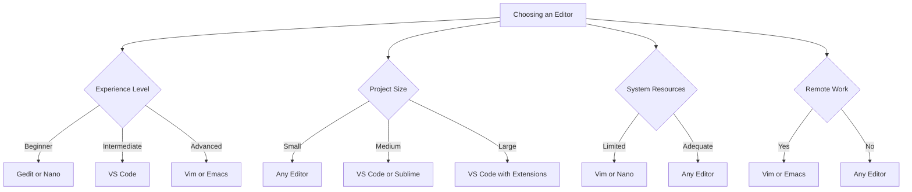

# Ubuntu Text Editors

## Introduction

Text editors are essential tools for any programmer or developer working on Ubuntu. Unlike full-fledged Integrated Development Environments (IDEs), text editors are lightweight applications focused primarily on editing plain text files, including source code. Ubuntu offers a variety of text editors, ranging from simple command-line based options to more sophisticated graphical editors with extensive features.

In this guide, we'll explore the most popular text editors available on Ubuntu, their features, and how to use them efficiently for your software development needs.

## Why Text Editors Matter

Before diving into specific editors, let's understand why choosing the right text editor is important:

- **Productivity**: A good text editor speeds up your coding with features like syntax highlighting and code completion
- **Workflow**: Different projects may require different tools, and knowing multiple editors gives you flexibility
- **Resource Usage**: Some development tasks don't require a full IDE, and text editors provide a lightweight alternative
- **Remote Work**: Command-line editors are essential when working on remote servers via SSH

## Command-Line Text Editors

### Nano

Nano is one of the most beginner-friendly command-line text editors available in Ubuntu. It's pre-installed on most Ubuntu distributions and provides a simple interface with commands listed at the bottom of the screen.

#### Installing Nano

Nano is usually pre-installed, but if needed:

```bash
sudo apt update
sudo apt install nano
```

#### Basic Usage

To open a file with nano:

```bash
nano filename.txt
```

To create a new file:

```bash
nano
```

#### Key Commands in Nano

| Command | Action |
|---------|--------|
| `Ctrl+G` | Display help |
| `Ctrl+O` | Save file |
| `Ctrl+X` | Exit nano |
| `Ctrl+K` | Cut text |
| `Ctrl+U` | Paste text |
| `Ctrl+W` | Search for text |
| `Ctrl+\` | Search and replace |

#### Pros and Cons

**Pros:**
- Very easy to learn
- Intuitive interface
- Pre-installed on most systems
- Lightweight

**Cons:**
- Limited features compared to advanced editors
- Not as customizable
- Less efficient for large projects

### Vim

Vim (Vi Improved) is a highly configurable, powerful text editor. It has a steeper learning curve than Nano but offers much more functionality and efficiency once mastered.

#### Installing Vim

```bash
sudo apt update
sudo apt install vim
```

#### Basic Usage

To open a file with Vim:

```bash
vim filename.txt
```

#### Vim Modes

Vim operates in different modes:
- **Normal Mode**: For navigation and commands
- **Insert Mode**: For typing text
- **Visual Mode**: For selecting text
- **Command Mode**: For executing commands

To enter insert mode, press `i`. To return to normal mode, press `Esc`.

#### Essential Vim Commands

| Command | Action |
|---------|--------|
| `:w` | Save file |
| `:q` | Quit Vim |
| `:wq` | Save and quit |
| `dd` | Delete line |
| `yy` | Copy (yank) line |
| `p` | Paste |
| `/text` | Search for "text" |
| `n` | Find next occurrence |
| `:%s/old/new/g` | Replace all occurrences of "old" with "new" |

#### Customizing Vim

Vim is highly customizable through the `~/.vimrc` file. Here's a simple example configuration:

```vim
" Enable syntax highlighting
syntax on

" Show line numbers
set number

" Enable auto-indentation
set autoindent

" Set tab width to 4 spaces
set tabstop=4
set shiftwidth=4
set expandtab

" Enable search highlighting
set hlsearch
```

#### Pros and Cons

**Pros:**
- Extremely powerful and efficient
- Highly customizable
- Available on virtually all Unix-based systems
- Can be used entirely without a mouse
- Extensible with plugins

**Cons:**
- Steep learning curve
- Not intuitive for beginners
- Requires time to become productive

### Emacs

Emacs is another powerful text editor with a rich history. It's known for its extensibility and can be customized to become almost an operating system in itself.

#### Installing Emacs

```bash
sudo apt update
sudo apt install emacs
```

#### Basic Usage

To open a file with Emacs:

```bash
emacs filename.txt
```

#### Key Commands in Emacs

| Command | Action |
|---------|--------|
| `Ctrl+X Ctrl+S` | Save file |
| `Ctrl+X Ctrl+C` | Exit Emacs |
| `Ctrl+K` | Cut (kill) text to end of line |
| `Ctrl+Y` | Paste (yank) |
| `Ctrl+S` | Search forward |
| `Ctrl+R` | Search backward |
| `Alt+X replace-string` | Replace text |

#### Pros and Cons

**Pros:**
- Extremely extensible
- Powerful editing capabilities
- Built-in tools like debugger, shell, and more
- Large ecosystem of packages

**Cons:**
- Steep learning curve
- Complex keybindings
- Heavier than Vim or Nano

## Graphical Text Editors

### Gedit

Gedit is the default text editor for the GNOME desktop environment, which comes with Ubuntu. It's a simple yet functional editor with a clean interface.

#### Installing Gedit

```bash
sudo apt update
sudo apt install gedit
```

#### Features

- Syntax highlighting for many languages
- Tabbed interface
- Plugin support
- Search and replace with regex
- Spell checking

#### Pros and Cons

**Pros:**
- Simple and intuitive
- Lightweight
- Good integration with GNOME desktop
- Decent feature set for basic coding

**Cons:**
- Limited advanced features
- Not as customizable as specialized code editors
- Basic project management capabilities

### Visual Studio Code

Visual Studio Code (VS Code) is a free, open-source code editor developed by Microsoft. It has gained immense popularity due to its balance of features, performance, and extensibility.

#### Installing VS Code

VS Code isn't available in the default Ubuntu repositories. Here's how to install it:

```bash
# Add Microsoft's GPG key
wget -qO- https://packages.microsoft.com/keys/microsoft.asc | gpg --dearmor > packages.microsoft.gpg
sudo install -o root -g root -m 644 packages.microsoft.gpg /etc/apt/trusted.gpg.d/
sudo sh -c 'echo "deb [arch=amd64,arm64,armhf signed-by=/etc/apt/trusted.gpg.d/packages.microsoft.gpg] https://packages.microsoft.com/repos/code stable main" > /etc/apt/sources.list.d/vscode.list'
rm -f packages.microsoft.gpg

# Install VS Code
sudo apt update
sudo apt install code
```

#### Key Features

- IntelliSense code completion
- Built-in Git integration
- Debugging support
- Extension marketplace
- Customizable UI
- Terminal integration
- Remote development capabilities

#### Workspace Customization

VS Code allows you to customize your workspace settings. For example, to configure Python settings for a project:

```json
{
    "python.linting.enabled": true,
    "python.linting.pylintEnabled": true,
    "python.formatting.provider": "black",
    "editor.formatOnSave": true,
    "editor.rulers": [88]
}
```

#### Useful Extensions for Ubuntu Development

- **Remote - SSH**: Edit code on remote machines
- **Python**: Rich support for Python
- **C/C++**: Language support for C/C++
- **Docker**: Manage Docker containers
- **GitLens**: Enhanced Git capabilities
- **Live Server**: Launch a local development server

#### Pros and Cons

**Pros:**
- Excellent balance of features and performance
- Huge extension ecosystem
- Regular updates and improvements
- Great for multiple languages
- Good documentation and community support

**Cons:**
- Heavier than traditional text editors
- Some privacy concerns (telemetry)
- Can be resource-intensive with many extensions

### Sublime Text

Sublime Text is a proprietary text editor known for its speed and minimalist design. While not free, it offers an unlimited evaluation period.

#### Installing Sublime Text

```bash
wget -qO - https://download.sublimetext.com/sublimehq-pub.gpg | sudo apt-key add -
sudo apt-add-repository "deb https://download.sublimetext.com/ apt/stable/"
sudo apt update
sudo apt install sublime-text
```

#### Key Features

- Extremely fast, even with large files
- Multiple selection and editing
- Command palette
- Distraction-free mode
- Package ecosystem via Package Control
- Project management
- Custom build systems

#### Pros and Cons

**Pros:**
- Very fast and responsive
- Powerful features for advanced users
- Cross-platform
- Good plugin ecosystem

**Cons:**
- Not free/open source
- Less frequent updates than VS Code
- Smaller community than some alternatives

## Choosing the Right Editor

When selecting a text editor for Ubuntu development, consider:

1. **Your experience level**: Beginners might prefer Gedit or VS Code
2. **The types of projects**: Large codebases benefit from VS Code or Sublime
3. **System resources**: On older hardware, Vim or Nano might be better choices
4. **Remote work needs**: Command-line editors (Vim, Nano) are essential for SSH sessions
5. **Customization desires**: Vim and Emacs offer the most customization



## Practical Examples

### Example 1: Editing Configuration Files

When working with system configuration files, command-line editors are often necessary:

```bash
# Edit a system configuration file with nano
sudo nano /etc/fstab

# Or with vim
sudo vim /etc/fstab
```

### Example 2: Developing a Web Application

For web development, VS Code provides a great environment:

1. Create a project folder:
   ```bash
   mkdir my-webapp
   cd my-webapp
   code .  # Opens VS Code in the current directory
   ```

2. Install necessary extensions:
   - HTML/CSS/JS support
   - Live Server
   - ESLint

3. Create and edit your files with syntax highlighting and code completion

### Example 3: Remote Server Development

When developing on a remote Ubuntu server:

```bash
# Connect to your server
ssh username@server-address

# Edit files with vim
vim app.py

# Or with nano if you prefer
nano app.py
```

With VS Code Remote SSH extension, you can also use VS Code's interface to edit remote files.

## Tips for Productivity

1. **Learn keyboard shortcuts** for your chosen editor
2. **Create custom configurations** to match your preferences
3. **Use syntax highlighting** to make code more readable
4. **Leverage search and replace** with regular expressions
5. **Explore plugins/extensions** that enhance your workflow
6. **Learn one editor deeply** rather than many superficially
7. **Back up your configurations** using version control

## Summary

Ubuntu offers a wide range of text editors to suit different programming needs and preferences. Command-line editors like Nano, Vim, and Emacs provide powerful editing capabilities especially useful for remote work, while graphical editors like Gedit, VS Code, and Sublime Text offer more intuitive interfaces with rich feature sets.

The best editor is ultimately the one that fits your workflow and helps you be most productive. Many developers use a combination of editors depending on the task—perhaps Vim for quick edits and VS Code for larger projects.

As you progress in your development journey, invest time in learning your chosen editor deeply. The efficiency gains from mastering your tools will pay dividends throughout your career.

## Additional Resources

- [Vim Tutorial](https://www.openvim.com/) - Interactive Vim tutorial
- [VS Code Documentation](https://code.visualstudio.com/docs)
- [The Emacs Editor](https://www.gnu.org/software/emacs/tour/)
- [Nano Editor Documentation](https://www.nano-editor.org/docs.php)

## Exercises

1. Install three different text editors on your Ubuntu system and compare their interfaces and features.
2. Create a simple "Hello World" program in your preferred programming language using different editors.
3. Learn 5 keyboard shortcuts for your favorite editor and practice using them.
4. Configure your chosen editor with custom settings that improve your workflow.
5. Try editing a file on a remote server using SSH and a command-line editor.