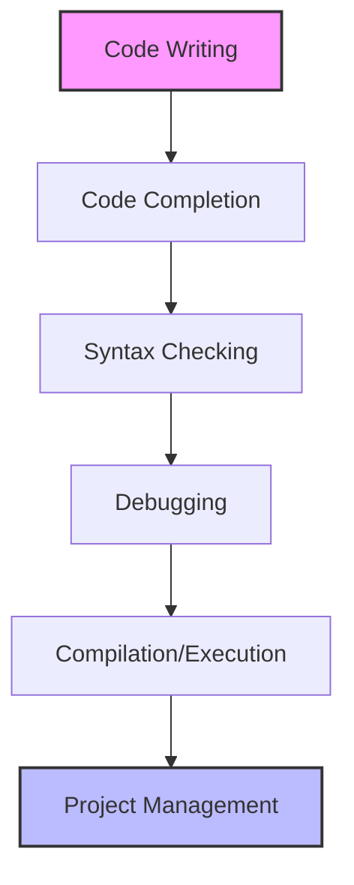
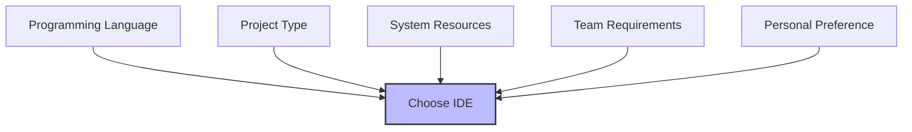

# Ubuntu IDEs

## Introduction

Integrated Development Environments (IDEs) are powerful software applications that provide comprehensive facilities for software development. On Ubuntu, a variety of IDEs are available to support different programming languages and development workflows. These tools combine essential components like code editors, build automation tools, debuggers, and intelligent code completion into a unified interface, significantly enhancing developer productivity.

This guide explores the most popular and effective IDEs available on Ubuntu, helping beginners understand their features, installation processes, and practical applications for various programming tasks.

## Understanding IDEs

Before diving into specific IDEs, let's understand what makes them essential tools for modern software development:

### What is an IDE?

An IDE (Integrated Development Environment) combines multiple development tools into a single graphical user interface (GUI). The key components typically include:

- **Code editor**: Enhanced text editor with syntax highlighting and intelligent code completion
- **Compiler/interpreter**: Converts your code into executable programs
- **Debugger**: Helps identify and fix errors in your code
- **Build automation tools**: Automates compilation and packaging processes

### Why Use an IDE?



IDEs streamline the development process by:

- Reducing context switching between different tools
- Providing real-time error detection
- Offering intelligent code suggestions
- Simplifying project navigation and management
- Integrating with version control systems

## Popular IDEs on Ubuntu

### Visual Studio Code

VS Code has become one of the most popular IDEs for Ubuntu users due to its lightweight nature, extensibility, and robust features.

#### Installation

```bash
# Install using Snap
sudo snap install code --classic

# Or using apt
sudo apt update
sudo apt install software-properties-common apt-transport-https wget
wget -q https://packages.microsoft.com/keys/microsoft.asc -O- | sudo apt-key add -
sudo add-apt-repository "deb [arch=amd64] https://packages.microsoft.com/repos/vscode stable main"
sudo apt update
sudo apt install code
```

#### Key Features

- Extensive extension marketplace
- Integrated terminal
- Git integration
- IntelliSense code completion
- Debugging tools
- Live Share for collaborative coding

#### Example: Setting Up a Python Project

1. Install the Python extension
2. Create a new Python file `hello.py`:

```python
def greet(name):
    """Return a greeting message"""
    return f"Hello, {name}! Welcome to Ubuntu development."

# Test the function
if __name__ == "__main__":
    user_name = input("Enter your name: ")
    message = greet(user_name)
    print(message)
```

3. Run the code by clicking the play button or pressing F5

### JetBrains IDEs

JetBrains offers specialized IDEs for different programming languages, all available on Ubuntu:

- **IntelliJ IDEA** - For Java development
- **PyCharm** - For Python development
- **WebStorm** - For web development
- **CLion** - For C/C++ development

#### Installation (PyCharm Example)

```bash
# Using Snap (recommended)
sudo snap install pycharm-community --classic

# For the Professional edition
sudo snap install pycharm-professional --classic
```

#### Key Features

- Advanced code analysis
- Powerful refactoring tools
- Built-in version control
- Database tools
- Docker integration
- Visual debugger

### Eclipse

Eclipse is a versatile, open-source IDE widely used for Java development but supports many other languages through plugins.

#### Installation

```bash
# Using Snap
sudo snap install eclipse --classic

# Using apt
sudo apt update
sudo apt install eclipse
```

#### Key Features

- Highly extensible through plugins
- Multi-language support
- Built-in Git integration
- Debugging and profiling tools
- Maven and Gradle integration

### Qt Creator

Qt Creator is ideal for cross-platform C++ development, particularly for applications using the Qt framework.

#### Installation

```bash
sudo apt update
sudo apt install qtcreator
```

#### Example: Creating a Simple Qt Application

```cpp
#include <QApplication>
#include <QLabel>
#include <QPushButton>
#include <QVBoxLayout>
#include <QWidget>

int main(int argc, char *argv[]) {
    QApplication app(argc, argv);
    
    // Create main window
    QWidget window;
    window.setWindowTitle("Ubuntu Qt Example");
    window.resize(250, 150);
    
    // Create a button and label
    QPushButton *button = new QPushButton("Click Me!");
    QLabel *label = new QLabel("Hello Ubuntu Developer");
    
    // Create layout and add widgets
    QVBoxLayout *layout = new QVBoxLayout;
    layout->addWidget(label);
    layout->addWidget(button);
    
    // Set layout to window
    window.setLayout(layout);
    
    // Connect button signal to a lambda that changes the label
    QObject::connect(button, &QPushButton::clicked, [label]() {
        label->setText("Button was clicked!");
    });
    
    // Show window and run application
    window.show();
    return app.exec();
}
```

### Arduino IDE

For those interested in embedded systems and IoT development on Ubuntu:

#### Installation

```bash
sudo apt update
sudo apt install arduino
```

#### Key Features

- Simple interface for beginners
- Built-in library manager
- Serial monitor
- Board manager for different Arduino hardware
- Example sketches

## Language-Specific IDEs and Editors

### For Web Development

**Brackets**
```bash
sudo snap install brackets --classic
```

**Atom**
```bash
sudo snap install atom --classic
```

### For Python

**Thonny** - An IDE specifically designed for beginners learning Python:
```bash
sudo apt install thonny
```

### For Ruby

**RubyMine**
```bash
sudo snap install rubymine --classic
```

## IDE Customization

Most IDEs on Ubuntu can be extensively customized to match your workflow and preferences:

### Example: Visual Studio Code Settings

Create or edit the `settings.json` file:

```json
{
  "editor.fontSize": 14,
  "editor.fontFamily": "Fira Code, Ubuntu Mono, monospace",
  "editor.wordWrap": "on",
  "editor.formatOnSave": true,
  "editor.minimap.enabled": true,
  "workbench.colorTheme": "Monokai",
  "terminal.integrated.fontSize": 13,
  "python.linting.enabled": true
}
```

### Extensions and Plugins

Extensions significantly enhance IDE capabilities. For VS Code, popular extensions include:

- **ESLint** - JavaScript linting
- **Python** - Python language support
- **Docker** - Docker integration
- **Live Server** - Local development server with live reload
- **GitLens** - Enhanced Git capabilities

## Choosing the Right IDE

Selecting the appropriate IDE depends on several factors:



Consider:

1. **Programming language support**: Choose an IDE optimized for your primary language
2. **Project size and complexity**: Larger projects may benefit from more robust IDEs
3. **System resources**: Some IDEs require more RAM and CPU power
4. **Community and extensions**: Consider the ecosystem around the IDE
5. **Learning curve**: Some IDEs are more beginner-friendly than others

## IDE Performance Tips for Ubuntu

### Optimizing Resource Usage

```bash
# Check current resource usage
top

# Improve system performance for development
sudo apt install preload
```

### SSD Considerations

For optimal IDE performance, consider:

1. Using an SSD for your Ubuntu installation
2. Ensuring adequate swap space
3. Placing project files on fast storage

### JVM Options (for Java-based IDEs)

For JetBrains IDEs or Eclipse, you can improve performance by editing the JVM options:

```bash
# Example for IntelliJ IDEA
echo "-Xms512m" >> ~/.config/JetBrains/IntelliJIdea2023.1/idea64.vmoptions
echo "-Xmx2048m" >> ~/.config/JetBrains/IntelliJIdea2023.1/idea64.vmoptions
```

## Integration with Ubuntu Environment

### Terminal Integration

Most modern IDEs integrate well with the Ubuntu terminal:

```bash
# Configure VS Code to use your preferred terminal
"terminal.integrated.shell.linux": "/usr/bin/zsh"
```

### Version Control Integration

Configure your Git identity within your IDE:

```bash
git config --global user.name "Your Name"
git config --global user.email "your.email@example.com"
```

## Practical Workflow Examples

### Web Development Workflow with VS Code

1. Install required extensions:
   - Live Server
   - ESLint
   - Prettier

2. Create a simple HTML/CSS/JS project:

```html
<!DOCTYPE html>
<html lang="en">
<head>
    <meta charset="UTF-8" />
    <meta name="viewport" content="width=device-width, initial-scale=1.0" />
    <title>Ubuntu Web Dev</title>
    <link rel="stylesheet" href="styles.css" />
</head>
<body>
    <div class="container">
        <h1>Welcome to Ubuntu Web Development</h1>
        <p>This is a simple example created in VS Code on Ubuntu.</p>
        <button id="greetButton">Click Me</button>
    </div>
    <script src="script.js"></script>
</body>
</html>
```

3. Add CSS (styles.css):

```css
body {
    font-family: Ubuntu, sans-serif;
    line-height: 1.6;
    margin: 0;
    padding: 20px;
    background-color: #f5f5f5;
}

.container {
    max-width: 800px;
    margin: 0 auto;
    background: white;
    padding: 20px;
    border-radius: 5px;
    box-shadow: 0 2px 5px rgba(0,0,0,0.1);
}

button {
    background: #E95420;
    color: white;
    border: none;
    padding: 10px 15px;
    border-radius: 4px;
    cursor: pointer;
}
```

4. Add JavaScript (script.js):

```javascript
document.getElementById('greetButton').addEventListener('click', function() {
    const now = new Date();
    alert(`Hello Ubuntu user! The current time is ${now.toLocaleTimeString()}`);
});
```

5. Launch with Live Server and test in browser

### Python Development with PyCharm

1. Create a new Python project
2. Set up a virtual environment
3. Install dependencies using the integrated terminal:

```bash
pip install requests pandas matplotlib
```

4. Create a simple data analysis script:

```python
import pandas as pd
import matplotlib.pyplot as plt
import requests
from io import StringIO

# Download sample data
url = "https://raw.githubusercontent.com/datasets/gdp/master/data/gdp.csv"
response = requests.get(url)
data = StringIO(response.text)

# Read and process data
df = pd.read_csv(data)
top_countries = df[df['Year'] == 2019].sort_values(by='Value', ascending=False).head(10)

# Create visualization
plt.figure(figsize=(12, 6))
plt.bar(top_countries['Country'], top_countries['Value'])
plt.title('Top 10 Countries by GDP (2019)')
plt.xlabel('Country')
plt.ylabel('GDP (US$)')
plt.xticks(rotation=45)
plt.tight_layout()
plt.savefig('gdp_analysis.png')
plt.show()

print("Analysis complete. Chart saved as gdp_analysis.png")
```

## Troubleshooting Common IDE Issues

### Package Repository Problems

If you encounter issues with installations:

```bash
# Fix broken packages
sudo apt --fix-broken install

# Update package lists
sudo apt update
```

### IDE Performance Issues

For sluggish IDE performance:

1. Disable unused plugins/extensions
2. Increase memory allocation (for Java-based IDEs)
3. Exclude large directories from indexing

### Debugging Tool Issues

If debuggers aren't working:

```bash
# For Python debugging in VS Code
sudo apt install python3-dbg

# For C/C++ debugging
sudo apt install gdb
```

## Summary

Ubuntu offers a rich ecosystem of IDEs for software development across various programming languages and frameworks. The choice of IDE depends on your specific development needs, project requirements, and personal preferences.

For beginners, Visual Studio Code provides an excellent balance of features, performance, and ease of use. As you progress in your development journey, you might explore more specialized IDEs like JetBrains' offerings or Eclipse for specific language ecosystems.

Remember that the best IDE is ultimately the one that enhances your productivity and fits seamlessly into your development workflow. Don't hesitate to try several options before settling on your preferred development environment.

## Additional Resources

- Official documentation for each IDE
- Ubuntu community forums for IDE-specific issues
- Stack Overflow for technical questions
- GitHub repositories with IDE configuration examples

## Practice Exercises

1. Install VS Code and set up a simple Python development environment
2. Create a basic web project using a live server extension
3. Configure Git integration in your preferred IDE
4. Practice debugging a simple application
5. Explore IDE extensions that enhance your specific development workflow