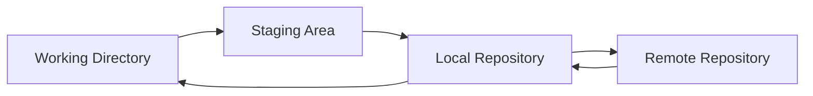

# Ubuntu Version Control

## Introduction

Version control is a crucial skill for any software developer. It allows you to track changes to your code, collaborate with others, and maintain a history of your project's development. In the Ubuntu environment, several powerful version control systems are available, with Git being the most widely used.

This guide will walk you through setting up and using version control tools in Ubuntu, focusing primarily on Git. We'll cover installation, basic commands, practical workflows, and best practices to help you integrate version control into your development process.

## What is Version Control?

Version control systems (VCS) are tools that help track changes to files over time. They allow you to:

- Record changes to files
- Revert to previous versions if needed
- Compare changes between versions
- Collaborate with other developers
- Maintain different development branches
- Merge changes from different sources



## Setting Up Git on Ubuntu

### Installation

Ubuntu makes it simple to install Git using the package manager:

```bash
sudo apt update
sudo apt install git
```

After installation, verify that Git is correctly installed:

```bash
git --version
```

Expected output:
```
git version 2.34.1 (or similar)
```

### Initial Configuration

Before using Git, you should set up your identity:

```bash
git config --global user.name "Your Name"
git config --global user.email "your.email@example.com"
```

You can verify your settings with:

```bash
git config --list
```

## Basic Git Commands

### Creating a Repository

To start tracking a project with Git:

```bash
# Navigate to your project directory
cd /path/to/your/project

# Initialize a new Git repository
git init
```

You should see output similar to:
```
Initialized empty Git repository in /path/to/your/project/.git/
```

### Tracking Files

To start tracking files:

```bash
# Add specific files
git add filename.txt

# Add all files in the directory
git add .
```

### Committing Changes

Once files are added to the staging area, commit them to save the changes:

```bash
git commit -m "Initial commit: Add project files"
```

Output:
```
[main (root-commit) f7d2a1c] Initial commit: Add project files
 3 files changed, 54 insertions(+)
 create mode 100644 index.html
 create mode 100644 style.css
 create mode 100644 script.js
```

### Checking Status

To see which files are modified, staged, or untracked:

```bash
git status
```

Sample output:
```
On branch main
Changes not staged for commit:
  (use "git add <file>..." to update what will be committed)
  (use "git restore <file>..." to discard changes in working directory)
        modified:   index.html

Untracked files:
  (use "git add <file>..." to include in what will be committed)
        images/
```

### Viewing History

To see the commit history:

```bash
git log
```

Example output:
```
commit f7d2a1c3d5e7f9g8h6i5j4k3l2m1n0o9p8q7r
Author: Your Name <your.email@example.com>
Date:   Fri Mar 10 14:35:12 2023 +0100

    Initial commit: Add project files
```

For a more concise view:

```bash
git log --oneline
```

Output:
```
f7d2a1c Initial commit: Add project files
```

## Working with Remote Repositories

### Connecting to GitHub

First, create a repository on GitHub, then connect your local repository:

```bash
# Add a remote repository
git remote add origin https://github.com/username/repository.git

# Verify the remote was added
git remote -v
```

Output:
```
origin  https://github.com/username/repository.git (fetch)
origin  https://github.com/username/repository.git (push)
```

### Pushing and Pulling Changes

To send your changes to the remote repository:

```bash
git push -u origin main
```

To get changes from the remote repository:

```bash
git pull origin main
```

## Branching and Merging

Branches allow you to develop features, fix bugs, or experiment without affecting the main codebase.

### Creating and Switching Branches

```bash
# Create a new branch
git branch feature-login

# Switch to the branch
git checkout feature-login

# Or create and switch in one command
git checkout -b feature-signup
```

### Merging Branches

Once you've completed work on a branch, you can merge it back:

```bash
# First switch to the target branch
git checkout main

# Then merge your feature branch
git merge feature-login
```

Successful merge output:
```
Updating a1b2c3d..e4f5g6h
Fast-forward
 login.html | 25 +++++++++++++++++++++++++
 1 file changed, 25 insertions(+)
 create mode 100644 login.html
```

## Practical Workflow Example

Let's walk through a typical workflow for a small project:

1. Create a new project:

```bash
mkdir my-ubuntu-app
cd my-ubuntu-app
git init
```

2. Create some initial files:

```bash
touch index.html style.css app.js
```

3. Add and commit the files:

```bash
git add .
git commit -m "Initial project structure"
```

4. Create a branch for a new feature:

```bash
git checkout -b feature-navigation
```

5. Make changes to files and commit them:

```bash
# After editing files
git add .
git commit -m "Add navigation bar"
```

6. Switch back to main and merge the feature:

```bash
git checkout main
git merge feature-navigation
```

7. Push to a remote repository:

```bash
git remote add origin https://github.com/username/my-ubuntu-app.git
git push -u origin main
```

## Advanced Git Features

### Stashing Changes

When you need to switch branches but aren't ready to commit your changes:

```bash
git stash save "Work in progress on login form"
```

To apply stashed changes later:

```bash
git stash list
git stash apply stash@{0}
```

### Resolving Merge Conflicts

When Git can't automatically merge changes, you'll need to resolve conflicts manually:

```bash
# After a merge conflict occurs
# Edit the conflicted files to resolve issues
git add resolved-file.txt
git commit -m "Resolve merge conflict in login functionality"
```

### Git Aliases

Create shortcuts for common commands:

```bash
git config --global alias.co checkout
git config --global alias.br branch
git config --global alias.st status
```

Now you can use shortcuts like:

```bash
git co main
git br
git st
```

## Other Version Control Systems in Ubuntu

While Git is the most popular, Ubuntu supports other version control systems:

### Subversion (SVN)

Install SVN:

```bash
sudo apt install subversion
```

Basic usage:

```bash
# Check out a repository
svn checkout https://svn.example.com/repo/trunk my-project

# Update working copy
svn update

# Add files
svn add file.txt

# Commit changes
svn commit -m "Add new file"
```

### Mercurial

Install Mercurial:

```bash
sudo apt install mercurial
```

Basic usage:

```bash
# Initialize repository
hg init

# Add files
hg add

# Commit changes
hg commit -m "Initial commit"

# Push changes
hg push
```

## Best Practices for Version Control

1. **Commit Often**: Make small, focused commits rather than large, sweeping changes
2. **Write Meaningful Commit Messages**: Briefly explain what changes were made and why
3. **Use Branches**: Create branches for features, bug fixes, and experiments
4. **Pull Before Push**: Always pull the latest changes before pushing to avoid conflicts
5. **Use .gitignore**: Exclude temporary files, build artifacts, and sensitive information
6. **Review Changes Before Commit**: Use `git diff` to review changes before committing

## Integrating with Ubuntu Development Tools

### Visual Studio Code

Install VS Code on Ubuntu:

```bash
sudo snap install code --classic
```

VS Code has excellent Git integration out of the box, including:
- Source control panel
- Branch switching
- Commit history
- Merge conflict resolution

### GitKraken

For a graphical Git client:

```bash
sudo snap install gitkraken
```

### Terminal Integration

Add Git information to your terminal prompt by adding to `~/.bashrc`:

```bash
parse_git_branch() {
  git branch 2> /dev/null | sed -e '/^[^*]/d' -e 's/* \(.*\)/ (\1)/'
}
export PS1="\u@\h \[\033[32m\]\w\[\033[33m\]\$(parse_git_branch)\[\033[00m\] $ "
```

## Summary

Version control is an essential tool for software development in Ubuntu. By mastering Git, you'll be able to:
- Track your project's history
- Collaborate effectively with other developers
- Maintain multiple versions of your code
- Recover from mistakes easily
- Work on multiple features simultaneously

This guide has covered the basics of setting up and using Git on Ubuntu, along with some advanced features and best practices. As you continue to develop software on Ubuntu, version control will become an indispensable part of your workflow.

## Additional Resources

- [Git Documentation](https://git-scm.com/doc)
- [Pro Git Book](https://git-scm.com/book/en/v2)
- [GitHub Learning Lab](https://lab.github.com/)
- [Git Cheat Sheet](https://education.github.com/git-cheat-sheet-education.pdf)

## Exercises

1. Create a new Git repository for a sample project
2. Make several commits with different changes
3. Create a branch, make changes, and merge it back
4. Set up a GitHub repository and push your local project
5. Simulate a merge conflict and practice resolving it
6. Create a `.gitignore` file for different types of projects (web, Python, Java)
7. Practice using Git with a graphical client like GitKraken or VS Code