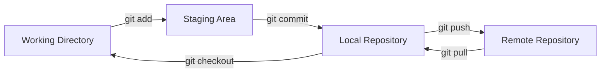
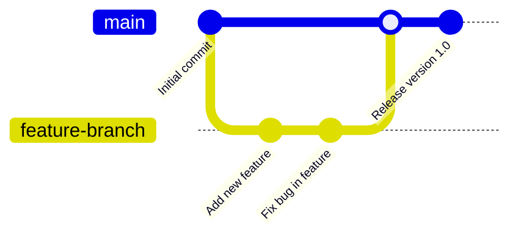

# Ubuntu Git Integration

## Introduction

Git is one of the most powerful and widely-used version control systems in the software development world. It allows developers to track changes, collaborate with teammates, and maintain different versions of their codebase. When working with Ubuntu, integrating Git into your development workflow provides numerous advantages for both beginners and experienced developers.

This guide will walk you through setting up Git on Ubuntu, configuring it properly, and using it effectively for your development projects. We'll cover everything from basic commands to practical workflows that will help you manage your code efficiently.

## Installing Git on Ubuntu

Before you can use Git, you need to install it on your Ubuntu system. Ubuntu makes this process straightforward with its package management system.

### Installation Steps

1. First, update your package lists:

```bash
sudo apt update
```

2. Install Git using the apt package manager:

```bash
sudo apt install git
```

3. Verify the installation by checking the Git version:

```bash
git --version
```

You should see output similar to:

```
git version 2.34.1
```

## Configuring Git

After installation, you need to configure Git with your identity. This is important because Git uses this information to attribute commits to the correct author.

### Basic Configuration

Set your name and email address:

```bash
git config --global user.name "Your Name"
git config --global user.email "your.email@example.com"
```

### Additional Configuration Options

Set your default editor (replace `nano` with your preferred editor):

```bash
git config --global core.editor "nano"
```

Enable colorful output in Git commands:

```bash
git config --global color.ui auto
```

View your Git configuration:

```bash
git config --list
```

## Creating Your First Git Repository

Now that Git is installed and configured, let's create a new repository for a project.

### Initializing a Repository

1. Create a new directory for your project:

```bash
mkdir my_project
cd my_project
```

2. Initialize the directory as a Git repository:

```bash
git init
```

You'll see a message like:

```
Initialized empty Git repository in /home/username/my_project/.git/
```

3. Create a sample file:

```bash
echo "# My Project" > README.md
```

4. Add the file to the staging area:

```bash
git add README.md
```

5. Commit the file to the repository:

```bash
git commit -m "Initial commit: Add README file"
```

Output:

```
[main (root-commit) f7d2a3c] Initial commit: Add README file
 1 file changed, 1 insertion(+)
 create mode 100644 README.md
```

## Understanding Git Workflow

Let's visualize the basic Git workflow:



### Git Areas Explained

1. **Working Directory**: The directory where you edit your files
2. **Staging Area**: A place to organize changes before committing
3. **Local Repository**: The `.git` directory containing all committed changes
4. **Remote Repository**: A repository hosted on a server (like GitHub, GitLab, etc.)

## Essential Git Commands

Let's explore the most commonly used Git commands:

### Tracking Changes

Check the status of your repository:

```bash
git status
```

Output (example):

```
On branch main
Changes not staged for commit:
  (use "git add <file>..." to update what will be committed)
  (use "git restore <file>..." to discard changes in working directory)
        modified: README.md

no changes added to commit (use "git add" and/or "git commit -a")
```

View changes in tracked files:

```bash
git diff
```

Add all changes to the staging area:

```bash
git add .
```

Commit changes with a message:

```bash
git commit -m "Update README with project description"
```

### Working with Branches

List all branches:

```bash
git branch
```

Create a new branch:

```bash
git branch feature-login
```

Switch to a branch:

```bash
git checkout feature-login
```

Or create and switch in one command:

```bash
git checkout -b feature-signup
```

Merge a branch into the current branch:

```bash
git merge feature-login
```

## Working with Remote Repositories

To collaborate with others, you'll need to work with remote repositories.

### Connecting to GitHub

1. Create a repository on GitHub

2. Connect your local repository to the remote:

```bash
git remote add origin https://github.com/yourusername/my_project.git
```

3. Push your code to GitHub:

```bash
git push -u origin main
```

### Cloning an Existing Repository

To work with an existing repository:

```bash
git clone https://github.com/username/repository.git
```

Example output:

```
Cloning into 'repository'...
remote: Enumerating objects: 84, done.
remote: Counting objects: 100% (84/84), done.
remote: Compressing objects: 100% (45/45), done.
remote: Total 84 (delta 32), reused 84 (delta 32), pack-reused 0
Receiving objects: 100% (84/84), 23.36 KiB | 1.56 MiB/s, done.
Resolving deltas: 100% (32/32), done.
```

### Pulling Updates from Remote

To get the latest changes from the remote repository:

```bash
git pull origin main
```

## Practical Git Workflows

Let's explore some real-world Git workflows commonly used in software development.

### Feature Branch Workflow

This workflow is ideal for collaborative projects:

1. Create a branch for a new feature:

```bash
git checkout -b feature-user-authentication
```

2. Make changes and commit them:

```bash
# Edit files
git add .
git commit -m "Implement user login functionality"
```

3. Push the feature branch to the remote repository:

```bash
git push origin feature-user-authentication
```

4. Create a pull request on GitHub

5. After review, merge the pull request and update your local repository:

```bash
git checkout main
git pull origin main
```

### Git Workflow Visualization



## Handling Common Scenarios

### Resolving Merge Conflicts

When Git can't automatically merge changes, you'll encounter a merge conflict:

1. Git will mark the conflicted files:

```bash
git status
```

2. Open the conflicted file in your editor. You'll see sections marked like:

```
<<<<<<< HEAD
Your changes
=======
Their changes
>>>>>>> feature-branch
```

3. Edit the file to resolve the conflict, then:

```bash
git add [resolved-file]
git commit -m "Resolve merge conflict"
```

### Undoing Changes

Discard changes in your working directory:

```bash
git checkout -- filename
```

Unstage a file:

```bash
git reset HEAD filename
```

Undo the last commit but keep the changes:

```bash
git reset --soft HEAD~1
```

## Git and Ubuntu-Specific Tools

Ubuntu offers several tools that integrate well with Git:

### Using Meld for Diff and Merge

Meld is a visual diff and merge tool available on Ubuntu:

1. Install Meld:

```bash
sudo apt install meld
```

2. Configure Git to use Meld:

```bash
git config --global merge.tool meld
git config --global diff.tool meld
```

3. Use Meld to view differences:

```bash
git difftool filename
```

### Using Git with VS Code on Ubuntu

Visual Studio Code provides excellent Git integration:

1. Install VS Code from the Ubuntu Software Center or using:

```bash
sudo snap install code --classic
```

2. Open a Git repository in VS Code:

```bash
code my_project
```

3. Use the Source Control panel (Ctrl+Shift+G) to manage Git operations visually.

## Best Practices for Git on Ubuntu

1. **Regular Commits**: Make small, focused commits that address a single concern.

2. **Meaningful Commit Messages**: Write clear, descriptive commit messages explaining what changes were made and why.

3. **Branching Strategy**: Use branches for features, bug fixes, and experiments to keep the main branch stable.

4. **Pull Before Push**: Always pull changes from the remote repository before pushing to avoid conflicts.

5. **Git Ignore**: Use `.gitignore` to exclude unnecessary files:

```bash
echo "node_modules/" > .gitignore
echo "*.log" >> .gitignore
echo ".env" >> .gitignore
```

6. **Backup SSH Keys**: If using SSH authentication, keep backups of your SSH keys.

## Advanced Git Features

### Git Aliases

Create shortcuts for common commands:

```bash
git config --global alias.co checkout
git config --global alias.br branch
git config --global alias.ci commit
git config --global alias.st status
```

Now you can use:

```bash
git co main  # Instead of git checkout main
git st       # Instead of git status
```

### Git Hooks

Git hooks allow you to run custom scripts before or after Git events:

1. Navigate to the hooks directory:

```bash
cd .git/hooks
```

2. Create a pre-commit hook (example to prevent committing to main):

```bash
echo '#!/bin/bash
branch=`git rev-parse --abbrev-ref HEAD`
if [ "$branch" = "main" ]; then
  echo "You can't commit directly to main branch"
  exit 1
fi' > pre-commit
```

3. Make it executable:

```bash
chmod +x pre-commit
```

## Summary

Git integration with Ubuntu provides a powerful foundation for version control in software development. In this guide, we've covered:

- Installing and configuring Git on Ubuntu
- Creating and managing Git repositories
- Essential Git commands and workflows
- Working with remote repositories like GitHub
- Handling common scenarios like merge conflicts
- Ubuntu-specific Git tools and integrations
- Best practices and advanced features

By mastering these concepts, you'll be well-equipped to use Git effectively for your Ubuntu-based development projects, whether you're working solo or collaborating with a team.

## Additional Resources

To further enhance your Git skills:

- Practice Git commands with [Git-it](https://github.com/jlord/git-it-electron)
- Learn more advanced Git features with [Pro Git Book](https://git-scm.com/book/en/v2)
- Improve your branching strategy with [Git Flow](https://nvie.com/posts/a-successful-git-branching-model/)

## Exercises

1. Create a new Git repository for a small project, add files, and make several commits.
2. Create branches for different features, make changes, and merge them back to the main branch.
3. Set up a remote repository on GitHub, push your local repository, then clone it to a different location.
4. Simulate a merge conflict by changing the same line in a file on two different branches, then resolve it.
5. Configure Git aliases to speed up your workflow.