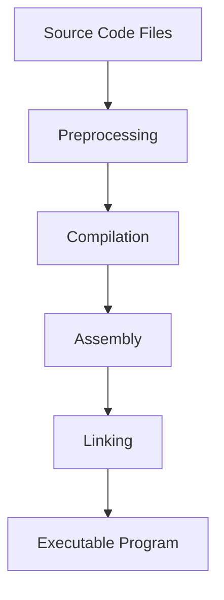

# Ubuntu Build Tools

## Introduction

Build tools are essential components of any software development environment. They automate the process of compiling source code, linking libraries, and creating executable programs. In Ubuntu, a variety of powerful build tools are available to help developers streamline their workflow.

This guide introduces the most important build tools in Ubuntu, explains how they work, and demonstrates their practical applications through step-by-step examples. Whether you're compiling a simple program or managing a complex software project, these tools will help you build software efficiently and reliably.

## Essential Build Tools in Ubuntu

Before diving into specific build systems, let's install the core build tools that form the foundation of most software compilation processes in Ubuntu:

```bash
sudo apt update
sudo apt install build-essential
```

The `build-essential` package installs several critical components:

- **GCC/G++**: The GNU Compiler Collection
- **Make**: A build automation tool
- **libc-dev**: C standard library development files
- Additional development libraries and debugging tools

## The Compilation Process

Before exploring specific build tools, it's helpful to understand the basic compilation process:



1. **Preprocessing**: Handles directives like `#include` and `#define`
2. **Compilation**: Converts source code to assembly code
3. **Assembly**: Converts assembly code to object files
4. **Linking**: Combines object files and libraries into an executable

Let's look at the tools that manage this process.

## GCC - The GNU Compiler Collection

GCC is the cornerstone of compilation in Ubuntu. It supports multiple languages including C, C++, Fortran, and more.

### Basic GCC Usage

To compile a simple C program:

```bash
gcc hello.c -o hello
```

For a C++ program:

```bash
g++ hello.cpp -o hello
```

### Important GCC Flags

- `-c`: Compile but don't link
- `-g`: Include debugging information
- `-O1`, `-O2`, `-O3`: Different optimization levels
- `-Wall`: Enable all warnings
- `-I`: Specify include directories
- `-l`: Link with a library

### Example: Compiling with Multiple Source Files

Consider a project with this structure:

```
project/
├── include/
│   └── functions.h
├── src/
│   ├── functions.c
│   └── main.c
```

In `functions.h`:

```c
#ifndef FUNCTIONS_H
#define FUNCTIONS_H

int add(int a, int b);

#endif
```

In `functions.c`:

```c
#include "functions.h"

int add(int a, int b) {
    return a + b;
}
```

In `main.c`:

```c
#include <stdio.h>
#include "functions.h"

int main() {
    int result = add(5, 7);
    printf("5 + 7 = %d
", result);
    return 0;
}
```

Compile and link:

```bash
gcc -c -I./include src/functions.c -o functions.o
gcc -c -I./include src/main.c -o main.o
gcc functions.o main.o -o myprogram
```

Output when running `./myprogram`:
```
5 + 7 = 12
```

## Make - Automation for Compilation

While GCC handles the compilation, `make` automates the build process using a `Makefile` that defines rules for compilation.

### Basic Makefile Structure

```makefile
target: dependencies
	commands
```

### Example Makefile for Our Project

```makefile
CC = gcc
CFLAGS = -Wall -I./include

myprogram: functions.o main.o
	$(CC) functions.o main.o -o myprogram

functions.o: src/functions.c include/functions.h
	$(CC) $(CFLAGS) -c src/functions.c

main.o: src/main.c include/functions.h
	$(CC) $(CFLAGS) -c src/main.c

clean:
	rm -f *.o myprogram
```

To build the project:

```bash
make
```

To clean build artifacts:

```bash
make clean
```

### Make Features

- **Incremental builds**: Only recompiles changed files
- **Variables**: Define reusable values
- **Dependencies**: Tracks relationships between files
- **Phony targets**: Special rules like `clean`

## CMake - Cross-Platform Build System

CMake is a higher-level build system that generates build files for various platforms.

### Installing CMake

```bash
sudo apt install cmake
```

### Basic CMake Usage

Create a `CMakeLists.txt` file for our project:

```cmake
cmake_minimum_required(VERSION 3.10)
project(MyProject)

# Set C standard
set(CMAKE_C_STANDARD 11)

# Include directories
include_directories(include)

# Add executable
add_executable(myprogram src/main.c src/functions.c)
```

Build process:

```bash
mkdir build
cd build
cmake ..
make
```

### CMake Advantages

- Cross-platform compatibility
- Easier management of dependencies
- Better support for complex projects
- Integration with IDEs

## GNU Autotools

Autotools is a suite of tools for creating portable build systems:

- **autoconf**: Generates configure scripts
- **automake**: Generates Makefiles
- **libtool**: Handles library creation

### Installing Autotools

```bash
sudo apt install autoconf automake libtool
```

### Basic Autotools Project Structure

```
project/
├── configure.ac
├── Makefile.am
└── src/
    ├── Makefile.am
    ├── functions.c
    ├── functions.h
    └── main.c
```

In `configure.ac`:

```autoconf
AC_INIT([myproject], [1.0], [your-email@example.com])
AM_INIT_AUTOMAKE([-Wall -Werror foreign])
AC_PROG_CC
AC_CONFIG_HEADERS([config.h])
AC_CONFIG_FILES([
 Makefile
 src/Makefile
])
AC_OUTPUT
```

In top-level `Makefile.am`:

```
SUBDIRS = src
```

In `src/Makefile.am`:

```
bin_PROGRAMS = myprogram
myprogram_SOURCES = main.c functions.c functions.h
```

Building with Autotools:

```bash
autoreconf --install
./configure
make
```

## Other Important Build Tools in Ubuntu

### pkg-config

Manages library dependencies and compiler/linker flags:

```bash
sudo apt install pkg-config
gcc `pkg-config --cflags --libs gtk+-3.0` gtk_app.c -o gtk_app
```

### Ninja Build System

A faster alternative to Make:

```bash
sudo apt install ninja-build
```

Use with CMake:

```bash
cmake -G Ninja ..
ninja
```

### Meson Build System

A modern, fast build system:

```bash
sudo apt install meson
```

Create a `meson.build` file:

```meson
project('myproject', 'c')
executable('myprogram', ['src/main.c', 'src/functions.c'],
           include_directories: include_directories('include'))
```

Build with meson:

```bash
meson setup builddir
meson compile -C builddir
```

## Practical Example: Building a System Monitor Tool

Let's create a simple system monitoring tool using build tools. This example demonstrates:

1. Multiple source files
2. External library dependency (ncurses)
3. CMake build system

Project structure:

```
sysmonitor/
├── CMakeLists.txt
├── include/
│   ├── cpu.h
│   └── memory.h
└── src/
    ├── cpu.c
    ├── main.c
    └── memory.c
```

`CMakeLists.txt`:

```cmake
cmake_minimum_required(VERSION 3.10)
project(SysMonitor C)

# Find ncurses library
find_package(Curses REQUIRED)
include_directories(${CURSES_INCLUDE_DIR})
include_directories(include)

# Add executable
add_executable(sysmonitor
    src/main.c
    src/cpu.c
    src/memory.c
)

# Link libraries
target_link_libraries(sysmonitor ${CURSES_LIBRARIES})
```

Example content of `include/cpu.h`:

```c
#ifndef CPU_H
#define CPU_H

typedef struct {
    double user;
    double system;
    double idle;
} CpuUsage;

CpuUsage get_cpu_usage();

#endif
```

Example implementation of `src/cpu.c`:

```c
#include "cpu.h"
#include <stdio.h>
#include <stdlib.h>
#include <string.h>

CpuUsage get_cpu_usage() {
    CpuUsage usage = {0};
    FILE *fp = fopen("/proc/stat", "r");
    
    if (fp == NULL) {
        perror("Failed to open /proc/stat");
        return usage;
    }
    
    char buffer[256];
    if (fgets(buffer, sizeof(buffer), fp) != NULL) {
        long user, nice, system, idle;
        sscanf(buffer, "cpu %ld %ld %ld %ld", &user, &nice, &system, &idle);
        
        long total = user + nice + system + idle;
        usage.user = 100.0 * (user + nice) / total;
        usage.system = 100.0 * system / total;
        usage.idle = 100.0 * idle / total;
    }
    
    fclose(fp);
    return usage;
}
```

Building the project:

```bash
# Install ncurses development package
sudo apt install libncurses-dev

# Build the project
mkdir build
cd build
cmake ..
make
```

This example shows how to organize a project with multiple source files, integrate external libraries, and use CMake to manage the build process.

## Debugging Tools

Ubuntu provides several tools for debugging compiled programs:

### GDB (GNU Debugger)

```bash
sudo apt install gdb
gcc -g program.c -o program  # Compile with debug symbols
gdb ./program                # Start debugger
```

Basic GDB commands:
- `break main` - Set breakpoint at main function
- `run` - Start program execution
- `next` - Execute next line
- `step` - Step into function
- `print var` - Print variable value
- `backtrace` - Show call stack

### Valgrind

Memory leak and error detector:

```bash
sudo apt install valgrind
valgrind --leak-check=full ./myprogram
```

## Summary

Ubuntu provides a rich ecosystem of build tools for software development:

1. **Build Essential** provides core compilation tools like GCC and Make
2. **Make** automates the build process
3. **CMake** offers a higher-level, cross-platform build system
4. **Autotools** helps create portable build systems
5. **Alternative systems** like Ninja and Meson provide modern alternatives

Mastering these build tools will significantly improve your productivity and help you manage projects of increasing complexity. They form the foundation of software development on Ubuntu and are essential skills for any developer.

## Additional Resources

- [GCC Documentation](https://gcc.gnu.org/onlinedocs/)
- [GNU Make Manual](https://www.gnu.org/software/make/manual/)
- [CMake Tutorial](https://cmake.org/cmake/help/latest/guide/tutorial/index.html)
- [Autotools Mythbuster](https://autotools.io/index.html)

## Exercises

1. Create a simple "Hello World" program using each of the build systems described in this guide.
2. Modify the system monitor example to add memory usage monitoring.
3. Create a library project with a shared library (.so) and static library (.a) using CMake.
4. Set up a project that depends on external libraries like SDL2 or GTK.
5. Experiment with different optimization flags and measure their impact on program performance.