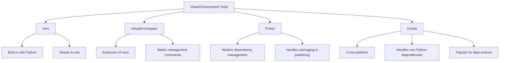

# Ubuntu Virtual Environments

## Introduction

When developing Python applications on Ubuntu, you'll often need to work with different packages and dependencies. Sometimes, projects require specific versions of libraries that might conflict with other projects. This is where **virtual environments** come to the rescue.

A virtual environment is an isolated Python environment that allows you to install packages specifically for a particular project without affecting your system-wide Python installation. In this tutorial, we'll explore how to create, activate, and manage virtual environments in Ubuntu.

## Why Use Virtual Environments?

Before diving into the technicalities, let's understand why virtual environments are essential:

1. **Dependency Isolation**: Each project can have its own dependencies, regardless of what dependencies other projects have.
2. **Version Control**: You can have different versions of the same package for different projects.
3. **Clean Development**: Your global Python environment remains clean and uncluttered.
4. **Project Portability**: Easier to share projects with their exact environment specifications.

## Built-in `venv` Module

Python 3.3+ comes with the `venv` module, which is the recommended way to create virtual environments. Let's start by creating a simple virtual environment.

### Installing Required Packages

First, ensure that Python is installed on your Ubuntu system:

```bash
python3 --version
```

If Python is not installed, you can install it using:

```bash
sudo apt update
sudo apt install python3
```

For virtual environments, you'll need the `venv` module. It usually comes with Python, but if not, you can install it:

```bash
sudo apt install python3-venv
```

### Creating a Virtual Environment

To create a virtual environment, navigate to your project directory and run:

```bash
python3 -m venv my_env
```

This creates a directory named `my_env` which contains all the necessary files for your virtual environment, including:
- A copy of the Python interpreter
- The `pip` package manager
- Standard library files

### Activating a Virtual Environment

Before using your virtual environment, you need to activate it:

```bash
source my_env/bin/activate
```

When activated, your shell prompt will change to show the name of the virtual environment:

```
(my_env) username@hostname:~/project$
```

Now, any Python packages you install using `pip` will be installed only in this virtual environment.

### Installing Packages

With your virtual environment activated, you can install packages using `pip`:

```bash
pip install numpy
```

This installs the NumPy package only in your virtual environment, not globally.

### Checking Installed Packages

To see what packages are installed in your virtual environment:

```bash
pip list
```

Example output:

```
Package    Version
---------- -------
numpy      1.24.3
pip        23.1.2
setuptools 67.7.2
```

### Deactivating a Virtual Environment

When you're done working with a virtual environment, you can deactivate it:

```bash
deactivate
```

Your shell prompt will return to normal, indicating that you're back to using the system Python environment.

## Managing Dependencies with `requirements.txt`

For project portability, it's good practice to track your dependencies. You can create a `requirements.txt` file that lists all packages needed for your project.

### Creating a Requirements File

To generate a requirements file from your current environment:

```bash
pip freeze > requirements.txt
```

This command creates a text file listing all installed packages and their versions.

Example `requirements.txt`:

```
numpy==1.24.3
pandas==2.0.1
matplotlib==3.7.1
```

### Installing from a Requirements File

To recreate an environment using a requirements file:

```bash
pip install -r requirements.txt
```

This installs all packages listed in the file with the specified versions.

## Working with `virtualenvwrapper`

While `venv` is built into Python, `virtualenvwrapper` is a popular tool that makes working with virtual environments even easier.

### Installing `virtualenvwrapper`

```bash
pip install virtualenvwrapper
```

Add the following lines to your shell startup file (`.bashrc`, `.zshrc`, etc.):

```bash
export WORKON_HOME=$HOME/.virtualenvs
export VIRTUALENVWRAPPER_PYTHON=/usr/bin/python3
source /usr/local/bin/virtualenvwrapper.sh
```

After editing, reload your shell configuration:

```bash
source ~/.bashrc  # or ~/.zshrc
```

### Creating Environments with `virtualenvwrapper`

```bash
mkvirtualenv my_project
```

This creates and activates a virtual environment named `my_project`.

### Working with Environments

- To list available environments:
  ```bash
  workon
  ```

- To activate an environment:
  ```bash
  workon my_project
  ```

- To deactivate:
  ```bash
  deactivate
  ```

- To delete an environment:
  ```bash
  rmvirtualenv my_project
  ```

## Practical Example: Web Development Project

Let's walk through a complete example of setting up a virtual environment for a Flask web application.

### Step 1: Create and Activate a Virtual Environment

```bash
# Create a project directory
mkdir flask_app
cd flask_app

# Create a virtual environment
python3 -m venv flask_env

# Activate the environment
source flask_env/bin/activate
```

### Step 2: Install Required Packages

```bash
pip install flask
```

### Step 3: Create a Simple Flask Application

Create a file named `app.py`:

```python
from flask import Flask

app = Flask(__name__)

@app.route('/')
def hello():
    return "Hello from Flask in a virtual environment!"

if __name__ == '__main__':
    app.run(debug=True)
```

### Step 4: Run the Application

```bash
python app.py
```

Output:
```
 * Serving Flask app 'app' (lazy loading)
 * Environment: production
   WARNING: This is a development server. Do not use it in a production deployment.
   Use a production WSGI server instead.
 * Debug mode: on
 * Running on http://127.0.0.1:5000/ (Press CTRL+C to quit)
```

### Step 5: Save Dependencies

```bash
pip freeze > requirements.txt
```

Now your project can be easily shared, and others can recreate the exact same environment.

## Virtual Environments with Poetry

Poetry is a modern dependency management tool for Python that simplifies virtual environment management and package dependencies.

### Installing Poetry

```bash
curl -sSL https://install.python-poetry.org | python3 -
```

Add Poetry to your PATH by adding the following line to your `.bashrc` or `.zshrc`:

```bash
export PATH="$HOME/.local/bin:$PATH"
```

### Creating a New Project

```bash
poetry new my_poetry_project
cd my_poetry_project
```

This creates a new project with the following structure:

```
my_poetry_project/
├── pyproject.toml
├── README.md
├── my_poetry_project/
│   └── __init__.py
└── tests/
    └── __init__.py
```

### Managing Dependencies

To add a dependency:

```bash
poetry add numpy
```

To install all dependencies:

```bash
poetry install
```

### Using the Virtual Environment

Poetry automatically creates and manages a virtual environment for your project. To activate it:

```bash
poetry shell
```

To run a command in the virtual environment without activating it:

```bash
poetry run python my_script.py
```

## Working with Conda

Conda is another popular package and environment management system, particularly useful for data science projects.

### Installing Miniconda

Download and install Miniconda:

```bash
wget https://repo.anaconda.com/miniconda/Miniconda3-latest-Linux-x86_64.sh
bash Miniconda3-latest-Linux-x86_64.sh
```

Follow the prompts to complete the installation.

### Creating a Conda Environment

```bash
conda create --name data_science python=3.9
```

### Activating a Conda Environment

```bash
conda activate data_science
```

### Installing Packages

```bash
conda install pandas scikit-learn matplotlib
```

### Exporting and Importing Environments

Export environment:

```bash
conda env export > environment.yml
```

Create environment from file:

```bash
conda env create -f environment.yml
```

## Comparing Virtual Environment Tools

Here's a quick comparison of the different virtual environment tools:



## Summary

Virtual environments are an essential tool for Python development in Ubuntu. They provide isolation, dependency management, and project portability. In this tutorial, we've covered:

- Creating and activating virtual environments with `venv`
- Managing dependencies with `requirements.txt`
- Using `virtualenvwrapper` for enhanced management
- Working with Poetry for modern dependency management
- Using Conda for data science projects

By incorporating virtual environments into your workflow, you'll have a more organized, consistent, and reproducible development experience.

## Additional Resources and Exercises

### Resources
- [Python Virtual Environments Official Documentation](https://docs.python.org/3/tutorial/venv.html)
- [Poetry Documentation](https://python-poetry.org/docs/)
- [Conda User Guide](https://docs.conda.io/projects/conda/en/latest/user-guide/index.html)

### Exercises

1. **Basic Environment Management**
   - Create a virtual environment for a new Python project
   - Install three packages of your choice
   - Generate a requirements.txt file
   - Deactivate and delete the environment

2. **Project Migration**
   - Create a simple Python script that uses a third-party package
   - Set up a virtual environment and install the necessary package
   - Export your environment
   - Delete and recreate the environment from your export file
   - Verify that your script still runs correctly

3. **Multiple Environment Management**
   - Create three different virtual environments with different Python versions (if available)
   - Practice switching between them
   - Install different packages in each
   - Create a script that lists all your environments and their installed packages

4. **Poetry Project**
   - Create a new project with Poetry
   - Add dependencies and write a simple application
   - Build and package your application
   - Share it with a colleague (or another machine)

By practicing these exercises, you'll become proficient in managing virtual environments for your Ubuntu Python development projects.