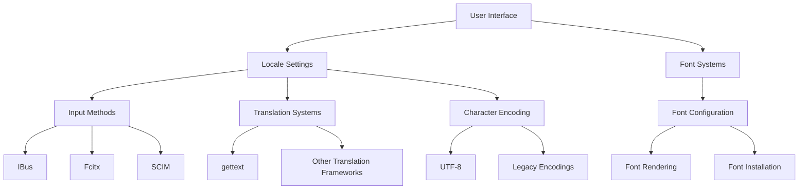

# Ubuntu Language Support

## Introduction

Ubuntu, one of the most popular Linux distributions, is designed with global accessibility in mind. Language support in Ubuntu refers to the system's ability to display, input, and process text in different languages. For software developers, understanding Ubuntu's language support mechanisms is crucial for creating applications that can reach users worldwide. This guide explores how Ubuntu handles languages and how you can develop software that properly supports multiple languages.

## Understanding Language Support in Ubuntu

Ubuntu's language support is built on several interconnected systems:

1. **Locale settings** - Define language, region, and character encoding preferences
2. **Input methods** - Allow typing in different languages and scripts
3. **Font support** - Provide glyphs for displaying various writing systems
4. **Translation frameworks** - Enable software localization

Let's explore each of these components in detail.

## Locale Configuration

A locale is a set of parameters that defines a user's language, region, and other preferences. In Ubuntu, locales follow the format `language_COUNTRY.encoding`. For example:

- `en_US.UTF-8` - English (United States) with UTF-8 encoding
- `fr_FR.UTF-8` - French (France) with UTF-8 encoding
- `ja_JP.UTF-8` - Japanese (Japan) with UTF-8 encoding

### Checking Current Locale Settings

To view your current locale settings, use the `locale` command:

```bash
locale
```

Sample output:
```
LANG=en_US.UTF-8
LANGUAGE=en_US:en
LC_CTYPE=en_US.UTF-8
LC_NUMERIC=en_US.UTF-8
LC_TIME=en_US.UTF-8
LC_COLLATE=en_US.UTF-8
LC_MONETARY=en_US.UTF-8
LC_MESSAGES=en_US.UTF-8
LC_PAPER=en_US.UTF-8
LC_NAME=en_US.UTF-8
LC_ADDRESS=en_US.UTF-8
LC_TELEPHONE=en_US.UTF-8
LC_MEASUREMENT=en_US.UTF-8
LC_IDENTIFICATION=en_US.UTF-8
LC_ALL=
```

### Installing Language Support

Ubuntu doesn't install all language packs by default to save space. To add support for a specific language:

```bash
sudo apt update
sudo apt install language-pack-xx
```

Replace `xx` with the language code (e.g., `de` for German, `ru` for Russian).

For a graphical interface, use the "Language Support" application:

1. Open the "Language Support" tool from the Applications menu
2. Click "Install / Remove Languages"
3. Select the languages you want to install
4. Click "Apply Changes"

## Character Encodings

Modern Ubuntu versions use UTF-8 as the default encoding, which can represent virtually any character from any writing system. UTF-8 is a variable-width encoding that uses 1 to 4 bytes per character, making it space-efficient while supporting the entire Unicode character set.

### Checking File Encodings

To check the encoding of a text file:

```bash
file -i myfile.txt
```

Sample output:
```
myfile.txt: text/plain; charset=utf-8
```

## Input Methods

Input methods allow users to type in non-Latin scripts or languages with special characters. Ubuntu provides several input method frameworks:

1. **IBus (Intelligent Input Bus)** - The default input method framework
2. **SCIM (Smart Common Input Method)** - An older alternative
3. **Fcitx (Free Chinese Input Toy for X)** - Popular for Asian languages

### Setting Up IBus

To configure IBus for additional languages:

```bash
# Install IBus and language-specific input methods
sudo apt install ibus ibus-gtk ibus-gtk3

# For Chinese input
sudo apt install ibus-pinyin

# For Japanese input
sudo apt install ibus-mozc

# For Korean input
sudo apt install ibus-hangul
```

After installation, configure IBus from "Settings → Region & Language → Input Sources".

## Font Support

Ubuntu includes fonts for many languages, but not all. To ensure your application displays text correctly in different languages, you need appropriate fonts.

### Installing Language-Specific Fonts

For comprehensive font coverage:

```bash
sudo apt install fonts-noto
```

The Noto font family ("No Tofu" - meaning no missing characters shown as boxes) aims to cover all scripts in Unicode.

For specific languages:

```bash
# Chinese, Japanese, Korean fonts
sudo apt install fonts-noto-cjk

# Thai fonts
sudo apt install fonts-thai-tlwg

# Arabic fonts
sudo apt install fonts-kacst
```

## Internationalization (i18n) and Localization (l10n)

For developers, two key concepts are important:

- **Internationalization (i18n)**: Designing software to potentially work in any language
- **Localization (l10n)**: Adapting software for specific languages and regions

### Using gettext for Translations

The GNU `gettext` system is widely used for software translations in Ubuntu. Here's a basic example in Python:

```python
import gettext

# Set up gettext
translation = gettext.translation('myapp', localedir='locale', fallback=True)
_ = translation.gettext

# Use the translation function
print(_("Hello, world!"))  # Will print the translated version if available
```

### Sample Workflow for Translatable Applications

1. **Mark strings for translation** in your code
2. **Extract strings** to a POT (Portable Object Template) file
3. **Create PO files** for each language
4. **Translate the strings** in the PO files
5. **Compile PO files** to MO (Machine Object) format
6. **Load translations** at runtime

Let's demonstrate with a simple Python application:

```python
#!/usr/bin/env python3
import gettext
import locale
from pathlib import Path

# Set up localization
APP_NAME = "hello_app"
LOCALE_DIR = Path(__file__).parent / "locale"

# Try to set locale based on user preference
locale.setlocale(locale.LC_ALL, '')
language_code, encoding = locale.getlocale()

# Initialize gettext
translation = gettext.translation(
    APP_NAME, 
    localedir=LOCALE_DIR, 
    languages=[language_code], 
    fallback=True
)
_ = translation.gettext

def main():
    print(_("Hello, welcome to my application!"))
    name = input(_("Please enter your name: "))
    print(_("Nice to meet you, {}!").format(name))
    
    num_files = 3
    print(_("You have {} file(s).").format(num_files))

if __name__ == "__main__":
    main()
```

### Creating Translation Files

To create translation files for the above application:

1. **Extract strings to a POT file**:

```bash
xgettext --language=Python --keyword=_ --output=locale/hello_app.pot hello_app.py
```

2. **Create a PO file for Spanish**:

```bash
mkdir -p locale/es/LC_MESSAGES
msginit --input=locale/hello_app.pot --locale=es --output=locale/es/LC_MESSAGES/hello_app.po
```

3. **Edit the Spanish PO file** to add translations:

```
msgid "Hello, welcome to my application!"
msgstr "¡Hola, bienvenido a mi aplicación!"

msgid "Please enter your name: "
msgstr "Por favor, introduce tu nombre: "

msgid "Nice to meet you, {}!"
msgstr "¡Encantado de conocerte, {}!"

msgid "You have {} file(s)."
msgstr "Tienes {} archivo(s)."
```

4. **Compile the PO file to MO format**:

```bash
msgfmt --output-file=locale/es/LC_MESSAGES/hello_app.mo locale/es/LC_MESSAGES/hello_app.po
```

## Handling Different Date, Time, and Number Formats

Different regions format dates, times, and numbers differently. For proper localization, use the `locale` module in Python:

```python
import locale

# Set locale based on user preference
locale.setlocale(locale.LC_ALL, '')

# Format a date
import datetime
today = datetime.date.today()
formatted_date = today.strftime('%x')  # Uses locale-specific date format
print(f"Today's date: {formatted_date}")

# Format a number
num = 1234567.89
formatted_num = locale.format_string("%d", num, grouping=True)
print(f"Formatted number: {formatted_num}")

# Format currency
currency = locale.currency(1234.56)
print(f"Currency: {currency}")
```

## Real-World Application: Creating a Localized GTK Application

Here's a practical example of a simple GTK application with language support:

```python
#!/usr/bin/env python3
import gettext
import locale
import gi

gi.require_version('Gtk', '3.0')
from gi.repository import Gtk

# Set up localization
APP_NAME = "hello_gtk"
LOCALE_DIR = "locale"

# Set locale based on user preference
locale.setlocale(locale.LC_ALL, '')
language_code, encoding = locale.getlocale()

# Initialize gettext
translation = gettext.translation(
    APP_NAME, 
    localedir=LOCALE_DIR, 
    languages=[language_code], 
    fallback=True
)
_ = translation.gettext

class HelloWindow(Gtk.Window):
    def __init__(self):
        Gtk.Window.__init__(self, title=_("Hello GTK App"))
        self.set_border_width(10)
        self.set_default_size(300, 200)
        
        # Create a vertical box
        vbox = Gtk.Box(orientation=Gtk.Orientation.VERTICAL, spacing=6)
        self.add(vbox)
        
        # Welcome label
        welcome_label = Gtk.Label(label=_("Welcome to my GTK application!"))
        vbox.pack_start(welcome_label, True, True, 0)
        
        # Name entry
        name_box = Gtk.Box(spacing=6)
        name_label = Gtk.Label(label=_("Your name:"))
        self.name_entry = Gtk.Entry()
        name_box.pack_start(name_label, False, False, 0)
        name_box.pack_start(self.name_entry, True, True, 0)
        vbox.pack_start(name_box, True, True, 0)
        
        # Greeting button
        button = Gtk.Button(label=_("Greet me!"))
        button.connect("clicked", self.on_button_clicked)
        vbox.pack_start(button, True, True, 0)
        
        # Result label
        self.result_label = Gtk.Label()
        vbox.pack_start(self.result_label, True, True, 0)
    
    def on_button_clicked(self, widget):
        name = self.name_entry.get_text() or _("friend")
        self.result_label.set_text(_("Hello, {}!").format(name))

def main():
    win = HelloWindow()
    win.connect("destroy", Gtk.main_quit)
    win.show_all()
    Gtk.main()

if __name__ == "__main__":
    main()
```

## Language Detection in Applications

Sometimes your application needs to detect the user's preferred language. In Python:

```python
import locale

def get_preferred_language():
    try:
        # Get user's preferred language from system locale
        locale.setlocale(locale.LC_ALL, '')
        language_code, encoding = locale.getlocale()
        return language_code
    except:
        # Fallback to English
        return 'en_US'

language = get_preferred_language()
print(f"Detected language: {language}")
```

## Right-to-Left (RTL) Language Support

Languages like Arabic, Hebrew, and Persian are written from right to left. To support RTL languages in GTK applications:

```python
from gi.repository import Gtk, Pango

# Check if current language is RTL
def is_rtl_language(language_code):
    rtl_languages = ['ar', 'he', 'fa', 'ur']
    language_prefix = language_code.split('_')[0]
    return language_prefix in rtl_languages

language_code = get_preferred_language()
if is_rtl_language(language_code):
    # Set RTL text direction
    label = Gtk.Label(label="مرحبا بالعالم")  # "Hello World" in Arabic
    label.set_direction(Gtk.TextDirection.RTL)
    
    # For Pango layout
    layout = Pango.Layout(context)
    layout.set_auto_dir(True)  # Automatically determine text direction
```

## Testing Language Support

To test your application with different languages without changing your system locale:

```bash
# Run application with a specific language
LANG=fr_FR.UTF-8 python3 my_app.py

# Or for GTK applications
LANGUAGE=ja_JP python3 my_gtk_app.py
```

## Language Support Diagram

Here's a visual overview of how language support works in Ubuntu:



## Common Issues and Solutions

### Missing Characters or "Tofu" Boxes

**Problem**: Text appears as empty boxes (�) or placeholder characters.
**Solution**: Install appropriate fonts for the language.

```bash
sudo apt install fonts-noto-cjk fonts-noto-color-emoji fonts-noto-extra
```

### Incorrect Character Encoding

**Problem**: Text appears garbled or with strange characters.
**Solution**: Ensure your application uses UTF-8 encoding consistently.

```python
# When reading files
with open('file.txt', 'r', encoding='utf-8') as f:
    content = f.read()

# When writing files
with open('output.txt', 'w', encoding='utf-8') as f:
    f.write(content)
```

### Input Method Not Working

**Problem**: Cannot type in a specific language.
**Solution**: Ensure the input method is properly installed and configured.

```bash
# Restart IBus
ibus restart

# Check installed input methods
ibus list-engine
```

## Summary

Ubuntu's language support provides a robust foundation for creating globally accessible software. By leveraging locale settings, input methods, proper font configuration, and translation frameworks, developers can create applications that work seamlessly for users around the world.

The key takeaways from this guide are:

1. Use UTF-8 encoding consistently in your applications
2. Implement proper internationalization using tools like gettext
3. Consider regional formatting for dates, numbers, and currencies
4. Test your application with different languages and scripts
5. Ensure proper font support for all target languages

## Additional Resources

- **Official Documentation**:
  - Ubuntu Language Support documentation: `help.ubuntu.com/community/Locale`
  - GNU gettext manual: `gnu.org/software/gettext/manual/gettext.html`

- **Useful Commands**:
  - `locale -a`: List all installed locales
  - `locale-gen`: Generate locales
  - `update-locale`: Update locale settings

## Exercises

1. Install support for a language you're not familiar with (e.g., Japanese, Arabic) and explore how Ubuntu handles it.
2. Modify the example GTK application to support at least two additional languages.
3. Create a small Python application that correctly formats dates, times, and currencies according to the user's locale.
4. Implement a language picker in a GTK application that allows users to switch languages on the fly.
5. Create a test plan for ensuring your application works correctly with RTL languages.