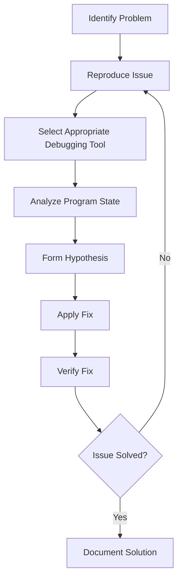

# Ubuntu Debugging Tools

## Introduction

Debugging is an essential part of the software development lifecycle. When you're developing applications on Ubuntu, having the right debugging tools can save you countless hours of frustration and help you build more reliable software. Ubuntu offers a rich ecosystem of debugging tools that cater to different programming languages, environments, and debugging scenarios.

In this guide, we'll explore the most commonly used debugging tools available in Ubuntu. Whether you're tracing system calls, analyzing memory issues, or stepping through your code, Ubuntu has specialized tools to help you identify and fix problems efficiently.

## Common Debugging Scenarios

Before diving into specific tools, let's understand some common debugging scenarios you might encounter:

1. **Runtime errors** - Your program crashes or behaves unexpectedly during execution
2. **Memory issues** - Memory leaks, buffer overflows, or use of uninitialized memory
3. **Performance bottlenecks** - Programs running slower than expected
4. **Logic errors** - Program runs without crashing but produces incorrect results
5. **System-level issues** - Problems related to system calls, file operations, or networking

Now, let's explore the tools that can help address these scenarios.

## Essential Command-Line Debugging Tools

### GDB (GNU Debugger)

GDB is the cornerstone of debugging in Linux environments, including Ubuntu. It supports multiple programming languages like C, C++, Objective-C, and more.

#### Installation

```bash
sudo apt-get install gdb
```

#### Basic Usage

To debug a program with GDB:

```bash
gdb ./your_program
```

This launches GDB with your program loaded. Common GDB commands include:

```
(gdb) run [args]    # Run the program with optional arguments
(gdb) break main    # Set a breakpoint at the main function
(gdb) break 42      # Set a breakpoint at line 42
(gdb) next          # Execute the next line of code (step over)
(gdb) step          # Step into a function call
(gdb) continue      # Continue execution until the next breakpoint
(gdb) print var     # Print the value of variable 'var'
(gdb) backtrace     # Show the call stack
(gdb) quit          # Exit GDB
```

#### Practical Example

Let's debug a simple C program with a segmentation fault:

```c
// buggy.c
#include <stdio.h>

void process_array(int *arr, int size) {
    for (int i = 0; i <= size; i++) {  // Bug: should be i < size
        printf("%d ", arr[i]);
    }
    printf("
");
}

int main() {
    int numbers[] = {1, 2, 3, 4, 5};
    process_array(numbers, 5);
    return 0;
}
```

First, compile with debugging symbols:

```bash
gcc -g -o buggy buggy.c
```

Now, let's debug with GDB:

```bash
gdb ./buggy
```

GDB session:

```
(gdb) run
Starting program: /home/user/buggy
1 2 3 4 5 

Program received signal SIGSEGV, Segmentation fault.
0x0000555555555195 in process_array (arr=0x7fffffffdeb0, size=5) at buggy.c:5
5         printf("%d ", arr[i]);
(gdb) print i
$1 = 5
(gdb) quit
```

From this session, we can see that the program crashed when trying to access `arr[5]`, which is outside the array bounds. The fix would be to change the loop condition from `i <= size` to `i < size`.

### Valgrind

Valgrind is a powerful suite of tools for debugging memory-related issues and detecting memory leaks.

#### Installation

```bash
sudo apt-get install valgrind
```

#### Basic Usage

```bash
valgrind --leak-check=full ./your_program [args]
```

#### Practical Example

Let's check a program with memory leaks:

```c
// memory_leak.c
#include <stdlib.h>

int main() {
    int *arr = malloc(10 * sizeof(int));
    // Missing free(arr)
    return 0;
}
```

Compile and check with Valgrind:

```bash
gcc -g -o memory_leak memory_leak.c
valgrind --leak-check=full ./memory_leak
```

Example output:

```
==12345== Memcheck, a memory error detector
==12345== Copyright (C) 2002-2017, and GNU GPL'd, by Julian Seward et al.
==12345== Using Valgrind-3.15.0 and LibVEX; rerun with -h for copyright info
==12345== Command: ./memory_leak
==12345== 
==12345== 
==12345== HEAP SUMMARY:
==12345==     in use at exit: 40 bytes in 1 blocks
==12345==   total heap usage: 1 allocs, 0 frees, 40 bytes allocated
==12345== 
==12345== 40 bytes in 1 blocks are definitely lost in loss record 1 of 1
==12345==    at 0x483B7F3: malloc (in /usr/lib/x86_64-linux-gnu/valgrind/vgpreload_memcheck-amd64-linux.so)
==12345==    by 0x109176: main (memory_leak.c:4)
==12345== 
==12345== LEAK SUMMARY:
==12345==    definitely lost: 40 bytes in 1 blocks
==12345==    indirectly lost: 0 bytes in 0 blocks
==12345==      possibly lost: 0 bytes in 0 blocks
==12345==    still reachable: 0 bytes in 0 blocks
==12345==         suppressed: 0 bytes in 0 blocks
==12345== 
==12345== For lists of detected and suppressed errors, rerun with: -s
==12345== ERROR SUMMARY: 1 errors from 1 contexts (suppressed: 0 from 0)
```

Valgrind clearly shows that 40 bytes were allocated but never freed, pinpointing the exact line number of the allocation.

### Strace

Strace is a powerful tool that traces system calls made by a process. It's useful for understanding how a program interacts with the operating system.

#### Installation

```bash
sudo apt-get install strace
```

#### Basic Usage

```bash
strace ./your_program
```

Or attach to a running process:

```bash
strace -p <PID>
```

#### Practical Example

Let's trace a simple program:

```bash
strace ls -l
```

Example output (abbreviated):

```
execve("/bin/ls", ["ls", "-l"], 0x7ffc7c9b3900 /* 66 vars */) = 0
brk(NULL)                               = 0x55ca52a3b000
access("/etc/ld.so.preload", R_OK)      = -1 ENOENT (No such file or directory)
openat(AT_FDCWD, "/etc/ld.so.cache", O_RDONLY|O_CLOEXEC) = 3
fstat(3, {st_mode=S_IFREG|0644, st_size=178121, ...}) = 0
mmap(NULL, 178121, PROT_READ, MAP_PRIVATE, 3, 0) = 0x7f7c0ef8a000
close(3)                                = 0
...
write(1, "total 32
-rw-r--r-- 1 user user"..., 352) = 352
close(1)                                = 0
close(2)                                = 0
exit_group(0)                           = ?
+++ exited with 0 +++
```

### ltrace

Similar to strace, but ltrace traces library calls instead of system calls.

#### Installation

```bash
sudo apt-get install ltrace
```

#### Basic Usage

```bash
ltrace ./your_program
```

#### Practical Example

```bash
ltrace ls -l
```

Example output (abbreviated):

```
__libc_start_main(0x426760, 2, 0x7ffd56232308, 0x43d7c0, 0x43d7b0 <unfinished ...>
setlocale(LC_ALL, "")                                      = "en_US.UTF-8"
bindtextdomain("coreutils", "/usr/share/locale")           = "/usr/share/locale"
textdomain("coreutils")                                    = "coreutils"
__cxa_atexit(0x40d930, 0, 0, 0x736c6974756572)            = 0
isatty(1)                                                  = 1
getenv("QUOTING_STYLE")                                   = NULL
...
```

## Language-Specific Debugging Tools

### Python: pdb

The Python Debugger (pdb) is built into Python and provides interactive debugging capabilities.

#### Basic Usage

You can use pdb directly in your code by adding:

```python
import pdb; pdb.set_trace()
```

Or run a script with pdb:

```bash
python -m pdb your_script.py
```

#### Practical Example

Let's debug a simple Python script:

```python
# debug_example.py
def calculate_average(numbers):
    total = 0
    for num in numbers:
        total += num
    return total / len(numbers)

numbers = [1, 2, 3, 4, 5]
import pdb; pdb.set_trace()  # Debugger will stop here
avg = calculate_average(numbers)
print(f"The average is: {avg}")
```

Running the script:

```bash
python debug_example.py
```

PDB will pause execution at the set_trace() line, allowing you to:

```
(Pdb) n  # next line
(Pdb) s  # step into function
(Pdb) p numbers  # print variable
(Pdb) c  # continue execution
```

### Java: jdb

For Java applications, the Java Debugger (jdb) is part of the JDK.

#### Basic Usage

First, compile your Java code with debugging information:

```bash
javac -g YourProgram.java
```

Then run jdb:

```bash
jdb YourProgram
```

#### Common Commands

```
> stop at YourClass:42  # Set breakpoint at line 42
> run                   # Start execution
> next                  # Step over
> step                  # Step into
> print variable        # Print variable value
> locals                # Print all local variables
> cont                  # Continue execution
```

## IDE-Based Debugging

### Visual Studio Code

Visual Studio Code provides excellent debugging support for various languages on Ubuntu.

#### Setup

1. Install VS Code:
```bash
sudo snap install code --classic
```

2. Install the appropriate language extensions (C/C++, Python, Java, etc.)

3. Configure `launch.json` for your project:
```json
{
    "version": "0.2.0",
    "configurations": [
        {
            "name": "Debug C++ Program",
            "type": "cppdbg",
            "request": "launch",
            "program": "${workspaceFolder}/your_program",
            "args": [],
            "stopAtEntry": false,
            "cwd": "${workspaceFolder}",
            "environment": [],
            "externalConsole": false,
            "MIMode": "gdb",
            "setupCommands": [
                {
                    "description": "Enable pretty-printing for gdb",
                    "text": "-enable-pretty-printing",
                    "ignoreFailures": true
                }
            ],
            "preLaunchTask": "build"
        }
    ]
}
```

### Eclipse

Eclipse IDE provides robust debugging support for Java, C/C++, and other languages.

#### Installation

```bash
sudo snap install eclipse --classic
```

## Advanced Debugging Tools

### Perf

Perf is a performance analysis tool in Linux that can help identify performance bottlenecks.

#### Installation

```bash
sudo apt-get install linux-tools-common linux-tools-generic linux-tools-`uname -r`
```

#### Basic Usage

```bash
perf record -g ./your_program
perf report
```

### Ftrace

Ftrace is a tracing utility built into the Linux kernel, useful for kernel-level debugging.

#### Basic Usage

```bash
trace-cmd record -p function_graph ./your_program
trace-cmd report
```

### Core Dump Analysis

When programs crash, they often generate core files that can be analyzed with GDB.

#### Enabling Core Dumps

```bash
ulimit -c unlimited
```

#### Analyzing a Core Dump

```bash
gdb ./your_program core
```

## Visualization of Debugging Data

### Memcheck GUI (KCachegrind)

KCachegrind provides visualization for Valgrind's Callgrind tool.

#### Installation

```bash
sudo apt-get install kcachegrind
```

#### Usage

```bash
valgrind --tool=callgrind ./your_program
kcachegrind callgrind.out.*
```

## Debugging Workflow

An effective debugging workflow typically follows these steps:



## Common Debugging Techniques

1. **Print Debugging**
   - Adding print statements to trace execution flow and variable values
   - Example in C: `printf("Variable x = %d
", x);`

2. **Logging**
   - Using a logging framework for more structured output
   - Example in Python: 
     ```python
     import logging
     logging.basicConfig(level=logging.DEBUG)
     logging.debug(f"Processing item: {item}")
     ```

3. **Rubber Duck Debugging**
   - Explaining your code line by line to an inanimate object (like a rubber duck)
   - This process often helps you spot the issue yourself

4. **Binary Search Debugging**
   - Systematically isolating the problem by testing half of the potential problem area at a time
   - Useful for pinpointing issues in large codebases

5. **Delta Debugging**
   - Systematically reducing the test case while preserving the failure
   - Helps identify the minimal code needed to reproduce an issue

## Best Practices for Debugging

1. **Understand the problem before fixing it**
   - Ensure you can reliably reproduce the issue
   - Understand what the expected behavior should be

2. **Make one change at a time**
   - Avoid making multiple changes simultaneously
   - This helps isolate which change fixed the issue

3. **Keep a debugging journal**
   - Document what you've tried and the results
   - Helps avoid repeating unsuccessful approaches

4. **Use version control**
   - Commit working code frequently
   - Makes it easier to identify what change introduced a bug

5. **Write tests for bugs**
   - Create tests that reproduce the issue
   - Ensures the bug doesn't return in the future

## Summary

Ubuntu provides a comprehensive suite of debugging tools for various programming languages and debugging scenarios. From traditional command-line tools like GDB and Valgrind to IDE-integrated debugging environments, you have many options to diagnose and fix issues in your software.

Remember that debugging is both a science and an art. While these tools provide valuable information, your ability to interpret that information and identify the root cause improves with practice and experience. Start with the simpler tools and gradually incorporate more advanced ones as your debugging skills develop.

## Additional Resources

- [GDB Documentation](https://sourceware.org/gdb/current/onlinedocs/gdb/)
- [Valgrind User Manual](https://valgrind.org/docs/manual/manual.html)
- [The Art of Debugging](https://nostarch.com/debugging.htm)
- [Linux Debugging Tools](https://www.linuxjournal.com/content/debugging-tools-linux)

## Exercises

1. Install GDB and use it to debug a simple C program with a segmentation fault.
2. Use Valgrind to find memory leaks in a provided sample program.
3. Write a Python script with a logic error and use pdb to identify and fix the issue.
4. Use strace to monitor system calls made by a common command like `ls` or `cat`.
5. Set up Visual Studio Code for debugging a project in your preferred programming language.